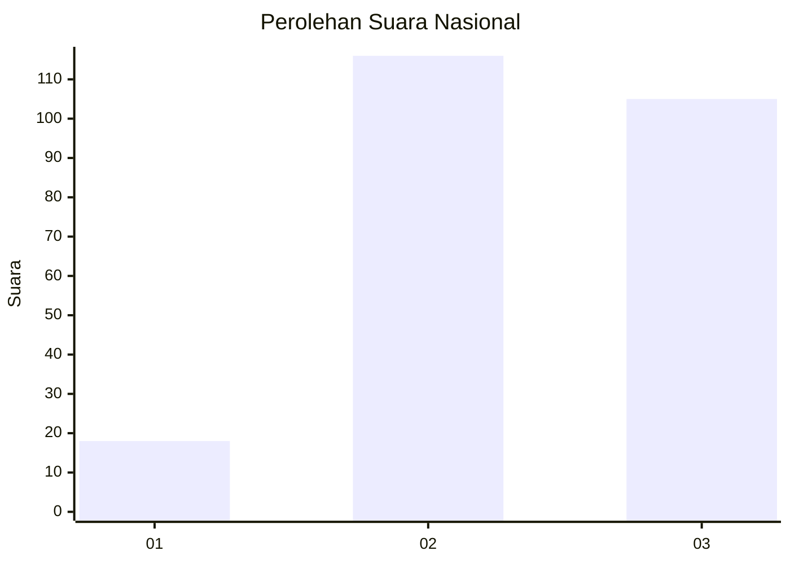
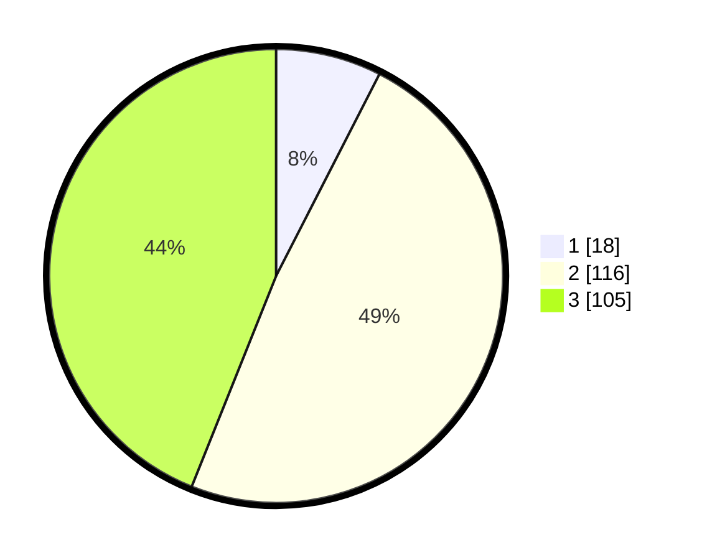

# Hasil

## Grafik

## Tabel

| No. | Nama Paslon    | Suara | Suara (raw) | Persentase |
|:--- |:-------------- | -----:| -----------:| ----------:|
| 1   | ANIES MUHAIMIN | 18    | [18][p-1]   | 7,53       |
| 2   | PRABOWO GIBRAN | 116   | [116][p-2]  | 48,54      |
| 3   | GANJAR MAHFUD  | 105   | [105][p-3]  | 43,93      |

[p-1]: https://github.com/gigit-pemilu/pemilu-2024/blob/main/pilpres/hitung-suara/sub/34-di-yogyakarta/sub/02-bantul/sub/07-pajangan/sub/2002-sendangsari/sub/028-tps/sub/paslon-1.txt
[p-2]: https://github.com/gigit-pemilu/pemilu-2024/blob/main/pilpres/hitung-suara/sub/34-di-yogyakarta/sub/02-bantul/sub/07-pajangan/sub/2002-sendangsari/sub/028-tps/sub/paslon-2.txt
[p-3]: https://github.com/gigit-pemilu/pemilu-2024/blob/main/pilpres/hitung-suara/sub/34-di-yogyakarta/sub/02-bantul/sub/07-pajangan/sub/2002-sendangsari/sub/028-tps/sub/paslon-3.txt

## Foto C Plano

https://sirekap-obj-formc.kpu.go.id/9698/pemilu/ppwp/34/02/07/20/02/3402072002028-20240215-004216--4d25136a-2795-452d-a933-9d203d04717e.jpg

https://sirekap-obj-formc.kpu.go.id/9698/pemilu/ppwp/34/02/07/20/02/3402072002028-20240215-004320--6cdfc64e-1742-4ca3-988e-e6ba9a1c4800.jpg

https://sirekap-obj-formc.kpu.go.id/9698/pemilu/ppwp/34/02/07/20/02/3402072002028-20240215-004413--e799bd55-4a31-4ec3-bda3-2c4f7f28b308.jpg

## Metadata

| Key        | Value               |
| ---------- | ------------------- |
| Time Stamp | 2024-02-25 14:00:00 |

