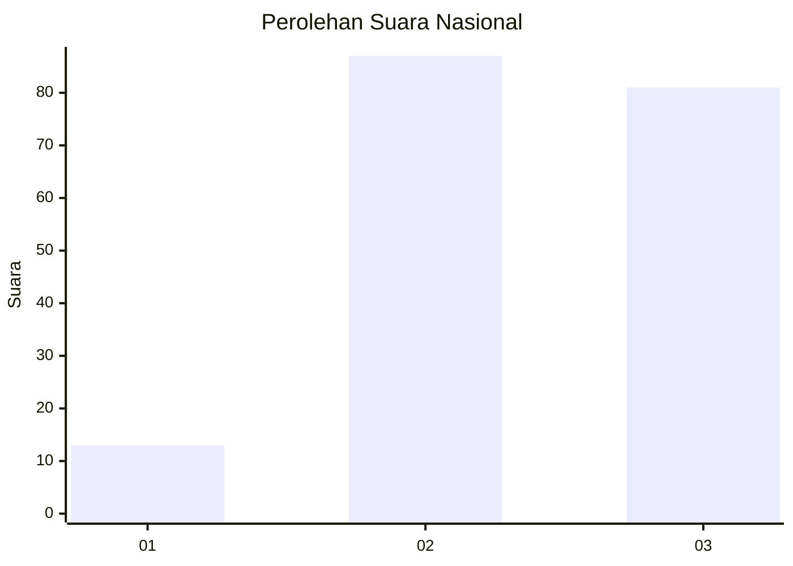
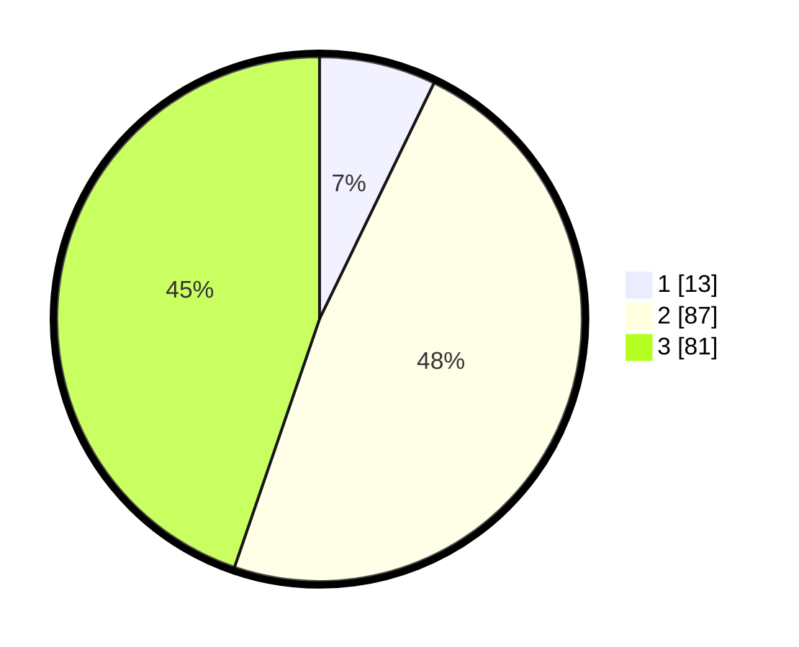

# Hasil

## Grafik

## Tabel

| No. | Nama Paslon    | Suara | Suara (raw) | Persentase |
|:--- |:-------------- | -----:| -----------:| ----------:|
| 1   | ANIES MUHAIMIN | 13    | [13][p-1]   | 7,18       |
| 2   | PRABOWO GIBRAN | 87    | [87][p-2]   | 48,07      |
| 3   | GANJAR MAHFUD  | 81    | [81][p-3]   | 44,75      |

[p-1]: https://github.com/gigit-pemilu/pemilu-2024/blob/main/pilpres/hitung-suara/sub/34-di-yogyakarta/sub/02-bantul/sub/07-pajangan/sub/2002-sendangsari/sub/030-tps/sub/paslon-1.txt
[p-2]: https://github.com/gigit-pemilu/pemilu-2024/blob/main/pilpres/hitung-suara/sub/34-di-yogyakarta/sub/02-bantul/sub/07-pajangan/sub/2002-sendangsari/sub/030-tps/sub/paslon-2.txt
[p-3]: https://github.com/gigit-pemilu/pemilu-2024/blob/main/pilpres/hitung-suara/sub/34-di-yogyakarta/sub/02-bantul/sub/07-pajangan/sub/2002-sendangsari/sub/030-tps/sub/paslon-3.txt

## Foto C Plano

https://sirekap-obj-formc.kpu.go.id/49fb/pemilu/ppwp/34/02/07/20/02/3402072002030-20240214-222928--901ad107-7e6c-4e4a-a784-3a797dfec0e8.jpg

https://sirekap-obj-formc.kpu.go.id/49fb/pemilu/ppwp/34/02/07/20/02/3402072002030-20240214-222937--f8471d3f-d4ac-4f07-aa23-e367c9bdb8fd.jpg

https://sirekap-obj-formc.kpu.go.id/49fb/pemilu/ppwp/34/02/07/20/02/3402072002030-20240214-222939--bea0c053-0f3f-47cd-b3a7-76a22bd709ec.jpg

## Metadata

| Key        | Value               |
| ---------- | ------------------- |
| Time Stamp | 2024-02-24 22:31:28 |

