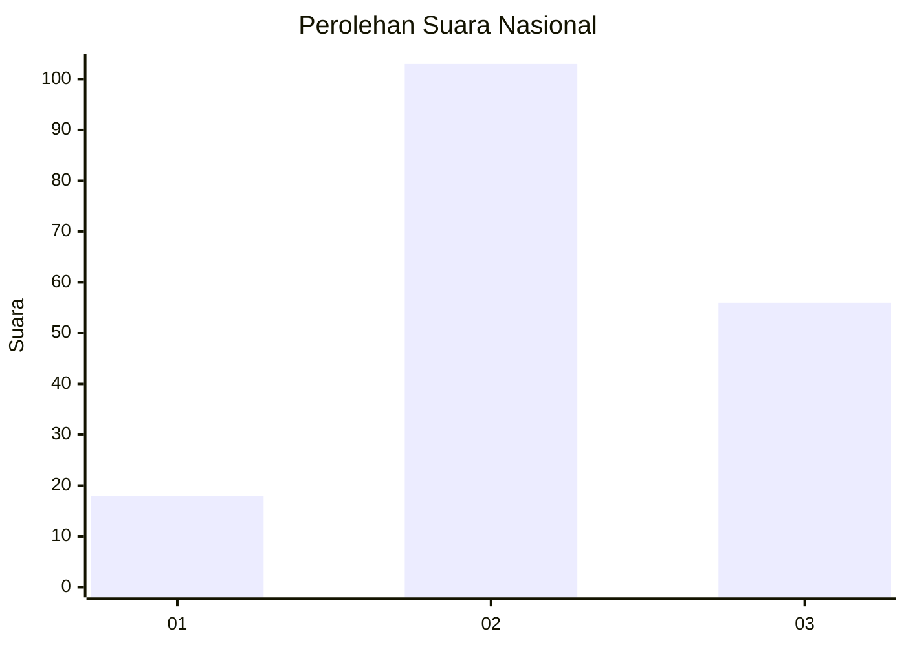
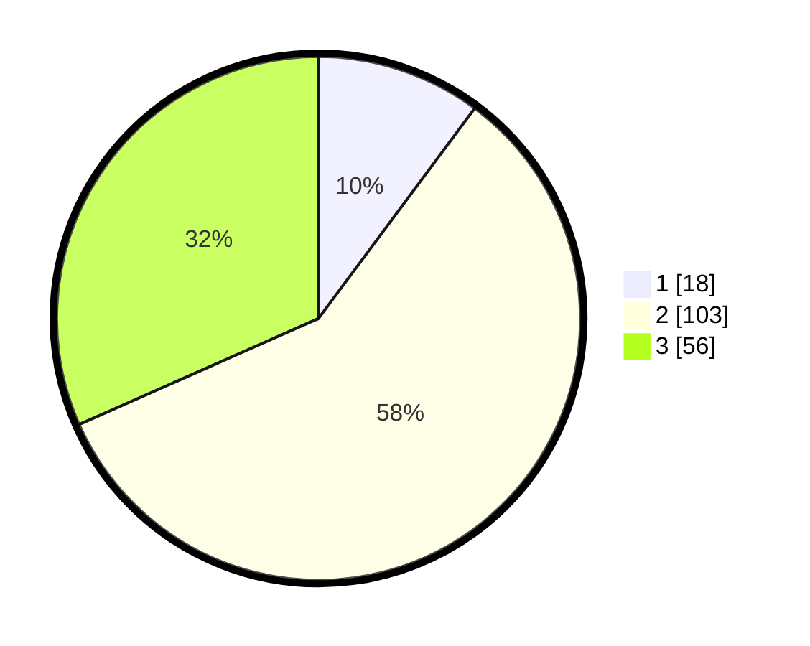

# Hasil

## Grafik

## Tabel

| No. | Nama Paslon    | Suara | Suara (raw) | Persentase |
|:--- |:-------------- | -----:| -----------:| ----------:|
| 1   | ANIES MUHAIMIN | 18    | [18][p-1]   | 10,17      |
| 2   | PRABOWO GIBRAN | 103   | [103][p-2]  | 58,19      |
| 3   | GANJAR MAHFUD  | 56    | [56][p-3]   | 31,64      |

[p-1]: https://github.com/gigit-pemilu/pemilu-2024/blob/main/pilpres/hitung-suara/sub/34-di-yogyakarta/sub/02-bantul/sub/07-pajangan/sub/2002-sendangsari/sub/032-tps/sub/paslon-1.txt
[p-2]: https://github.com/gigit-pemilu/pemilu-2024/blob/main/pilpres/hitung-suara/sub/34-di-yogyakarta/sub/02-bantul/sub/07-pajangan/sub/2002-sendangsari/sub/032-tps/sub/paslon-2.txt
[p-3]: https://github.com/gigit-pemilu/pemilu-2024/blob/main/pilpres/hitung-suara/sub/34-di-yogyakarta/sub/02-bantul/sub/07-pajangan/sub/2002-sendangsari/sub/032-tps/sub/paslon-3.txt

## Foto C Plano

https://sirekap-obj-formc.kpu.go.id/b190/pemilu/ppwp/34/02/07/20/02/3402072002032-20240217-093839--7bbfcf2f-e7f7-4b6d-9994-75474af6403f.jpg

https://sirekap-obj-formc.kpu.go.id/b190/pemilu/ppwp/34/02/07/20/02/3402072002032-20240217-095438--67e17d7f-a3b1-44f1-9841-f44d8442b362.jpg

https://sirekap-obj-formc.kpu.go.id/b190/pemilu/ppwp/34/02/07/20/02/3402072002032-20240217-095255--64a491c8-43cf-41fa-922b-1f59fe119975.jpg

## Metadata

| Key        | Value               |
| ---------- | ------------------- |
| Time Stamp | 2024-02-24 22:31:28 |

