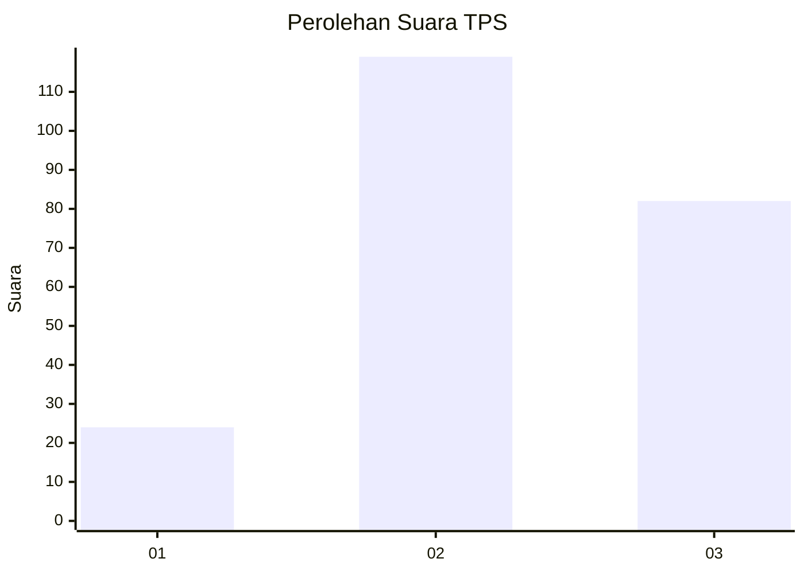
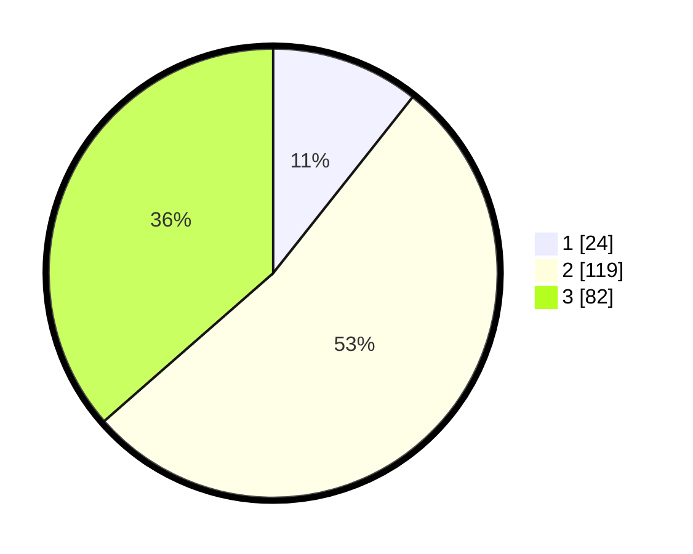

# Hasil

## Grafik

## Tabel

| No. | Nama Paslon    | Suara | Suara (raw) | Persentase |
|:--- |:-------------- | -----:| -----------:| ----------:|
| 1   | ANIES MUHAIMIN | 24    | [24][p-1]   | 10,67      |
| 2   | PRABOWO GIBRAN | 119   | [119][p-2]  | 52,89      |
| 3   | GANJAR MAHFUD  | 82    | [82][p-3]   | 36,44      |

[p-1]: https://github.com/gigit-pemilu/pemilu-2024-34-di-yogyakarta/blob/main/pilpres/hitung-suara/sub/34-di-yogyakarta/sub/02-bantul/sub/07-pajangan/sub/2002-sendangsari/sub/036-tps/sub/paslon-1.txt
[p-2]: https://github.com/gigit-pemilu/pemilu-2024-34-di-yogyakarta/blob/main/pilpres/hitung-suara/sub/34-di-yogyakarta/sub/02-bantul/sub/07-pajangan/sub/2002-sendangsari/sub/036-tps/sub/paslon-2.txt
[p-3]: https://github.com/gigit-pemilu/pemilu-2024-34-di-yogyakarta/blob/main/pilpres/hitung-suara/sub/34-di-yogyakarta/sub/02-bantul/sub/07-pajangan/sub/2002-sendangsari/sub/036-tps/sub/paslon-3.txt

## Foto C Plano

https://sirekap-obj-formc.kpu.go.id/5023/pemilu/ppwp/34/02/07/20/02/3402072002036-20240215-025939--cdf988cc-f306-4ee0-8450-f71fb657be79.jpg

https://sirekap-obj-formc.kpu.go.id/5023/pemilu/ppwp/34/02/07/20/02/3402072002036-20240215-030039--d1f443d1-0e78-4a54-bd4d-47b7ae030718.jpg

https://sirekap-obj-formc.kpu.go.id/5023/pemilu/ppwp/34/02/07/20/02/3402072002036-20240215-030207--98effe90-a181-471d-90e1-7f2cbebd4108.jpg

## Metadata

| Key        | Value               |
| ---------- | ------------------- |
| Time Stamp | 2024-02-24 22:31:28 |

