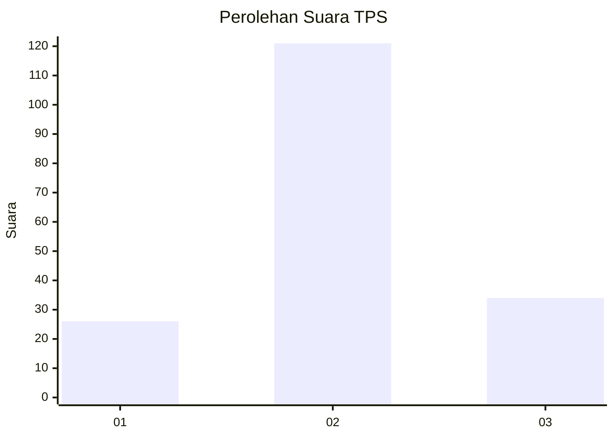
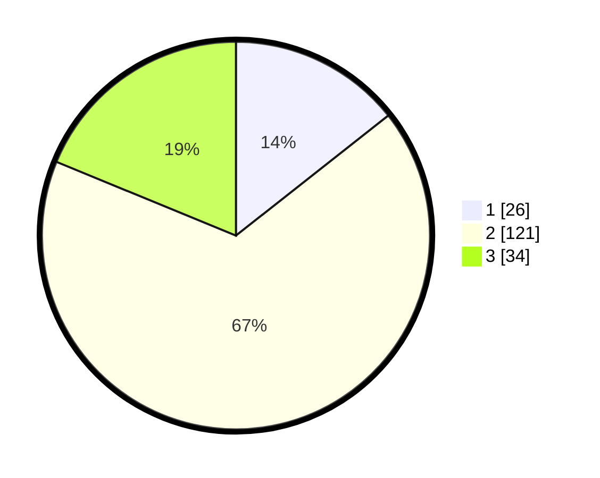

# Hasil

## Grafik

## Tabel

| No. | Nama Paslon    | Suara | Suara (raw) | Persentase |
|:--- |:-------------- | -----:| -----------:| ----------:|
| 1   | ANIES MUHAIMIN | 26    | [26][p-1]   | 14,36      |
| 2   | PRABOWO GIBRAN | 121   | [121][p-2]  | 66,85      |
| 3   | GANJAR MAHFUD  | 34    | [34][p-3]   | 18,78      |

[p-1]: https://github.com/gigit-pemilu/pemilu-2024-34-di-yogyakarta/blob/main/pilpres/hitung-suara/sub/34-di-yogyakarta/sub/02-bantul/sub/07-pajangan/sub/2002-sendangsari/sub/038-tps/sub/paslon-1.txt
[p-2]: https://github.com/gigit-pemilu/pemilu-2024-34-di-yogyakarta/blob/main/pilpres/hitung-suara/sub/34-di-yogyakarta/sub/02-bantul/sub/07-pajangan/sub/2002-sendangsari/sub/038-tps/sub/paslon-2.txt
[p-3]: https://github.com/gigit-pemilu/pemilu-2024-34-di-yogyakarta/blob/main/pilpres/hitung-suara/sub/34-di-yogyakarta/sub/02-bantul/sub/07-pajangan/sub/2002-sendangsari/sub/038-tps/sub/paslon-3.txt

## Foto C Plano

https://sirekap-obj-formc.kpu.go.id/8e3f/pemilu/ppwp/34/02/07/20/02/3402072002038-20240214-204732--f3f12505-406e-494e-884e-6c041e62e4f5.jpg

https://sirekap-obj-formc.kpu.go.id/8e3f/pemilu/ppwp/34/02/07/20/02/3402072002038-20240214-204824--8002b38c-4274-4627-b59e-38d3b66a0760.jpg

https://sirekap-obj-formc.kpu.go.id/8e3f/pemilu/ppwp/34/02/07/20/02/3402072002038-20240214-204949--1625ff11-11df-4955-a03a-a39b19f19614.jpg

## Metadata

| Key        | Value               |
| ---------- | ------------------- |
| Time Stamp | 2024-02-24 22:31:28 |

