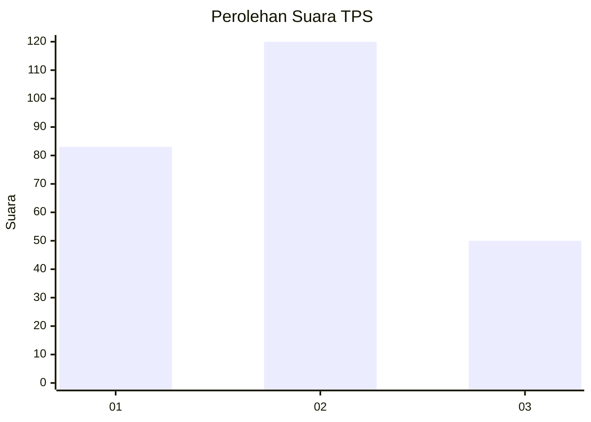
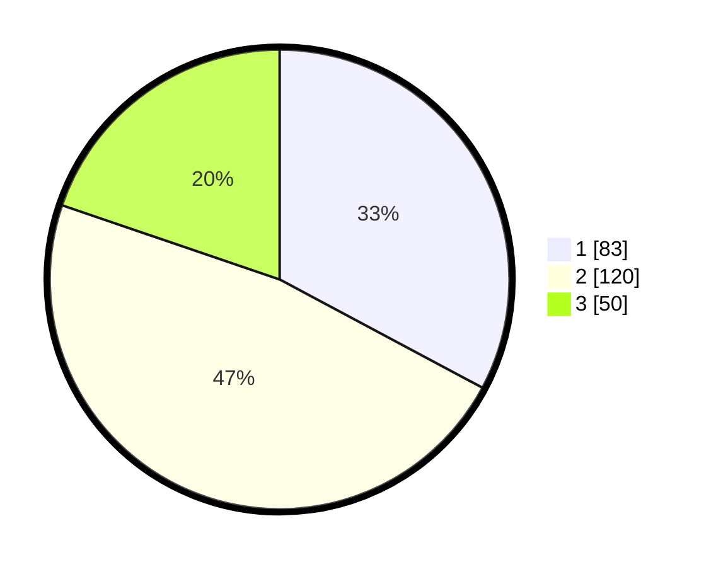

# Hasil

## Grafik

## Tabel

| No. | Nama Paslon    | Suara | Suara (raw) | Persentase |
|:--- |:-------------- | -----:| -----------:| ----------:|
| 1   | ANIES MUHAIMIN | 83    | [83][p-1]   | 32,81      |
| 2   | PRABOWO GIBRAN | 120   | [120][p-2]  | 47,43      |
| 3   | GANJAR MAHFUD  | 50    | [50][p-3]   | 19,76      |

[p-1]: https://github.com/gigit-pemilu/pemilu-2024-34-di-yogyakarta/blob/main/pilpres/hitung-suara/sub/34-di-yogyakarta/sub/02-bantul/sub/07-pajangan/sub/2003-guwosari/sub/003-tps/sub/paslon-1.txt
[p-2]: https://github.com/gigit-pemilu/pemilu-2024-34-di-yogyakarta/blob/main/pilpres/hitung-suara/sub/34-di-yogyakarta/sub/02-bantul/sub/07-pajangan/sub/2003-guwosari/sub/003-tps/sub/paslon-2.txt
[p-3]: https://github.com/gigit-pemilu/pemilu-2024-34-di-yogyakarta/blob/main/pilpres/hitung-suara/sub/34-di-yogyakarta/sub/02-bantul/sub/07-pajangan/sub/2003-guwosari/sub/003-tps/sub/paslon-3.txt

## Foto C Plano

https://sirekap-obj-formc.kpu.go.id/9aae/pemilu/ppwp/34/02/07/20/03/3402072003003-20240214-210637--16ddeee0-dd2e-4c7e-b362-3cc56394a514.jpg

https://sirekap-obj-formc.kpu.go.id/9aae/pemilu/ppwp/34/02/07/20/03/3402072003003-20240214-210804--84732870-6159-43d0-b176-7a032ef72944.jpg

https://sirekap-obj-formc.kpu.go.id/9aae/pemilu/ppwp/34/02/07/20/03/3402072003003-20240214-210942--2ef8c059-f6e0-42d6-ae02-be80fd6a1bc9.jpg

## Metadata

| Key        | Value               |
| ---------- | ------------------- |
| Time Stamp | 2024-02-24 22:31:28 |

