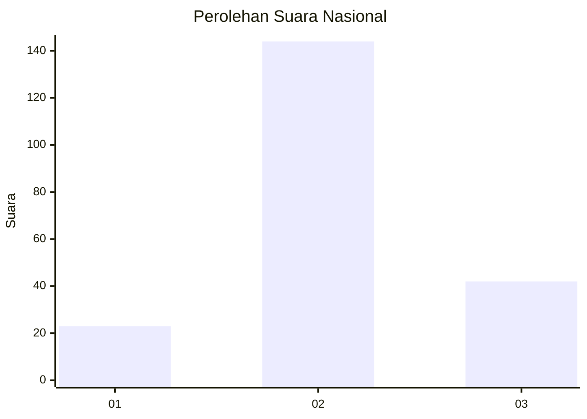
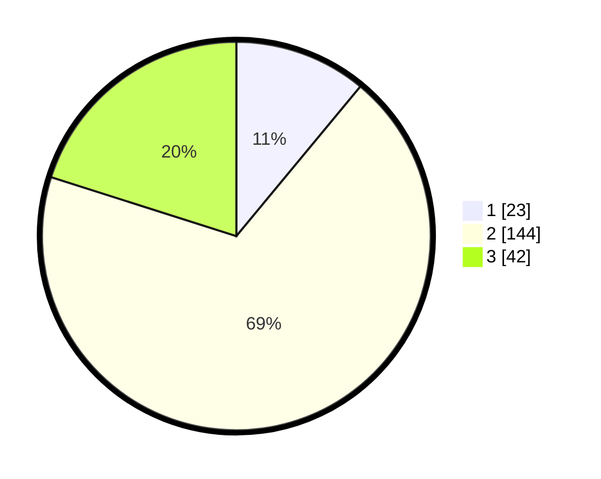

# Hasil

## Grafik

## Tabel

| No. | Nama Paslon    | Suara | Suara (raw) | Persentase |
|:--- |:-------------- | -----:| -----------:| ----------:|
| 1   | ANIES MUHAIMIN | 23    | [23][p-1]   | 11,00      |
| 2   | PRABOWO GIBRAN | 144   | [144][p-2]  | 68,90      |
| 3   | GANJAR MAHFUD  | 42    | [42][p-3]   | 20,10      |

[p-1]: https://github.com/gigit-pemilu/pemilu-2024/blob/main/pilpres/hitung-suara/sub/34-di-yogyakarta/sub/02-bantul/sub/07-pajangan/sub/2003-guwosari/sub/004-tps/sub/paslon-1.txt
[p-2]: https://github.com/gigit-pemilu/pemilu-2024/blob/main/pilpres/hitung-suara/sub/34-di-yogyakarta/sub/02-bantul/sub/07-pajangan/sub/2003-guwosari/sub/004-tps/sub/paslon-2.txt
[p-3]: https://github.com/gigit-pemilu/pemilu-2024/blob/main/pilpres/hitung-suara/sub/34-di-yogyakarta/sub/02-bantul/sub/07-pajangan/sub/2003-guwosari/sub/004-tps/sub/paslon-3.txt

## Foto C Plano

https://sirekap-obj-formc.kpu.go.id/a7ea/pemilu/ppwp/34/02/07/20/03/3402072003004-20240214-232459--55c1fc4c-1b22-433f-8290-1364f9eb017d.jpg

https://sirekap-obj-formc.kpu.go.id/a7ea/pemilu/ppwp/34/02/07/20/03/3402072003004-20240214-232246--dc1e5072-031a-46c3-8a07-07a1cba4a459.jpg

https://sirekap-obj-formc.kpu.go.id/a7ea/pemilu/ppwp/34/02/07/20/03/3402072003004-20240214-232616--3f89569a-a84f-4ce9-8b63-cdc005f3c11f.jpg

## Metadata

| Key        | Value               |
| ---------- | ------------------- |
| Time Stamp | 2024-02-24 22:31:28 |

