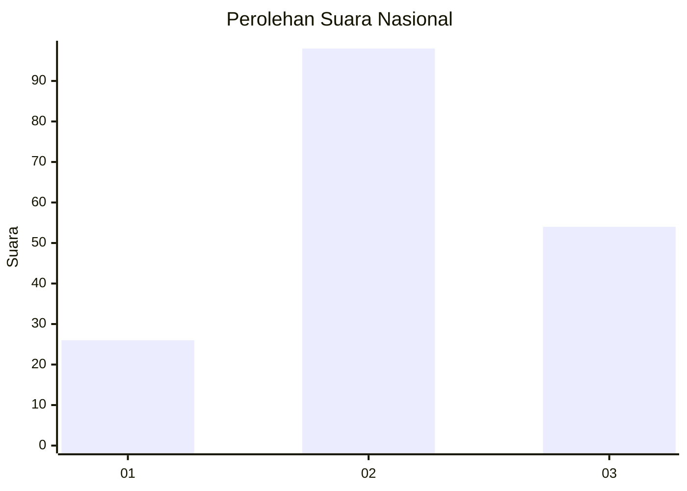
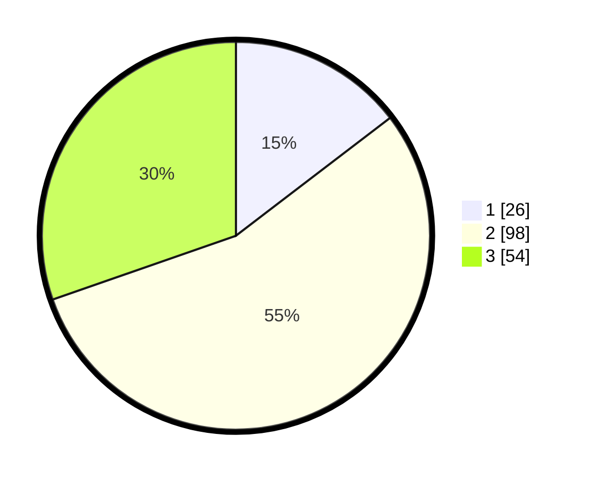

# Hasil

## Grafik

## Tabel

| No. | Nama Paslon    | Suara | Suara (raw) | Persentase |
|:--- |:-------------- | -----:| -----------:| ----------:|
| 1   | ANIES MUHAIMIN | 26    | [26][p-1]   | 14,61      |
| 2   | PRABOWO GIBRAN | 98    | [98][p-2]   | 55,06      |
| 3   | GANJAR MAHFUD  | 54    | [54][p-3]   | 30,34      |

[p-1]: https://github.com/gigit-pemilu/pemilu-2024/blob/main/pilpres/hitung-suara/sub/34-di-yogyakarta/sub/02-bantul/sub/07-pajangan/sub/2003-guwosari/sub/006-tps/sub/paslon-1.txt
[p-2]: https://github.com/gigit-pemilu/pemilu-2024/blob/main/pilpres/hitung-suara/sub/34-di-yogyakarta/sub/02-bantul/sub/07-pajangan/sub/2003-guwosari/sub/006-tps/sub/paslon-2.txt
[p-3]: https://github.com/gigit-pemilu/pemilu-2024/blob/main/pilpres/hitung-suara/sub/34-di-yogyakarta/sub/02-bantul/sub/07-pajangan/sub/2003-guwosari/sub/006-tps/sub/paslon-3.txt

## Foto C Plano

https://sirekap-obj-formc.kpu.go.id/4367/pemilu/ppwp/34/02/07/20/03/3402072003006-20240216-201623--caaa83e5-d298-4fd3-b33e-aed1badfe9e9.jpg

https://sirekap-obj-formc.kpu.go.id/4367/pemilu/ppwp/34/02/07/20/03/3402072003006-20240216-201634--657ec3e1-90c0-4792-abcf-d412e3023b5d.jpg

https://sirekap-obj-formc.kpu.go.id/4367/pemilu/ppwp/34/02/07/20/03/3402072003006-20240216-201642--f2acbc74-d11b-4ba2-a4e7-4e6a9a140ccc.jpg

## Metadata

| Key        | Value               |
| ---------- | ------------------- |
| Time Stamp | 2024-02-25 12:00:00 |

