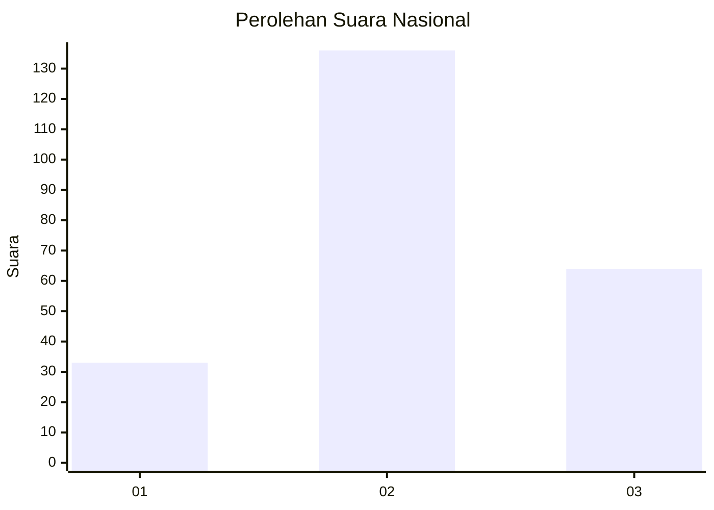
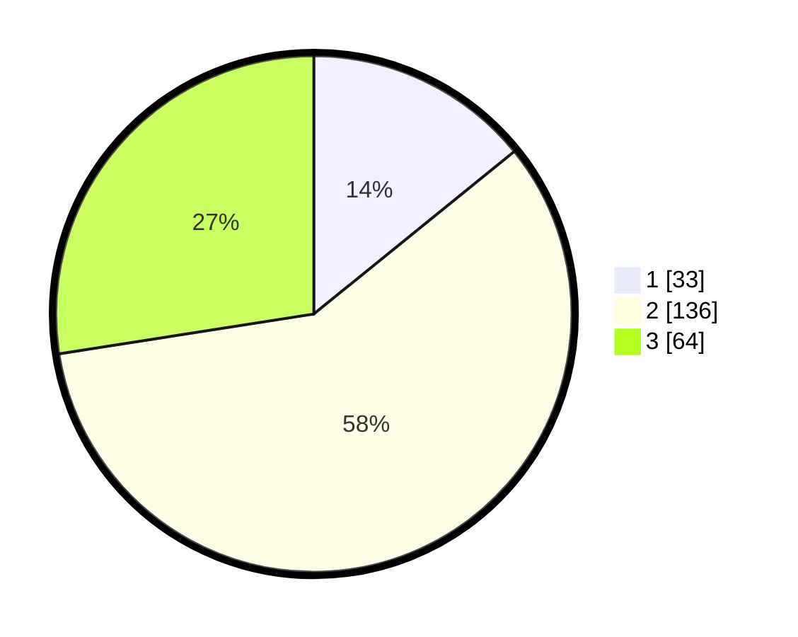

# Hasil

## Grafik

## Tabel

| No. | Nama Paslon    | Suara | Suara (raw) | Persentase |
|:--- |:-------------- | -----:| -----------:| ----------:|
| 1   | ANIES MUHAIMIN | 33    | [33][p-1]   | 14,16      |
| 2   | PRABOWO GIBRAN | 136   | [136][p-2]  | 58,37      |
| 3   | GANJAR MAHFUD  | 64    | [64][p-3]   | 27,47      |

[p-1]: https://github.com/gigit-pemilu/pemilu-2024/blob/main/pilpres/hitung-suara/sub/34-di-yogyakarta/sub/02-bantul/sub/07-pajangan/sub/2003-guwosari/sub/007-tps/sub/paslon-1.txt
[p-2]: https://github.com/gigit-pemilu/pemilu-2024/blob/main/pilpres/hitung-suara/sub/34-di-yogyakarta/sub/02-bantul/sub/07-pajangan/sub/2003-guwosari/sub/007-tps/sub/paslon-2.txt
[p-3]: https://github.com/gigit-pemilu/pemilu-2024/blob/main/pilpres/hitung-suara/sub/34-di-yogyakarta/sub/02-bantul/sub/07-pajangan/sub/2003-guwosari/sub/007-tps/sub/paslon-3.txt

## Foto C Plano

https://sirekap-obj-formc.kpu.go.id/c042/pemilu/ppwp/34/02/07/20/03/3402072003007-20240214-235053--d0223bba-1d25-4267-80d1-5319c595caef.jpg

https://sirekap-obj-formc.kpu.go.id/c042/pemilu/ppwp/34/02/07/20/03/3402072003007-20240214-192524--fdf96dc1-438d-414e-970f-74aa2b03ed38.jpg

https://sirekap-obj-formc.kpu.go.id/c042/pemilu/ppwp/34/02/07/20/03/3402072003007-20240214-192256--7362d37c-b12c-4280-a457-e2d8d153423a.jpg

## Metadata

| Key        | Value               |
| ---------- | ------------------- |
| Time Stamp | 2024-02-24 22:31:28 |

