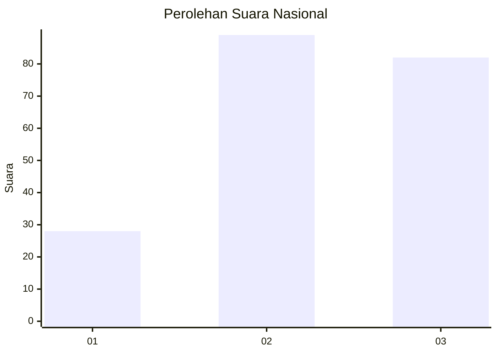
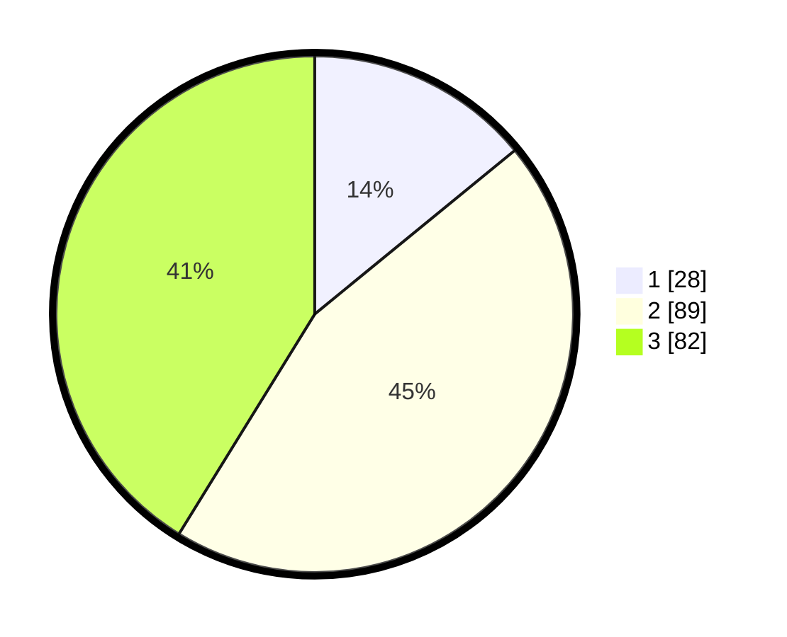

# Hasil

## Grafik

## Tabel

| No. | Nama Paslon    | Suara | Suara (raw) | Persentase |
|:--- |:-------------- | -----:| -----------:| ----------:|
| 1   | ANIES MUHAIMIN | 28    | [28][p-1]   | 14,07      |
| 2   | PRABOWO GIBRAN | 89    | [89][p-2]   | 44,72      |
| 3   | GANJAR MAHFUD  | 82    | [82][p-3]   | 41,21      |

[p-1]: https://github.com/gigit-pemilu/pemilu-2024/blob/main/pilpres/hitung-suara/sub/34-di-yogyakarta/sub/02-bantul/sub/07-pajangan/sub/2003-guwosari/sub/013-tps/sub/paslon-1.txt
[p-2]: https://github.com/gigit-pemilu/pemilu-2024/blob/main/pilpres/hitung-suara/sub/34-di-yogyakarta/sub/02-bantul/sub/07-pajangan/sub/2003-guwosari/sub/013-tps/sub/paslon-2.txt
[p-3]: https://github.com/gigit-pemilu/pemilu-2024/blob/main/pilpres/hitung-suara/sub/34-di-yogyakarta/sub/02-bantul/sub/07-pajangan/sub/2003-guwosari/sub/013-tps/sub/paslon-3.txt

## Foto C Plano

https://sirekap-obj-formc.kpu.go.id/c05f/pemilu/ppwp/34/02/07/20/03/3402072003013-20240216-180921--6f79b2fa-e75e-4d58-a779-639bfaf0de02.jpg

https://sirekap-obj-formc.kpu.go.id/c05f/pemilu/ppwp/34/02/07/20/03/3402072003013-20240216-181534--16f4cfbb-418b-46c5-ac36-627e4017301e.jpg

https://sirekap-obj-formc.kpu.go.id/c05f/pemilu/ppwp/34/02/07/20/03/3402072003013-20240216-181903--c27aa7d9-7e3e-4f7c-8b3f-12cc603b06ce.jpg

## Metadata

| Key        | Value               |
| ---------- | ------------------- |
| Time Stamp | 2024-02-24 22:31:28 |

