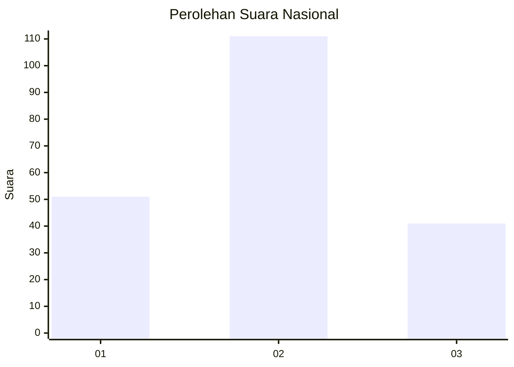
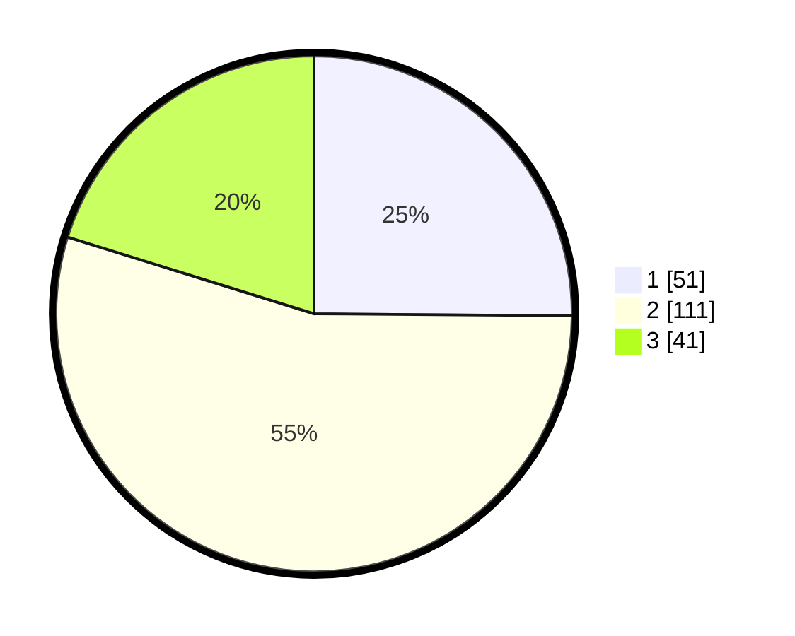

# Hasil

## Grafik

## Tabel

| No. | Nama Paslon    | Suara | Suara (raw) | Persentase |
|:--- |:-------------- | -----:| -----------:| ----------:|
| 1   | ANIES MUHAIMIN | 51    | [51][p-1]   | 25,12      |
| 2   | PRABOWO GIBRAN | 111   | [111][p-2]  | 54,68      |
| 3   | GANJAR MAHFUD  | 41    | [41][p-3]   | 20,20      |

[p-1]: https://github.com/gigit-pemilu/pemilu-2024/blob/main/pilpres/hitung-suara/sub/34-di-yogyakarta/sub/02-bantul/sub/07-pajangan/sub/2003-guwosari/sub/019-tps/sub/paslon-1.txt
[p-2]: https://github.com/gigit-pemilu/pemilu-2024/blob/main/pilpres/hitung-suara/sub/34-di-yogyakarta/sub/02-bantul/sub/07-pajangan/sub/2003-guwosari/sub/019-tps/sub/paslon-2.txt
[p-3]: https://github.com/gigit-pemilu/pemilu-2024/blob/main/pilpres/hitung-suara/sub/34-di-yogyakarta/sub/02-bantul/sub/07-pajangan/sub/2003-guwosari/sub/019-tps/sub/paslon-3.txt

## Foto C Plano

https://sirekap-obj-formc.kpu.go.id/da22/pemilu/ppwp/34/02/07/20/03/3402072003019-20240216-184513--29cb065c-cf60-4e66-b9e7-0b1fda0b28c2.jpg

https://sirekap-obj-formc.kpu.go.id/da22/pemilu/ppwp/34/02/07/20/03/3402072003019-20240216-185142--a801b13c-98b7-4e8d-8a53-5db31044558e.jpg

https://sirekap-obj-formc.kpu.go.id/da22/pemilu/ppwp/34/02/07/20/03/3402072003019-20240216-191712--8cfa8bdd-ff84-4353-a227-f8a7c70427bd.jpg

## Metadata

| Key        | Value               |
| ---------- | ------------------- |
| Time Stamp | 2024-02-25 12:00:00 |

