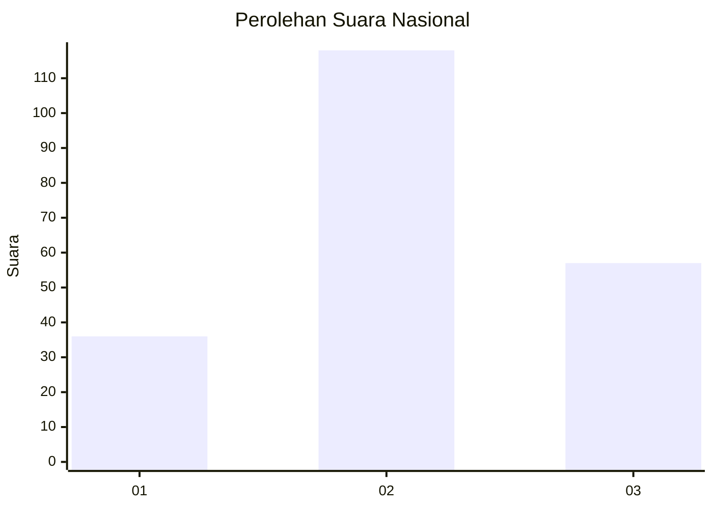
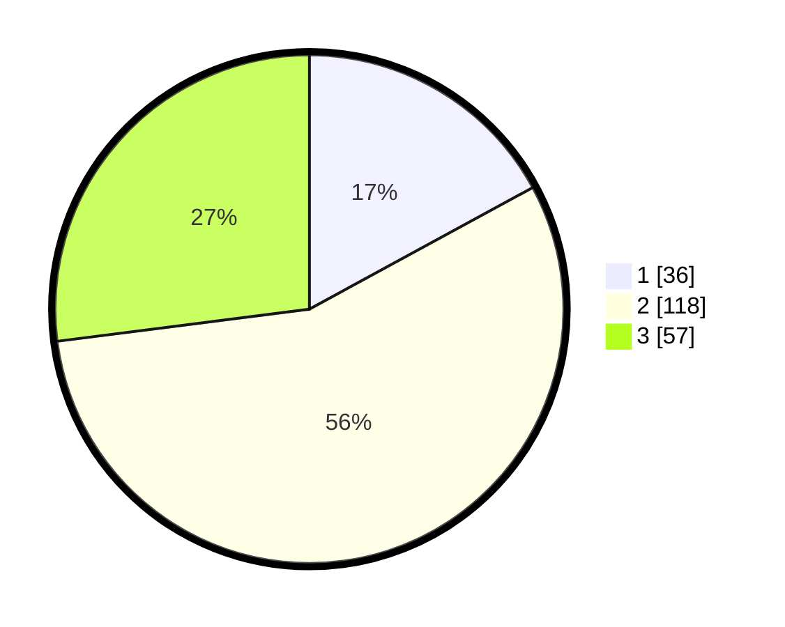

# Hasil

## Grafik

## Tabel

| No. | Nama Paslon    | Suara | Suara (raw) | Persentase |
|:--- |:-------------- | -----:| -----------:| ----------:|
| 1   | ANIES MUHAIMIN | 36    | [36][p-1]   | 17,06      |
| 2   | PRABOWO GIBRAN | 118   | [118][p-2]  | 55,92      |
| 3   | GANJAR MAHFUD  | 57    | [57][p-3]   | 27,01      |

[p-1]: https://github.com/gigit-pemilu/pemilu-2024/blob/main/pilpres/hitung-suara/sub/34-di-yogyakarta/sub/02-bantul/sub/07-pajangan/sub/2003-guwosari/sub/020-tps/sub/paslon-1.txt
[p-2]: https://github.com/gigit-pemilu/pemilu-2024/blob/main/pilpres/hitung-suara/sub/34-di-yogyakarta/sub/02-bantul/sub/07-pajangan/sub/2003-guwosari/sub/020-tps/sub/paslon-2.txt
[p-3]: https://github.com/gigit-pemilu/pemilu-2024/blob/main/pilpres/hitung-suara/sub/34-di-yogyakarta/sub/02-bantul/sub/07-pajangan/sub/2003-guwosari/sub/020-tps/sub/paslon-3.txt

## Foto C Plano

https://sirekap-obj-formc.kpu.go.id/365e/pemilu/ppwp/34/02/07/20/03/3402072003020-20240214-234216--39fc9fac-8fb4-4c07-80ca-2d575d16f460.jpg

https://sirekap-obj-formc.kpu.go.id/365e/pemilu/ppwp/34/02/07/20/03/3402072003020-20240214-234343--a8087b0f-832e-4367-9b2f-8ae55a86d35d.jpg

https://sirekap-obj-formc.kpu.go.id/365e/pemilu/ppwp/34/02/07/20/03/3402072003020-20240214-234513--87a64cc6-92f2-490b-8d6e-9128fea75cc8.jpg

## Metadata

| Key        | Value               |
| ---------- | ------------------- |
| Time Stamp | 2024-02-25 12:00:00 |

