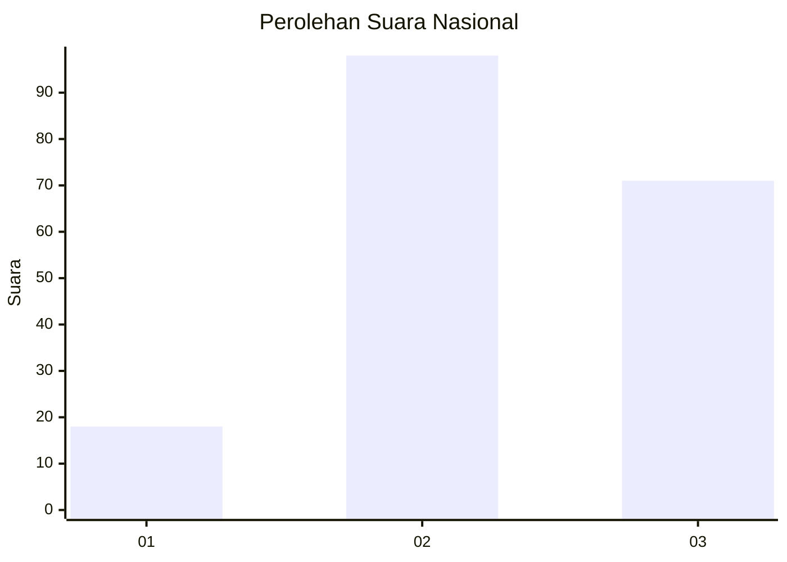
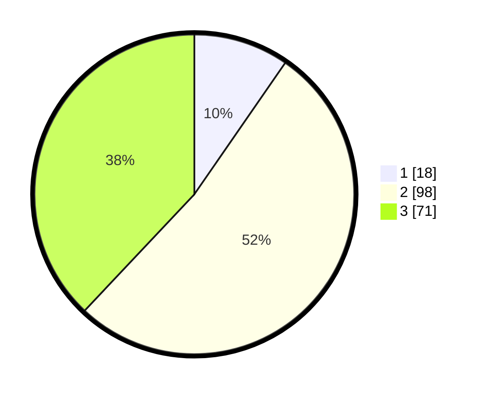

# Hasil

## Grafik

## Tabel

| No. | Nama Paslon    | Suara | Suara (raw) | Persentase |
|:--- |:-------------- | -----:| -----------:| ----------:|
| 1   | ANIES MUHAIMIN | 18    | [18][p-1]   | 9,63       |
| 2   | PRABOWO GIBRAN | 98    | [98][p-2]   | 52,41      |
| 3   | GANJAR MAHFUD  | 71    | [71][p-3]   | 37,97      |

[p-1]: https://github.com/gigit-pemilu/pemilu-2024/blob/main/pilpres/hitung-suara/sub/34-di-yogyakarta/sub/02-bantul/sub/07-pajangan/sub/2003-guwosari/sub/022-tps/sub/paslon-1.txt
[p-2]: https://github.com/gigit-pemilu/pemilu-2024/blob/main/pilpres/hitung-suara/sub/34-di-yogyakarta/sub/02-bantul/sub/07-pajangan/sub/2003-guwosari/sub/022-tps/sub/paslon-2.txt
[p-3]: https://github.com/gigit-pemilu/pemilu-2024/blob/main/pilpres/hitung-suara/sub/34-di-yogyakarta/sub/02-bantul/sub/07-pajangan/sub/2003-guwosari/sub/022-tps/sub/paslon-3.txt

## Foto C Plano

https://sirekap-obj-formc.kpu.go.id/ec70/pemilu/ppwp/34/02/07/20/03/3402072003022-20240214-234432--7c1a774f-0c39-42b3-9e35-42a8add1b542.jpg

https://sirekap-obj-formc.kpu.go.id/ec70/pemilu/ppwp/34/02/07/20/03/3402072003022-20240214-234610--5a4d9eba-fc15-4558-b1a0-92e8a32a4a9d.jpg

https://sirekap-obj-formc.kpu.go.id/ec70/pemilu/ppwp/34/02/07/20/03/3402072003022-20240214-234644--53a4da70-4539-43d0-92f2-17b1365dad71.jpg

## Metadata

| Key        | Value               |
| ---------- | ------------------- |
| Time Stamp | 2024-02-24 22:31:28 |

