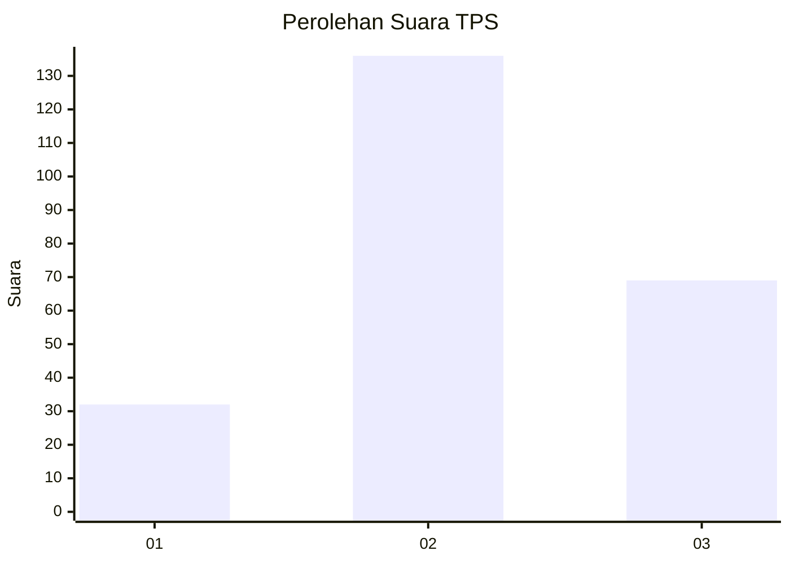
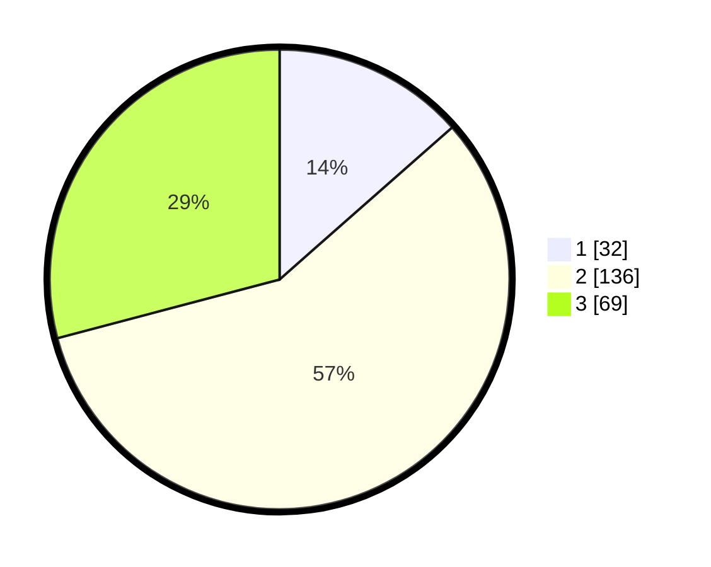

# Hasil

## Grafik

## Tabel

| No. | Nama Paslon    | Suara | Suara (raw) | Persentase |
|:--- |:-------------- | -----:| -----------:| ----------:|
| 1   | ANIES MUHAIMIN | 32    | [32][p-1]   | 13,50      |
| 2   | PRABOWO GIBRAN | 136   | [136][p-2]  | 57,38      |
| 3   | GANJAR MAHFUD  | 69    | [69][p-3]   | 29,11      |

[p-1]: https://github.com/gigit-pemilu/pemilu-2024-34-di-yogyakarta/blob/main/pilpres/hitung-suara/sub/34-di-yogyakarta/sub/02-bantul/sub/07-pajangan/sub/2003-guwosari/sub/023-tps/sub/paslon-1.txt
[p-2]: https://github.com/gigit-pemilu/pemilu-2024-34-di-yogyakarta/blob/main/pilpres/hitung-suara/sub/34-di-yogyakarta/sub/02-bantul/sub/07-pajangan/sub/2003-guwosari/sub/023-tps/sub/paslon-2.txt
[p-3]: https://github.com/gigit-pemilu/pemilu-2024-34-di-yogyakarta/blob/main/pilpres/hitung-suara/sub/34-di-yogyakarta/sub/02-bantul/sub/07-pajangan/sub/2003-guwosari/sub/023-tps/sub/paslon-3.txt

## Foto C Plano

https://sirekap-obj-formc.kpu.go.id/57a2/pemilu/ppwp/34/02/07/20/03/3402072003023-20240214-230958--21c96280-e2f4-4e97-8e22-6f62a4ce9984.jpg

https://sirekap-obj-formc.kpu.go.id/57a2/pemilu/ppwp/34/02/07/20/03/3402072003023-20240214-231439--65ba9e37-fb09-4354-afbd-3fb6e9a2635e.jpg

https://sirekap-obj-formc.kpu.go.id/57a2/pemilu/ppwp/34/02/07/20/03/3402072003023-20240214-232219--d49f2a78-3d93-415a-952b-c04f0a6d3174.jpg

## Metadata

| Key        | Value               |
| ---------- | ------------------- |
| Time Stamp | 2024-02-25 11:00:00 |

