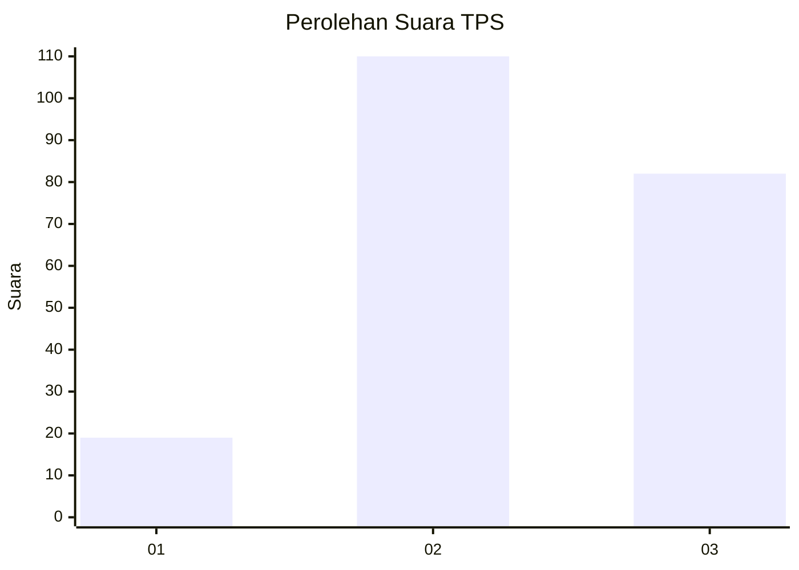
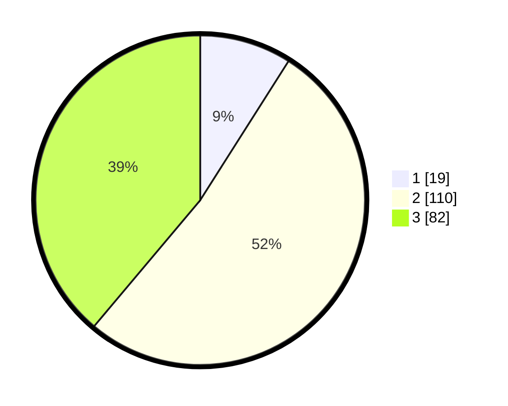

# Hasil

## Grafik

## Tabel

| No. | Nama Paslon    | Suara | Suara (raw) | Persentase |
|:--- |:-------------- | -----:| -----------:| ----------:|
| 1   | ANIES MUHAIMIN | 19    | [19][p-1]   | 9,00       |
| 2   | PRABOWO GIBRAN | 110   | [110][p-2]  | 52,13      |
| 3   | GANJAR MAHFUD  | 82    | [82][p-3]   | 38,86      |

[p-1]: https://github.com/gigit-pemilu/pemilu-2024-34-di-yogyakarta/blob/main/pilpres/hitung-suara/sub/34-di-yogyakarta/sub/02-bantul/sub/07-pajangan/sub/2003-guwosari/sub/024-tps/sub/paslon-1.txt
[p-2]: https://github.com/gigit-pemilu/pemilu-2024-34-di-yogyakarta/blob/main/pilpres/hitung-suara/sub/34-di-yogyakarta/sub/02-bantul/sub/07-pajangan/sub/2003-guwosari/sub/024-tps/sub/paslon-2.txt
[p-3]: https://github.com/gigit-pemilu/pemilu-2024-34-di-yogyakarta/blob/main/pilpres/hitung-suara/sub/34-di-yogyakarta/sub/02-bantul/sub/07-pajangan/sub/2003-guwosari/sub/024-tps/sub/paslon-3.txt

## Foto C Plano

https://sirekap-obj-formc.kpu.go.id/1390/pemilu/ppwp/34/02/07/20/03/3402072003024-20240214-232427--ef6cc984-0c63-456d-9b70-a370bcc00aed.jpg

https://sirekap-obj-formc.kpu.go.id/1390/pemilu/ppwp/34/02/07/20/03/3402072003024-20240214-232525--6fbc852f-365a-43cd-b14e-13759a465534.jpg

https://sirekap-obj-formc.kpu.go.id/1390/pemilu/ppwp/34/02/07/20/03/3402072003024-20240214-232635--dd262cf9-d99b-4ba1-9e7a-09d4eab1482d.jpg

## Metadata

| Key        | Value               |
| ---------- | ------------------- |
| Time Stamp | 2024-02-24 22:31:28 |

