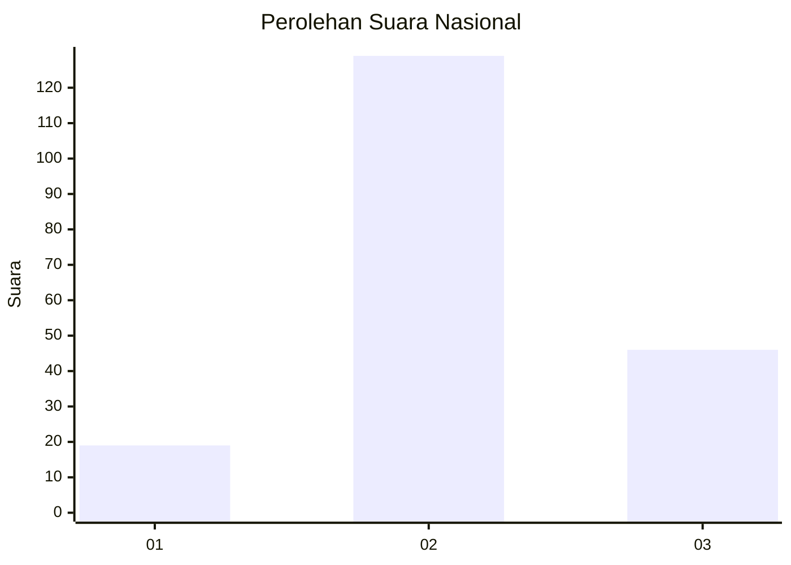
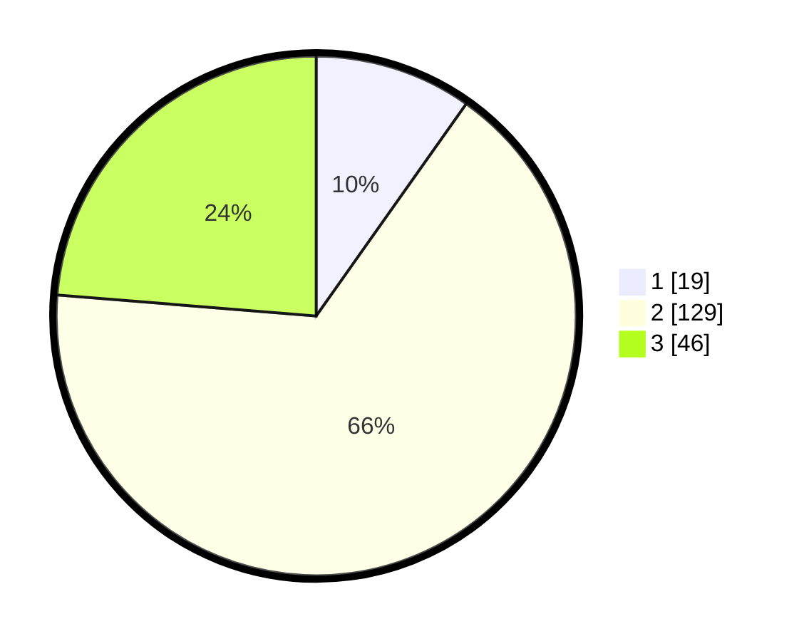

# Hasil

## Grafik

## Tabel

| No. | Nama Paslon    | Suara | Suara (raw) | Persentase |
|:--- |:-------------- | -----:| -----------:| ----------:|
| 1   | ANIES MUHAIMIN | 19    | [19][p-1]   | 9,79       |
| 2   | PRABOWO GIBRAN | 129   | [129][p-2]  | 66,49      |
| 3   | GANJAR MAHFUD  | 46    | [46][p-3]   | 23,71      |

[p-1]: https://github.com/gigit-pemilu/pemilu-2024/blob/main/pilpres/hitung-suara/sub/34-di-yogyakarta/sub/02-bantul/sub/07-pajangan/sub/2003-guwosari/sub/034-tps/sub/paslon-1.txt
[p-2]: https://github.com/gigit-pemilu/pemilu-2024/blob/main/pilpres/hitung-suara/sub/34-di-yogyakarta/sub/02-bantul/sub/07-pajangan/sub/2003-guwosari/sub/034-tps/sub/paslon-2.txt
[p-3]: https://github.com/gigit-pemilu/pemilu-2024/blob/main/pilpres/hitung-suara/sub/34-di-yogyakarta/sub/02-bantul/sub/07-pajangan/sub/2003-guwosari/sub/034-tps/sub/paslon-3.txt

## Foto C Plano

https://sirekap-obj-formc.kpu.go.id/da54/pemilu/ppwp/34/02/07/20/03/3402072003034-20240214-231122--0da94646-1522-420b-ad5a-38375fafee77.jpg

https://sirekap-obj-formc.kpu.go.id/da54/pemilu/ppwp/34/02/07/20/03/3402072003034-20240214-231158--814b3231-b837-469c-a411-fe43bbc47e6d.jpg

https://sirekap-obj-formc.kpu.go.id/da54/pemilu/ppwp/34/02/07/20/03/3402072003034-20240214-231312--b8943e64-2163-4ab7-9cfb-e65f3a4da177.jpg

## Metadata

| Key        | Value               |
| ---------- | ------------------- |
| Time Stamp | 2024-02-17 14:45:18 |

