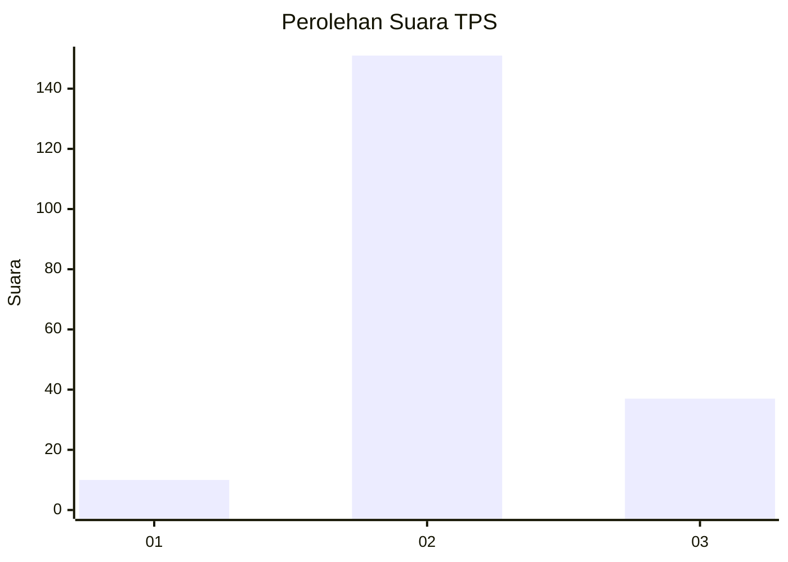
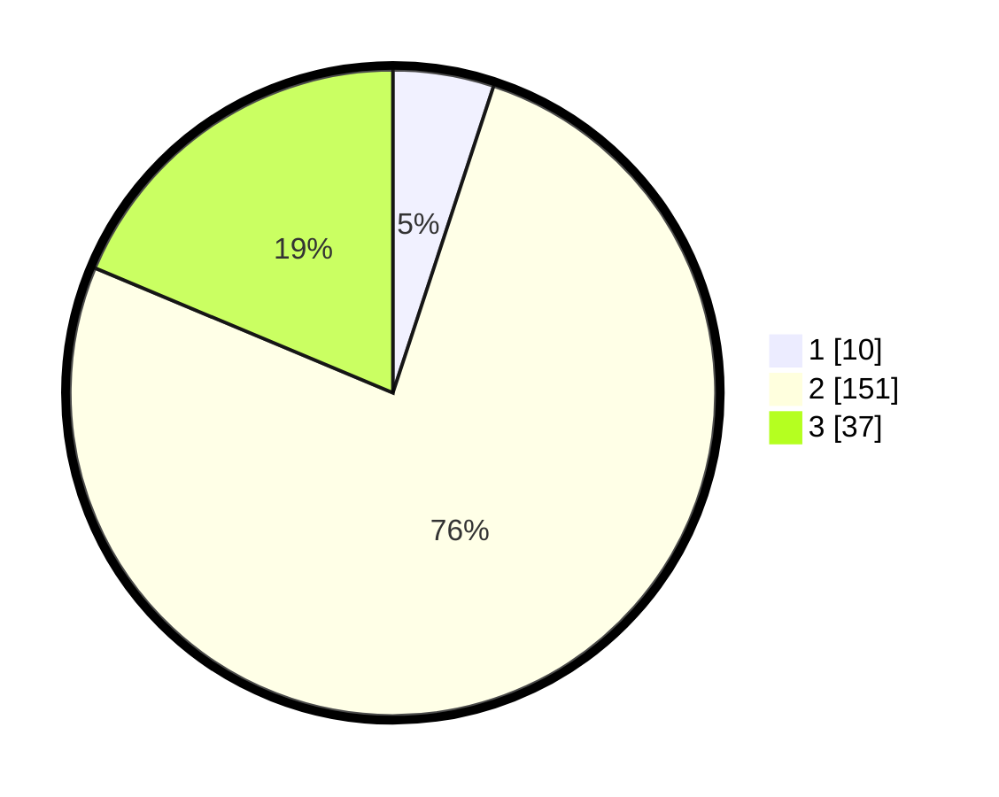

# Hasil

## Grafik

## Tabel

| No. | Nama Paslon    | Suara | Suara (raw) | Persentase |
|:--- |:-------------- | -----:| -----------:| ----------:|
| 1   | ANIES MUHAIMIN | 10    | [10][p-1]   | 5,05       |
| 2   | PRABOWO GIBRAN | 151   | [151][p-2]  | 76,26      |
| 3   | GANJAR MAHFUD  | 37    | [37][p-3]   | 18,69      |

[p-1]: https://github.com/gigit-pemilu/pemilu-2024-34-di-yogyakarta/blob/main/pilpres/hitung-suara/sub/34-di-yogyakarta/sub/02-bantul/sub/07-pajangan/sub/2003-guwosari/sub/035-tps/sub/paslon-1.txt
[p-2]: https://github.com/gigit-pemilu/pemilu-2024-34-di-yogyakarta/blob/main/pilpres/hitung-suara/sub/34-di-yogyakarta/sub/02-bantul/sub/07-pajangan/sub/2003-guwosari/sub/035-tps/sub/paslon-2.txt
[p-3]: https://github.com/gigit-pemilu/pemilu-2024-34-di-yogyakarta/blob/main/pilpres/hitung-suara/sub/34-di-yogyakarta/sub/02-bantul/sub/07-pajangan/sub/2003-guwosari/sub/035-tps/sub/paslon-3.txt

## Foto C Plano

https://sirekap-obj-formc.kpu.go.id/93ff/pemilu/ppwp/34/02/07/20/03/3402072003035-20240214-231423--4ddda1fd-885d-4c8a-8e77-1edd57bea3a1.jpg

https://sirekap-obj-formc.kpu.go.id/93ff/pemilu/ppwp/34/02/07/20/03/3402072003035-20240214-231509--7c692d24-b8c0-4528-9448-ba1f7f4f5df7.jpg

https://sirekap-obj-formc.kpu.go.id/93ff/pemilu/ppwp/34/02/07/20/03/3402072003035-20240214-231546--c2dabaae-344b-48eb-ac4f-de9c00863964.jpg

## Metadata

| Key        | Value               |
| ---------- | ------------------- |
| Time Stamp | 2024-02-24 22:31:28 |

