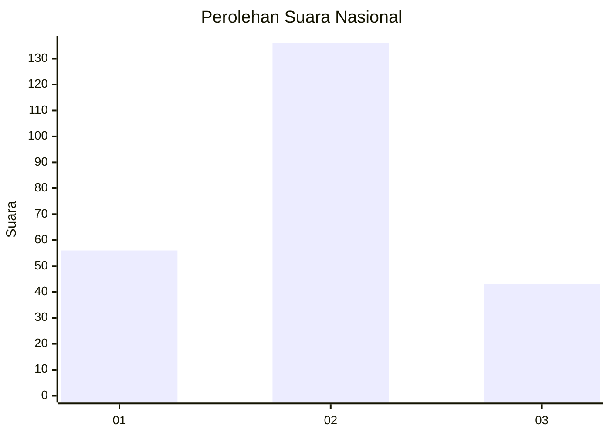
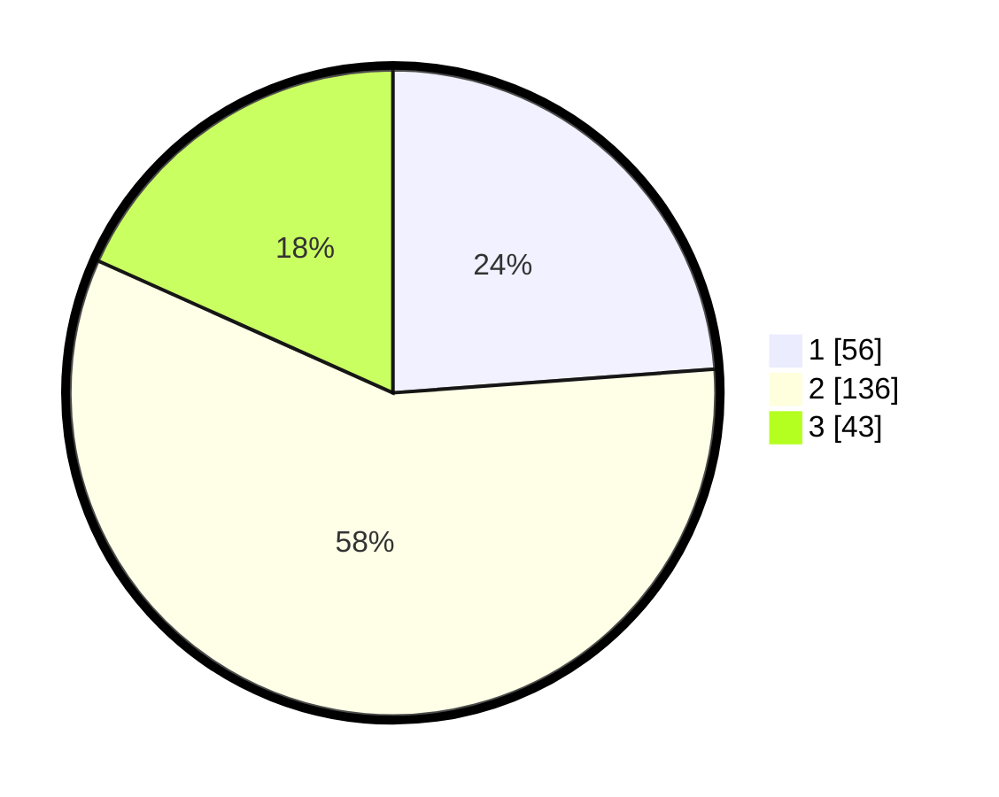

# Hasil

## Grafik

## Tabel

| No. | Nama Paslon    | Suara | Suara (raw) | Persentase |
|:--- |:-------------- | -----:| -----------:| ----------:|
| 1   | ANIES MUHAIMIN | 56    | [56][p-1]   | 23,83      |
| 2   | PRABOWO GIBRAN | 136   | [136][p-2]  | 57,87      |
| 3   | GANJAR MAHFUD  | 43    | [43][p-3]   | 18,30      |

[p-1]: https://github.com/gigit-pemilu/pemilu-2024/blob/main/pilpres/hitung-suara/sub/34-di-yogyakarta/sub/02-bantul/sub/07-pajangan/sub/2003-guwosari/sub/038-tps/sub/paslon-1.txt
[p-2]: https://github.com/gigit-pemilu/pemilu-2024/blob/main/pilpres/hitung-suara/sub/34-di-yogyakarta/sub/02-bantul/sub/07-pajangan/sub/2003-guwosari/sub/038-tps/sub/paslon-2.txt
[p-3]: https://github.com/gigit-pemilu/pemilu-2024/blob/main/pilpres/hitung-suara/sub/34-di-yogyakarta/sub/02-bantul/sub/07-pajangan/sub/2003-guwosari/sub/038-tps/sub/paslon-3.txt

## Foto C Plano

https://sirekap-obj-formc.kpu.go.id/0875/pemilu/ppwp/34/02/07/20/03/3402072003038-20240214-155314--78682e06-4ac1-4f3e-bf33-c933e726830b.jpg

https://sirekap-obj-formc.kpu.go.id/0875/pemilu/ppwp/34/02/07/20/03/3402072003038-20240214-155423--983ce174-953a-4021-ab26-34a6d5b99de8.jpg

https://sirekap-obj-formc.kpu.go.id/0875/pemilu/ppwp/34/02/07/20/03/3402072003038-20240214-155703--cc1b1849-eb8e-4bef-b7ef-525d5aea0d1e.jpg

## Metadata

| Key        | Value               |
| ---------- | ------------------- |
| Time Stamp | 2024-02-24 22:31:28 |

