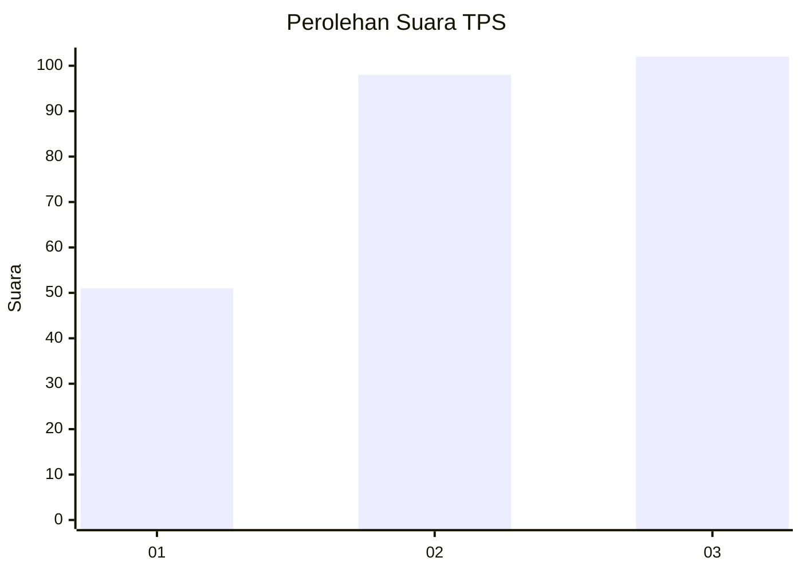
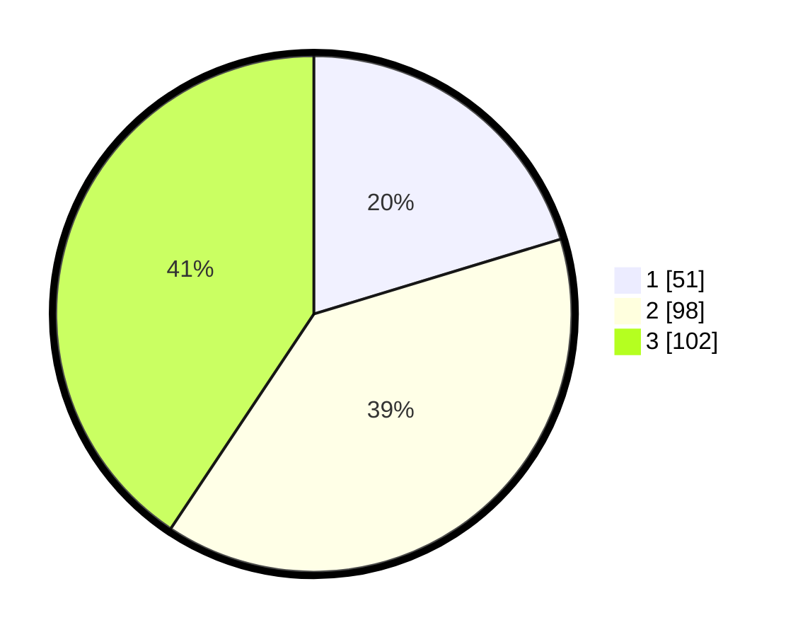

# Hasil

## Grafik

## Tabel

| No. | Nama Paslon    | Suara | Suara (raw) | Persentase |
|:--- |:-------------- | -----:| -----------:| ----------:|
| 1   | ANIES MUHAIMIN | 51    | [51][p-1]   | 20,32      |
| 2   | PRABOWO GIBRAN | 98    | [98][p-2]   | 39,04      |
| 3   | GANJAR MAHFUD  | 102   | [102][p-3]  | 40,64      |

[p-1]: https://github.com/gigit-pemilu/pemilu-2024-34-di-yogyakarta/blob/main/pilpres/hitung-suara/sub/34-di-yogyakarta/sub/02-bantul/sub/07-pajangan/sub/2003-guwosari/sub/041-tps/sub/paslon-1.txt
[p-2]: https://github.com/gigit-pemilu/pemilu-2024-34-di-yogyakarta/blob/main/pilpres/hitung-suara/sub/34-di-yogyakarta/sub/02-bantul/sub/07-pajangan/sub/2003-guwosari/sub/041-tps/sub/paslon-2.txt
[p-3]: https://github.com/gigit-pemilu/pemilu-2024-34-di-yogyakarta/blob/main/pilpres/hitung-suara/sub/34-di-yogyakarta/sub/02-bantul/sub/07-pajangan/sub/2003-guwosari/sub/041-tps/sub/paslon-3.txt

## Foto C Plano

https://sirekap-obj-formc.kpu.go.id/86cf/pemilu/ppwp/34/02/07/20/03/3402072003041-20240215-002724--dfa34ce7-e807-4fc7-9110-c25080bf4178.jpg

https://sirekap-obj-formc.kpu.go.id/86cf/pemilu/ppwp/34/02/07/20/03/3402072003041-20240214-192005--3247ac5c-eb2d-4273-bf1e-7636af2b3695.jpg

https://sirekap-obj-formc.kpu.go.id/86cf/pemilu/ppwp/34/02/07/20/03/3402072003041-20240215-003009--cd4253c5-2190-4479-883c-963e877d4533.jpg

## Metadata

| Key        | Value               |
| ---------- | ------------------- |
| Time Stamp | 2024-02-15 09:00:24 |

