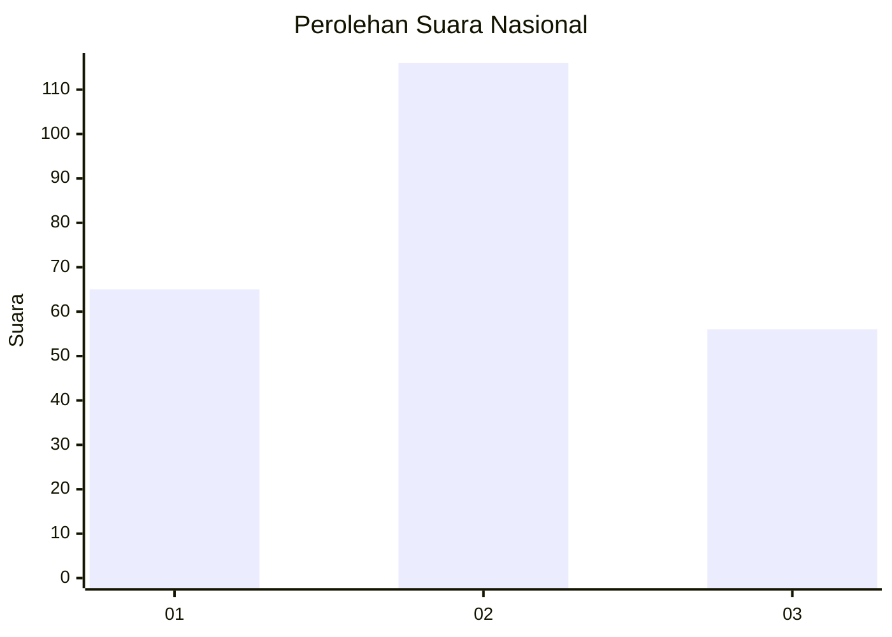
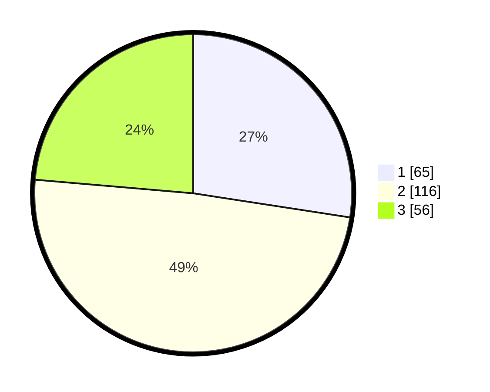

# Hasil

## Grafik

## Tabel

| No. | Nama Paslon    | Suara | Suara (raw) | Persentase |
|:--- |:-------------- | -----:| -----------:| ----------:|
| 1   | ANIES MUHAIMIN | 65    | [65][p-1]   | 27,43      |
| 2   | PRABOWO GIBRAN | 116   | [116][p-2]  | 48,95      |
| 3   | GANJAR MAHFUD  | 56    | [56][p-3]   | 23,63      |

[p-1]: https://github.com/gigit-pemilu/pemilu-2024/blob/main/pilpres/hitung-suara/sub/34-di-yogyakarta/sub/02-bantul/sub/07-pajangan/sub/2003-guwosari/sub/042-tps/sub/paslon-1.txt
[p-2]: https://github.com/gigit-pemilu/pemilu-2024/blob/main/pilpres/hitung-suara/sub/34-di-yogyakarta/sub/02-bantul/sub/07-pajangan/sub/2003-guwosari/sub/042-tps/sub/paslon-2.txt
[p-3]: https://github.com/gigit-pemilu/pemilu-2024/blob/main/pilpres/hitung-suara/sub/34-di-yogyakarta/sub/02-bantul/sub/07-pajangan/sub/2003-guwosari/sub/042-tps/sub/paslon-3.txt

## Foto C Plano

https://sirekap-obj-formc.kpu.go.id/2622/pemilu/ppwp/34/02/07/20/03/3402072003042-20240214-155018--9fbf271e-d12d-4892-8548-e767ae59cba8.jpg

https://sirekap-obj-formc.kpu.go.id/2622/pemilu/ppwp/34/02/07/20/03/3402072003042-20240214-155206--7922cf16-ca8a-429e-964e-d49b4da44b24.jpg

https://sirekap-obj-formc.kpu.go.id/2622/pemilu/ppwp/34/02/07/20/03/3402072003042-20240214-155432--7928ed92-e8d9-4db3-966f-e67c6b90df55.jpg

## Metadata

| Key        | Value               |
| ---------- | ------------------- |
| Time Stamp | 2024-02-14 21:46:01 |

