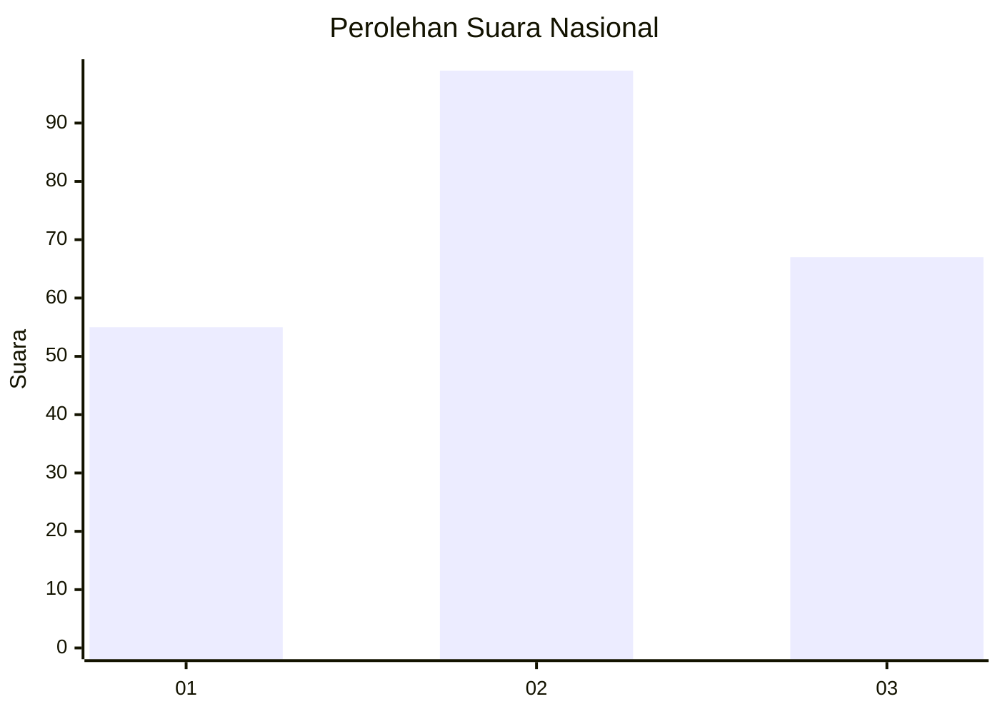
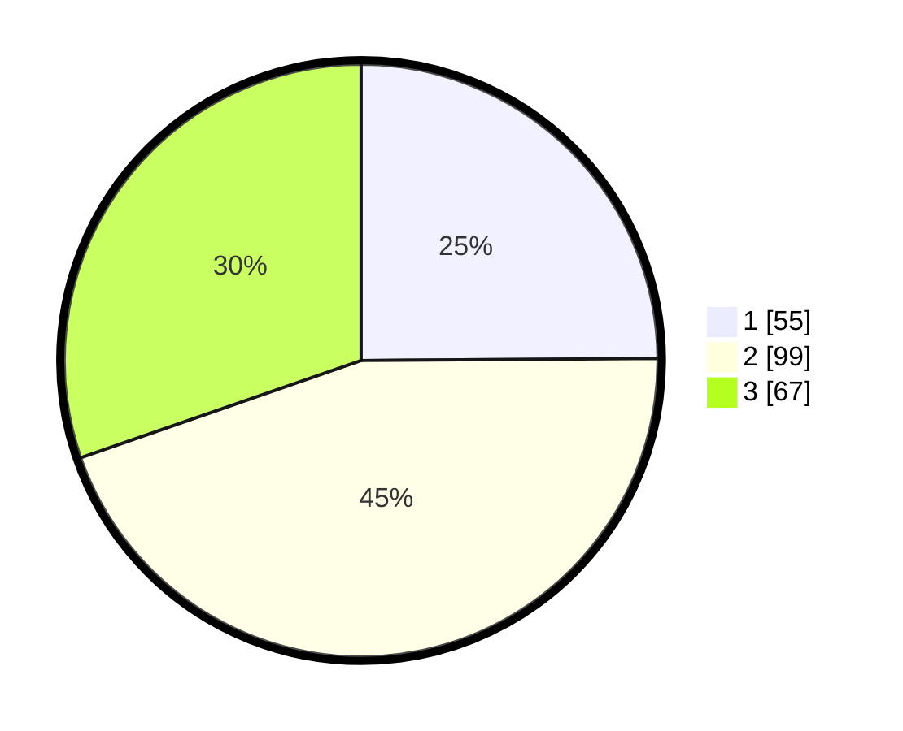

# Hasil

## Grafik

## Tabel

| No. | Nama Paslon    | Suara | Suara (raw) | Persentase |
|:--- |:-------------- | -----:| -----------:| ----------:|
| 1   | ANIES MUHAIMIN | 55    | [55][p-1]   | 24,89      |
| 2   | PRABOWO GIBRAN | 99    | [99][p-2]   | 44,80      |
| 3   | GANJAR MAHFUD  | 67    | [67][p-3]   | 30,32      |

[p-1]: https://github.com/gigit-pemilu/pemilu-2024/blob/main/pilpres/hitung-suara/sub/34-di-yogyakarta/sub/02-bantul/sub/07-pajangan/sub/2003-guwosari/sub/044-tps/sub/paslon-1.txt
[p-2]: https://github.com/gigit-pemilu/pemilu-2024/blob/main/pilpres/hitung-suara/sub/34-di-yogyakarta/sub/02-bantul/sub/07-pajangan/sub/2003-guwosari/sub/044-tps/sub/paslon-2.txt
[p-3]: https://github.com/gigit-pemilu/pemilu-2024/blob/main/pilpres/hitung-suara/sub/34-di-yogyakarta/sub/02-bantul/sub/07-pajangan/sub/2003-guwosari/sub/044-tps/sub/paslon-3.txt

## Foto C Plano

https://sirekap-obj-formc.kpu.go.id/a0cd/pemilu/ppwp/34/02/07/20/03/3402072003044-20240216-123453--33a81893-ff89-49d0-a70c-c5b9d2c4f5b6.jpg

https://sirekap-obj-formc.kpu.go.id/a0cd/pemilu/ppwp/34/02/07/20/03/3402072003044-20240216-123657--a4b2c481-0f32-4ab5-a7f3-80d77f231099.jpg

https://sirekap-obj-formc.kpu.go.id/a0cd/pemilu/ppwp/34/02/07/20/03/3402072003044-20240214-213603--91f7cea1-330e-4515-9294-3182244cb06b.jpg

## Metadata

| Key        | Value               |
| ---------- | ------------------- |
| Time Stamp | 2024-02-25 16:00:00 |

