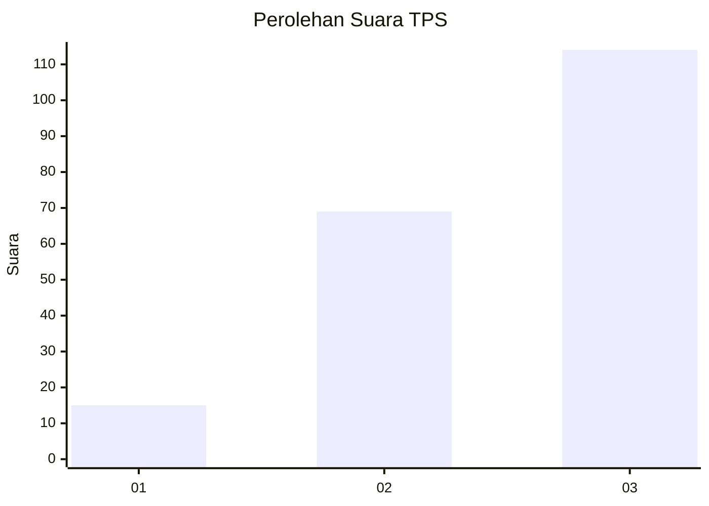
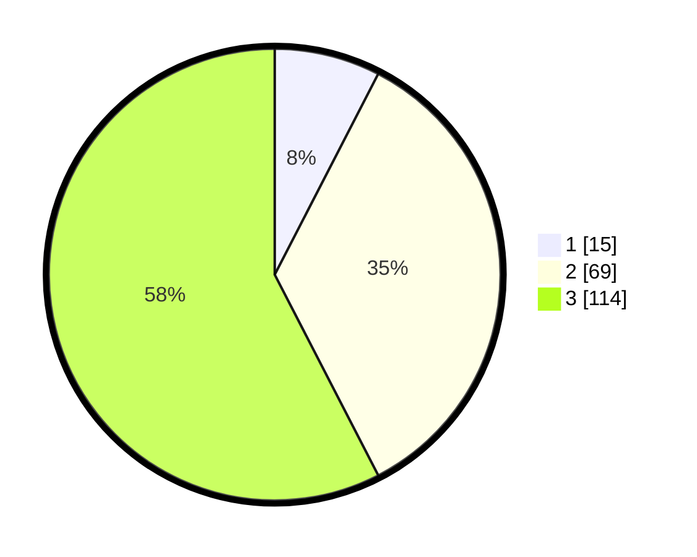

# Hasil

## Grafik

## Tabel

| No. | Nama Paslon    | Suara | Suara (raw) | Persentase |
|:--- |:-------------- | -----:| -----------:| ----------:|
| 1   | ANIES MUHAIMIN | 15    | [15][p-1]   | 7,58       |
| 2   | PRABOWO GIBRAN | 69    | [69][p-2]   | 34,85      |
| 3   | GANJAR MAHFUD  | 114   | [114][p-3]  | 57,58      |

[p-1]: https://github.com/gigit-pemilu/pemilu-2024-34-di-yogyakarta/blob/main/pilpres/hitung-suara/sub/34-di-yogyakarta/sub/02-bantul/sub/07-pajangan/sub/2003-guwosari/sub/901-tps/sub/paslon-1.txt
[p-2]: https://github.com/gigit-pemilu/pemilu-2024-34-di-yogyakarta/blob/main/pilpres/hitung-suara/sub/34-di-yogyakarta/sub/02-bantul/sub/07-pajangan/sub/2003-guwosari/sub/901-tps/sub/paslon-2.txt
[p-3]: https://github.com/gigit-pemilu/pemilu-2024-34-di-yogyakarta/blob/main/pilpres/hitung-suara/sub/34-di-yogyakarta/sub/02-bantul/sub/07-pajangan/sub/2003-guwosari/sub/901-tps/sub/paslon-3.txt

## Foto C Plano

https://sirekap-obj-formc.kpu.go.id/aefa/pemilu/ppwp/34/02/07/20/03/3402072003901-20240216-110231--036af188-44af-4b74-8701-62b983e2a789.jpg

https://sirekap-obj-formc.kpu.go.id/aefa/pemilu/ppwp/34/02/07/20/03/3402072003901-20240216-105951--b8067f02-f10c-4425-a769-8e9197d86edd.jpg

https://sirekap-obj-formc.kpu.go.id/aefa/pemilu/ppwp/34/02/07/20/03/3402072003901-20240216-131045--d097f377-84d5-43a1-ba82-2f09f4f0540a.jpg

## Metadata

| Key        | Value               |
| ---------- | ------------------- |
| Time Stamp | 2024-02-20 11:00:00 |

## DATA PEMILIH TETAP

Jumlah pemilih dalam DPT: **206**.
 * L: **204**.
 * P: **2**.

## DATA PENGGUNA HAK PILIH

Jumlah pengguna hak pilih dalam DPT: **24**.
 * L: **23**.
 * P: **1**.

Jumlah pengguna hak pilih dalam DPTb: **180**.
 * L: **178**.
 * P: **2**.

Jumlah pengguna hak pilih dalam DPK: **0**.
 * L: **0**.
 * P: **0**.

Jumlah pengguna hak pilih: **204**.
 * L: **201**.
 * P: **3**.

## JUMLAH SUARA SAH DAN TIDAK SAH

JUMLAH SELURUH SUARA SAH: **198**.

JUMLAH SUARA TIDAK SAH: **6**.

JUMLAH SELURUH SUARA SAH DAN SUARA TIDAK SAH: **204**.

