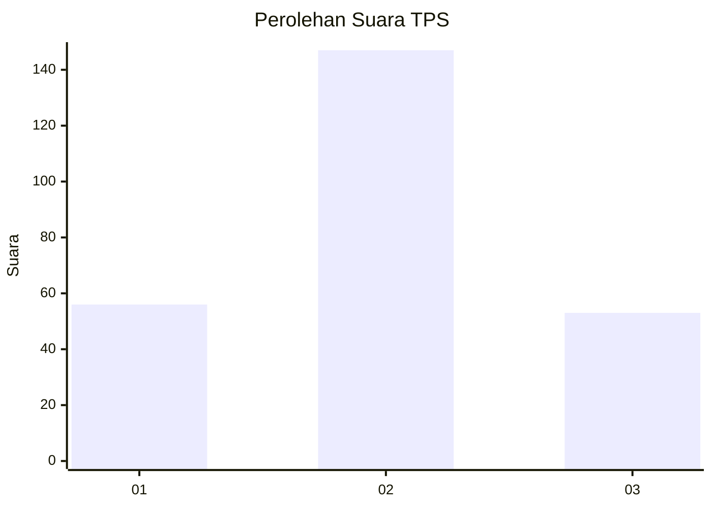
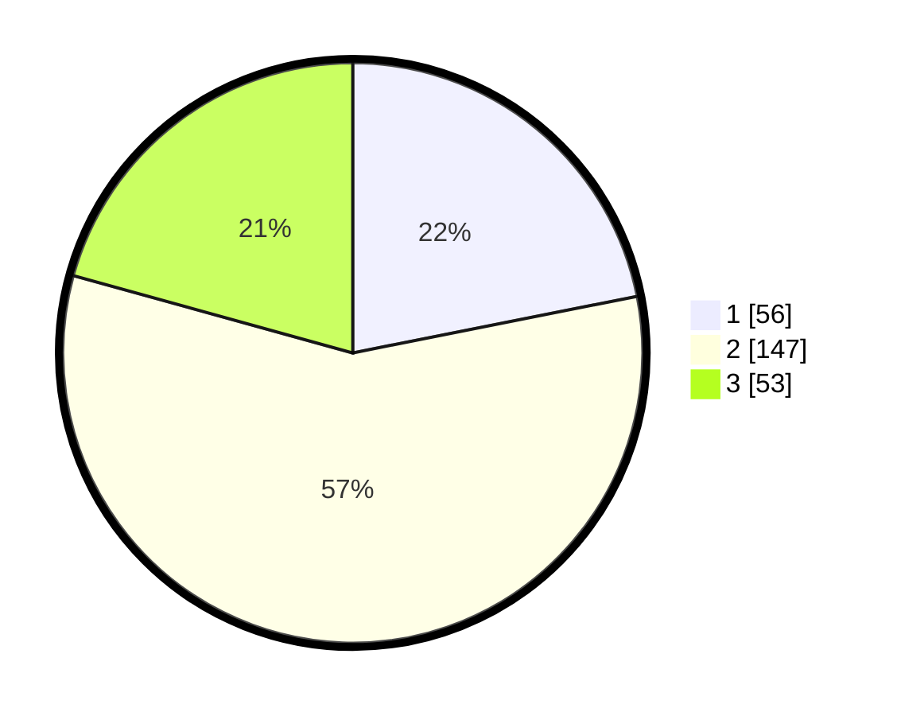

# Hasil

## Grafik

## Tabel

| No. | Nama Paslon    | Suara | Suara (raw) | Persentase |
|:--- |:-------------- | -----:| -----------:| ----------:|
| 1   | ANIES MUHAIMIN | 56    | [56][p-1]   | 21,88      |
| 2   | PRABOWO GIBRAN | 147   | [147][p-2]  | 57,42      |
| 3   | GANJAR MAHFUD  | 53    | [53][p-3]   | 20,70      |

[p-1]: https://github.com/gigit-pemilu/pemilu-2024-34-di-yogyakarta/blob/main/pilpres/hitung-suara/sub/34-di-yogyakarta/sub/02-bantul/sub/08-bantul/sub/2001-palbapang/sub/002-tps/sub/paslon-1.txt
[p-2]: https://github.com/gigit-pemilu/pemilu-2024-34-di-yogyakarta/blob/main/pilpres/hitung-suara/sub/34-di-yogyakarta/sub/02-bantul/sub/08-bantul/sub/2001-palbapang/sub/002-tps/sub/paslon-2.txt
[p-3]: https://github.com/gigit-pemilu/pemilu-2024-34-di-yogyakarta/blob/main/pilpres/hitung-suara/sub/34-di-yogyakarta/sub/02-bantul/sub/08-bantul/sub/2001-palbapang/sub/002-tps/sub/paslon-3.txt

## Foto C Plano

https://sirekap-obj-formc.kpu.go.id/6606/pemilu/ppwp/34/02/08/20/01/3402082001002-20240214-221047--8f773323-69c3-473a-8331-e7082fd3524c.jpg

https://sirekap-obj-formc.kpu.go.id/6606/pemilu/ppwp/34/02/08/20/01/3402082001002-20240214-212958--c952a55d-9e2d-45c1-b75c-ce097791c14c.jpg

https://sirekap-obj-formc.kpu.go.id/6606/pemilu/ppwp/34/02/08/20/01/3402082001002-20240214-213241--2871f5e0-df56-438f-99a9-15886acbc35a.jpg

## Metadata

| Key        | Value               |
| ---------- | ------------------- |
| Time Stamp | 2024-02-20 11:00:00 |

