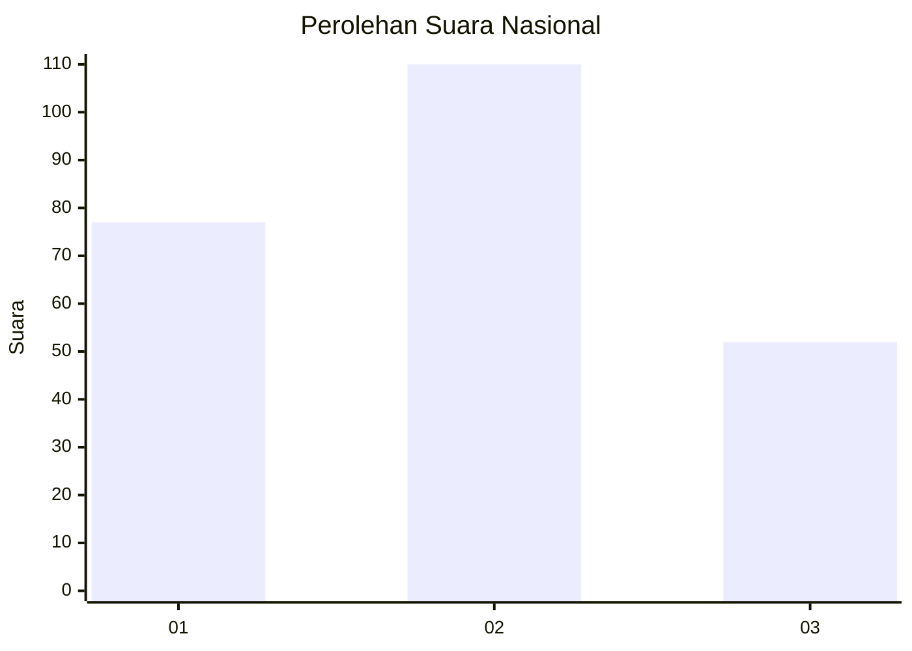
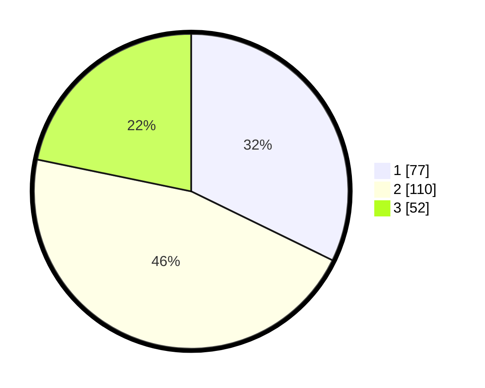

# Hasil

## Grafik

## Tabel

| No. | Nama Paslon    | Suara | Suara (raw) | Persentase |
|:--- |:-------------- | -----:| -----------:| ----------:|
| 1   | ANIES MUHAIMIN | 77    | [77][p-1]   | 32,22      |
| 2   | PRABOWO GIBRAN | 110   | [110][p-2]  | 46,03      |
| 3   | GANJAR MAHFUD  | 52    | [52][p-3]   | 21,76      |

[p-1]: https://github.com/gigit-pemilu/pemilu-2024/blob/main/pilpres/hitung-suara/sub/34-di-yogyakarta/sub/02-bantul/sub/08-bantul/sub/2001-palbapang/sub/004-tps/sub/paslon-1.txt
[p-2]: https://github.com/gigit-pemilu/pemilu-2024/blob/main/pilpres/hitung-suara/sub/34-di-yogyakarta/sub/02-bantul/sub/08-bantul/sub/2001-palbapang/sub/004-tps/sub/paslon-2.txt
[p-3]: https://github.com/gigit-pemilu/pemilu-2024/blob/main/pilpres/hitung-suara/sub/34-di-yogyakarta/sub/02-bantul/sub/08-bantul/sub/2001-palbapang/sub/004-tps/sub/paslon-3.txt

## Foto C Plano

https://sirekap-obj-formc.kpu.go.id/2624/pemilu/ppwp/34/02/08/20/01/3402082001004-20240215-003911--ff537014-39f2-4e10-a8e1-3f8319ed2886.jpg

https://sirekap-obj-formc.kpu.go.id/2624/pemilu/ppwp/34/02/08/20/01/3402082001004-20240215-004059--224c94ae-00e9-4483-bff8-5ec58ab4b6a3.jpg

https://sirekap-obj-formc.kpu.go.id/2624/pemilu/ppwp/34/02/08/20/01/3402082001004-20240215-004243--e6603276-bf46-47b1-8867-20b5a0e00a49.jpg

## Metadata

| Key        | Value               |
| ---------- | ------------------- |
| Time Stamp | 2024-02-21 22:00:00 |

