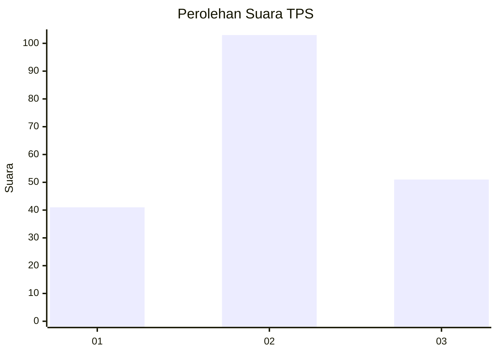
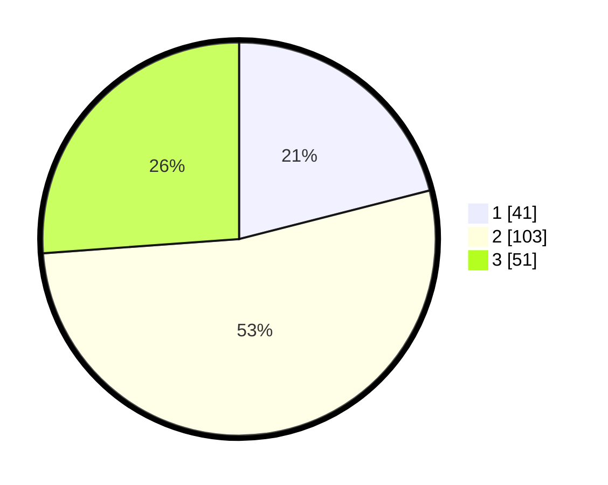

# Hasil

## Grafik

## Tabel

| No. | Nama Paslon    | Suara | Suara (raw) | Persentase |
|:--- |:-------------- | -----:| -----------:| ----------:|
| 1   | ANIES MUHAIMIN | 41    | [41][p-1]   | 21,03      |
| 2   | PRABOWO GIBRAN | 103   | [103][p-2]  | 52,82      |
| 3   | GANJAR MAHFUD  | 51    | [51][p-3]   | 26,15      |

[p-1]: https://github.com/gigit-pemilu/pemilu-2024-34-di-yogyakarta/blob/main/pilpres/hitung-suara/sub/34-di-yogyakarta/sub/02-bantul/sub/08-bantul/sub/2001-palbapang/sub/005-tps/sub/paslon-1.txt
[p-2]: https://github.com/gigit-pemilu/pemilu-2024-34-di-yogyakarta/blob/main/pilpres/hitung-suara/sub/34-di-yogyakarta/sub/02-bantul/sub/08-bantul/sub/2001-palbapang/sub/005-tps/sub/paslon-2.txt
[p-3]: https://github.com/gigit-pemilu/pemilu-2024-34-di-yogyakarta/blob/main/pilpres/hitung-suara/sub/34-di-yogyakarta/sub/02-bantul/sub/08-bantul/sub/2001-palbapang/sub/005-tps/sub/paslon-3.txt

## Foto C Plano

https://sirekap-obj-formc.kpu.go.id/2718/pemilu/ppwp/34/02/08/20/01/3402082001005-20240215-000415--1b29f36c-056d-480f-9a3d-acd56e7aceca.jpg

https://sirekap-obj-formc.kpu.go.id/2718/pemilu/ppwp/34/02/08/20/01/3402082001005-20240215-000740--b44267c8-90d8-4c4a-bbd6-08692d56288f.jpg

https://sirekap-obj-formc.kpu.go.id/2718/pemilu/ppwp/34/02/08/20/01/3402082001005-20240215-001208--410a6fb1-74c2-491a-80ab-9bc8d38b58cc.jpg

## Metadata

| Key        | Value               |
| ---------- | ------------------- |
| Time Stamp | 2024-02-15 19:30:26 |

## DATA PEMILIH TETAP

Jumlah pemilih dalam DPT: **218**.
 * L: **108**.
 * P: **110**.

## DATA PENGGUNA HAK PILIH

Jumlah pengguna hak pilih dalam DPT: **200**.
 * L: **99**.
 * P: **101**.

Jumlah pengguna hak pilih dalam DPTb: **5**.
 * L: **3**.
 * P: **2**.

Jumlah pengguna hak pilih dalam DPK: **0**.
 * L: **0**.
 * P: **0**.

Jumlah pengguna hak pilih: **205**.
 * L: **102**.
 * P: **103**.

## JUMLAH SUARA SAH DAN TIDAK SAH

JUMLAH SELURUH SUARA SAH: **195**.

JUMLAH SUARA TIDAK SAH: **5**.

JUMLAH SELURUH SUARA SAH DAN SUARA TIDAK SAH: **200**.

