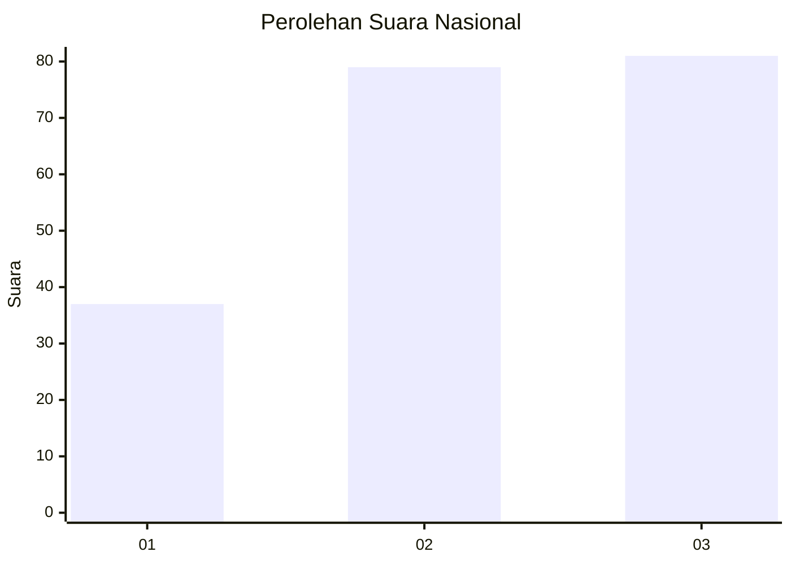
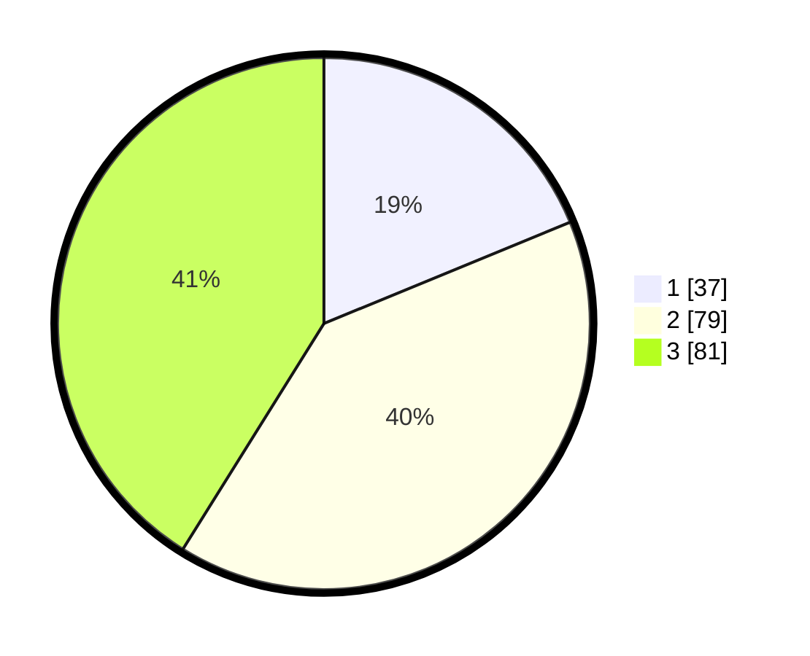

# Hasil

## Grafik

## Tabel

| No. | Nama Paslon    | Suara | Suara (raw) | Persentase |
|:--- |:-------------- | -----:| -----------:| ----------:|
| 1   | ANIES MUHAIMIN | 37    | [37][p-1]   | 18,78      |
| 2   | PRABOWO GIBRAN | 79    | [79][p-2]   | 40,10      |
| 3   | GANJAR MAHFUD  | 81    | [81][p-3]   | 41,12      |

[p-1]: https://github.com/gigit-pemilu/pemilu-2024/blob/main/pilpres/hitung-suara/sub/34-di-yogyakarta/sub/02-bantul/sub/08-bantul/sub/2001-palbapang/sub/007-tps/sub/paslon-1.txt
[p-2]: https://github.com/gigit-pemilu/pemilu-2024/blob/main/pilpres/hitung-suara/sub/34-di-yogyakarta/sub/02-bantul/sub/08-bantul/sub/2001-palbapang/sub/007-tps/sub/paslon-2.txt
[p-3]: https://github.com/gigit-pemilu/pemilu-2024/blob/main/pilpres/hitung-suara/sub/34-di-yogyakarta/sub/02-bantul/sub/08-bantul/sub/2001-palbapang/sub/007-tps/sub/paslon-3.txt

## Foto C Plano

https://sirekap-obj-formc.kpu.go.id/5c13/pemilu/ppwp/34/02/08/20/01/3402082001007-20240214-214348--79f1da38-ca14-4a7e-b5ff-3e7064c5dd79.jpg

https://sirekap-obj-formc.kpu.go.id/5c13/pemilu/ppwp/34/02/08/20/01/3402082001007-20240214-214407--7295c40a-8029-46ae-ad33-aa33402cafc4.jpg

https://sirekap-obj-formc.kpu.go.id/5c13/pemilu/ppwp/34/02/08/20/01/3402082001007-20240214-214422--52d4508e-ba91-4219-9e4c-b4611ccf8700.jpg

## Metadata

| Key        | Value               |
| ---------- | ------------------- |
| Time Stamp | 2024-02-16 16:25:10 |

## DATA PEMILIH TETAP

Jumlah pemilih dalam DPT: **210**.
 * L: **108**.
 * P: **102**.

## DATA PENGGUNA HAK PILIH

Jumlah pengguna hak pilih dalam DPT: **194**.
 * L: **103**.
 * P: **91**.

Jumlah pengguna hak pilih dalam DPTb: **7**.
 * L: **6**.
 * P: **1**.

Jumlah pengguna hak pilih dalam DPK: **0**.
 * L: **0**.
 * P: **0**.

Jumlah pengguna hak pilih: **201**.
 * L: **109**.
 * P: **92**.

## JUMLAH SUARA SAH DAN TIDAK SAH

JUMLAH SELURUH SUARA SAH: **197**.

JUMLAH SUARA TIDAK SAH: **4**.

JUMLAH SELURUH SUARA SAH DAN SUARA TIDAK SAH: **201**.

