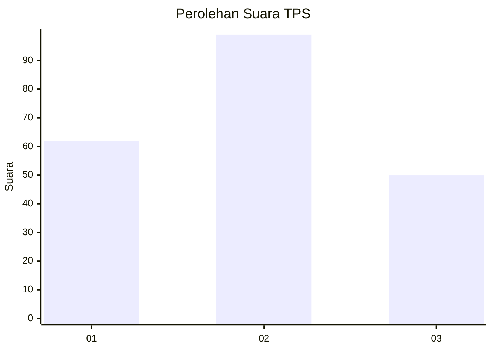
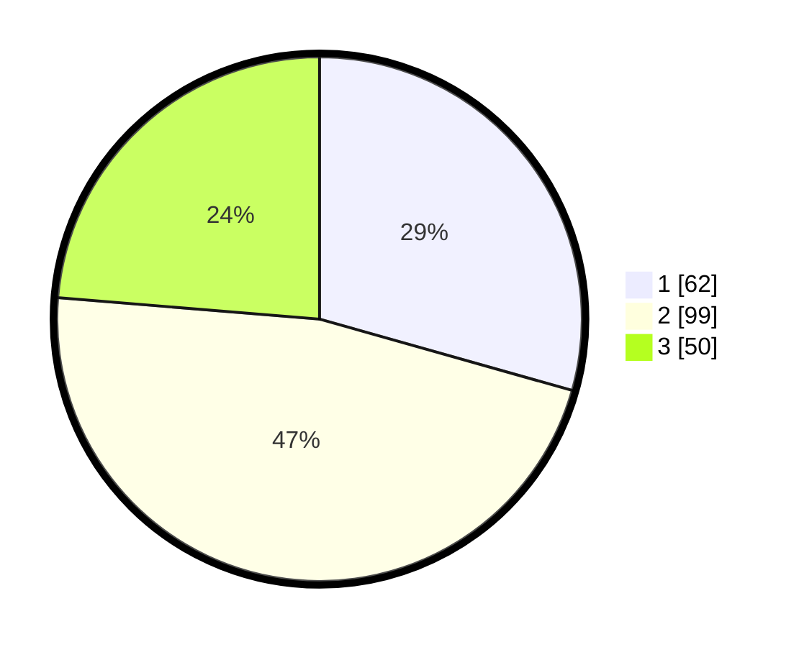

# Hasil

## Grafik

## Tabel

| No. | Nama Paslon    | Suara | Suara (raw) | Persentase |
|:--- |:-------------- | -----:| -----------:| ----------:|
| 1   | ANIES MUHAIMIN | 62    | [62][p-1]   | 29,38      |
| 2   | PRABOWO GIBRAN | 99    | [99][p-2]   | 46,92      |
| 3   | GANJAR MAHFUD  | 50    | [50][p-3]   | 23,70      |

[p-1]: https://github.com/gigit-pemilu/pemilu-2024-34-di-yogyakarta/blob/main/pilpres/hitung-suara/sub/34-di-yogyakarta/sub/02-bantul/sub/08-bantul/sub/2001-palbapang/sub/008-tps/sub/paslon-1.txt
[p-2]: https://github.com/gigit-pemilu/pemilu-2024-34-di-yogyakarta/blob/main/pilpres/hitung-suara/sub/34-di-yogyakarta/sub/02-bantul/sub/08-bantul/sub/2001-palbapang/sub/008-tps/sub/paslon-2.txt
[p-3]: https://github.com/gigit-pemilu/pemilu-2024-34-di-yogyakarta/blob/main/pilpres/hitung-suara/sub/34-di-yogyakarta/sub/02-bantul/sub/08-bantul/sub/2001-palbapang/sub/008-tps/sub/paslon-3.txt

## Foto C Plano

https://sirekap-obj-formc.kpu.go.id/50e0/pemilu/ppwp/34/02/08/20/01/3402082001008-20240214-225054--affc442d-b675-4506-b1b4-70e191b42687.jpg

https://sirekap-obj-formc.kpu.go.id/50e0/pemilu/ppwp/34/02/08/20/01/3402082001008-20240215-002013--561877b4-82b5-40a8-99a0-1ce306273458.jpg

https://sirekap-obj-formc.kpu.go.id/50e0/pemilu/ppwp/34/02/08/20/01/3402082001008-20240215-002321--ff7ac67a-0f00-43de-b89f-394a38a30a2c.jpg

## Metadata

| Key        | Value               |
| ---------- | ------------------- |
| Time Stamp | 2024-02-15 09:00:24 |

