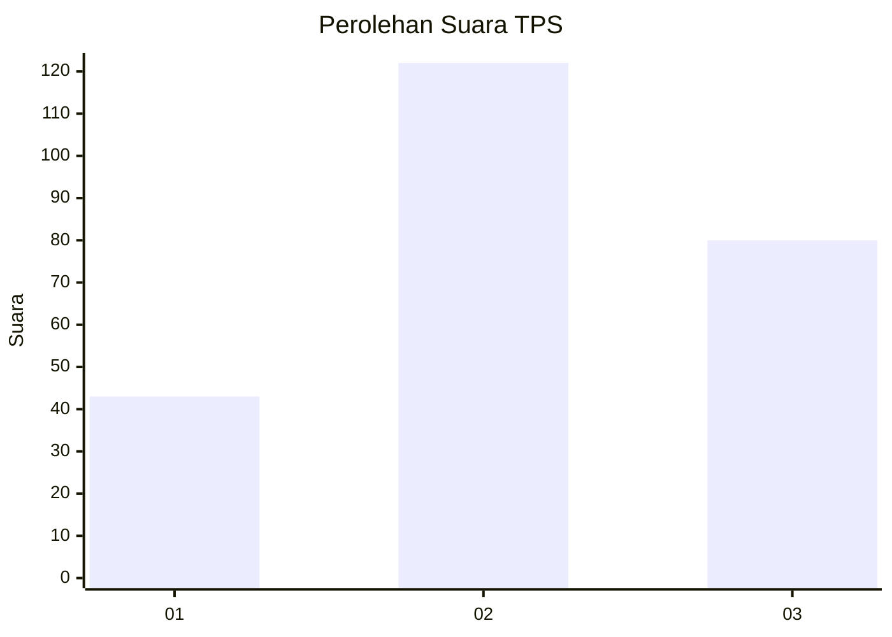
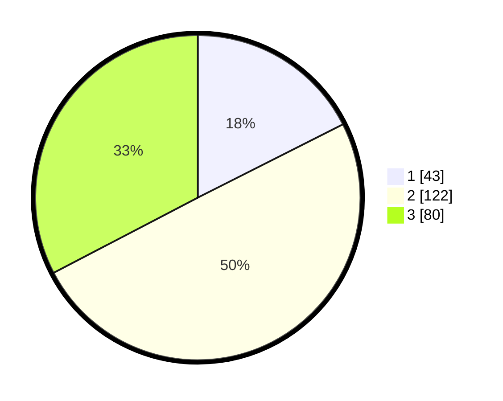

# Hasil

## Grafik

## Tabel

| No. | Nama Paslon    | Suara | Suara (raw) | Persentase |
|:--- |:-------------- | -----:| -----------:| ----------:|
| 1   | ANIES MUHAIMIN | 43    | [43][p-1]   | 17,55      |
| 2   | PRABOWO GIBRAN | 122   | [122][p-2]  | 49,80      |
| 3   | GANJAR MAHFUD  | 80    | [80][p-3]   | 32,65      |

[p-1]: https://github.com/gigit-pemilu/pemilu-2024-34-di-yogyakarta/blob/main/pilpres/hitung-suara/sub/34-di-yogyakarta/sub/02-bantul/sub/08-bantul/sub/2001-palbapang/sub/010-tps/sub/paslon-1.txt
[p-2]: https://github.com/gigit-pemilu/pemilu-2024-34-di-yogyakarta/blob/main/pilpres/hitung-suara/sub/34-di-yogyakarta/sub/02-bantul/sub/08-bantul/sub/2001-palbapang/sub/010-tps/sub/paslon-2.txt
[p-3]: https://github.com/gigit-pemilu/pemilu-2024-34-di-yogyakarta/blob/main/pilpres/hitung-suara/sub/34-di-yogyakarta/sub/02-bantul/sub/08-bantul/sub/2001-palbapang/sub/010-tps/sub/paslon-3.txt

## Foto C Plano

https://sirekap-obj-formc.kpu.go.id/96df/pemilu/ppwp/34/02/08/20/01/3402082001010-20240215-000438--be4149f3-1f06-4258-9d2f-03a6d83fde57.jpg

https://sirekap-obj-formc.kpu.go.id/96df/pemilu/ppwp/34/02/08/20/01/3402082001010-20240215-001101--e2111537-4afc-47ad-95ee-1bfe17436cad.jpg

https://sirekap-obj-formc.kpu.go.id/96df/pemilu/ppwp/34/02/08/20/01/3402082001010-20240215-002100--687c8cfa-523a-4feb-89bc-e06bc1740457.jpg

## Metadata

| Key        | Value               |
| ---------- | ------------------- |
| Time Stamp | 2024-02-16 16:25:10 |

