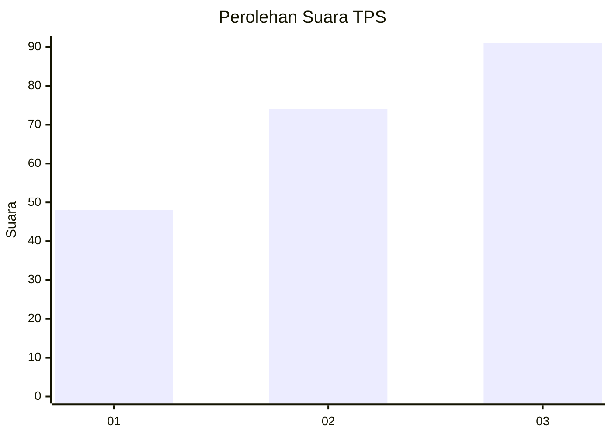
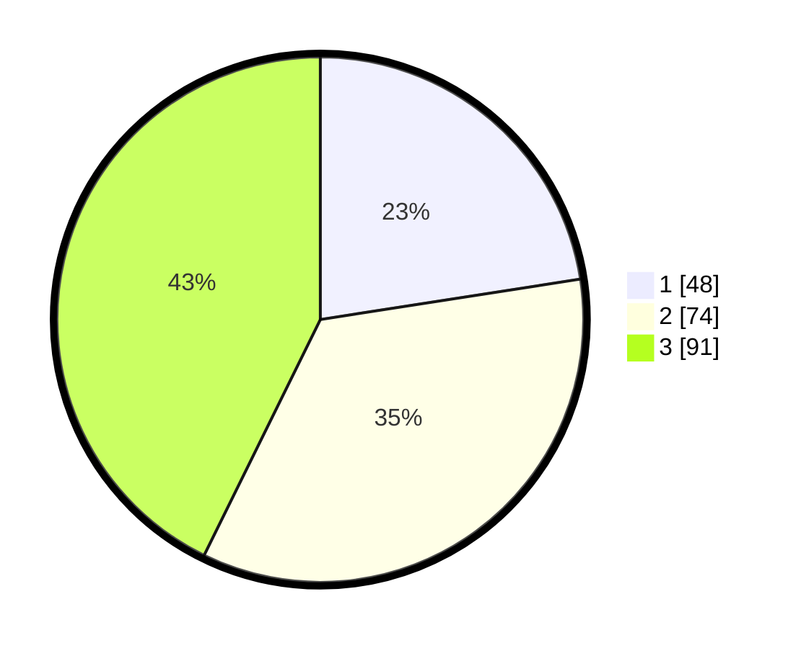

# Hasil

## Grafik

## Tabel

| No. | Nama Paslon    | Suara | Suara (raw) | Persentase |
|:--- |:-------------- | -----:| -----------:| ----------:|
| 1   | ANIES MUHAIMIN | 48    | [48][p-1]   | 22,54      |
| 2   | PRABOWO GIBRAN | 74    | [74][p-2]   | 34,74      |
| 3   | GANJAR MAHFUD  | 91    | [91][p-3]   | 42,72      |

[p-1]: https://github.com/gigit-pemilu/pemilu-2024-34-di-yogyakarta/blob/main/pilpres/hitung-suara/sub/34-di-yogyakarta/sub/02-bantul/sub/08-bantul/sub/2001-palbapang/sub/014-tps/sub/paslon-1.txt
[p-2]: https://github.com/gigit-pemilu/pemilu-2024-34-di-yogyakarta/blob/main/pilpres/hitung-suara/sub/34-di-yogyakarta/sub/02-bantul/sub/08-bantul/sub/2001-palbapang/sub/014-tps/sub/paslon-2.txt
[p-3]: https://github.com/gigit-pemilu/pemilu-2024-34-di-yogyakarta/blob/main/pilpres/hitung-suara/sub/34-di-yogyakarta/sub/02-bantul/sub/08-bantul/sub/2001-palbapang/sub/014-tps/sub/paslon-3.txt

## Foto C Plano

https://sirekap-obj-formc.kpu.go.id/bd5a/pemilu/ppwp/34/02/08/20/01/3402082001014-20240221-185944--bc95338b-6371-4707-83b4-784a0999c472.jpg

https://sirekap-obj-formc.kpu.go.id/bd5a/pemilu/ppwp/34/02/08/20/01/3402082001014-20240221-190207--0b7a5451-7086-49da-a433-5d6a2cffd72c.jpg

https://sirekap-obj-formc.kpu.go.id/bd5a/pemilu/ppwp/34/02/08/20/01/3402082001014-20240221-190110--c90ea37e-98f6-4db1-af17-36269153b57d.jpg

## Metadata

| Key        | Value               |
| ---------- | ------------------- |
| Time Stamp | 2024-02-24 22:31:28 |

