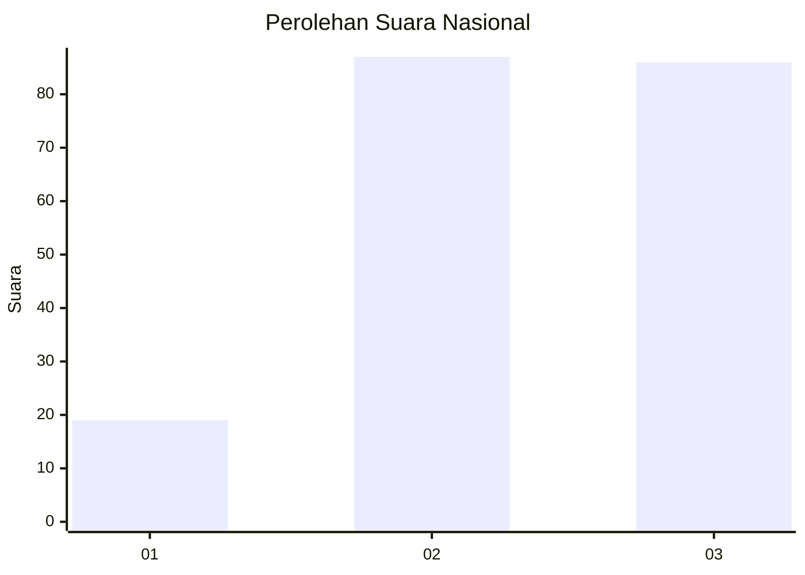
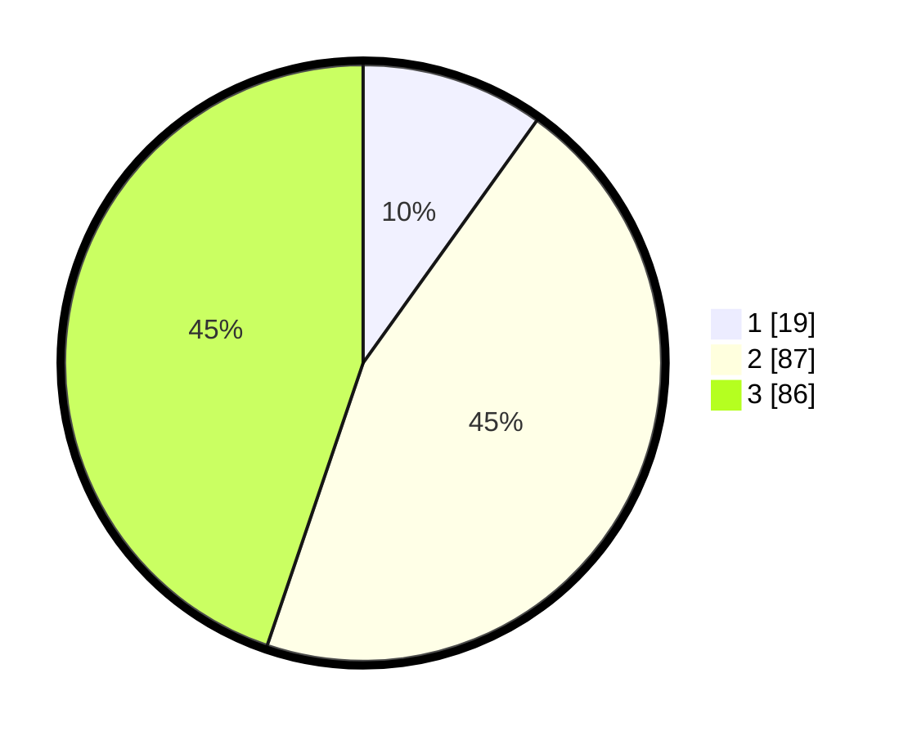

# Hasil

## Grafik

## Tabel

| No. | Nama Paslon    | Suara | Suara (raw) | Persentase |
|:--- |:-------------- | -----:| -----------:| ----------:|
| 1   | ANIES MUHAIMIN | 19    | [19][p-1]   | 9,90       |
| 2   | PRABOWO GIBRAN | 87    | [87][p-2]   | 45,31      |
| 3   | GANJAR MAHFUD  | 86    | [86][p-3]   | 44,79      |

[p-1]: https://github.com/gigit-pemilu/pemilu-2024/blob/main/pilpres/hitung-suara/sub/34-di-yogyakarta/sub/02-bantul/sub/08-bantul/sub/2001-palbapang/sub/017-tps/sub/paslon-1.txt
[p-2]: https://github.com/gigit-pemilu/pemilu-2024/blob/main/pilpres/hitung-suara/sub/34-di-yogyakarta/sub/02-bantul/sub/08-bantul/sub/2001-palbapang/sub/017-tps/sub/paslon-2.txt
[p-3]: https://github.com/gigit-pemilu/pemilu-2024/blob/main/pilpres/hitung-suara/sub/34-di-yogyakarta/sub/02-bantul/sub/08-bantul/sub/2001-palbapang/sub/017-tps/sub/paslon-3.txt

## Foto C Plano

https://sirekap-obj-formc.kpu.go.id/ce92/pemilu/ppwp/34/02/08/20/01/3402082001017-20240214-222457--bcf4ea8a-b81d-4aa5-ad2e-3e38c700eec6.jpg

https://sirekap-obj-formc.kpu.go.id/ce92/pemilu/ppwp/34/02/08/20/01/3402082001017-20240215-005124--e980180f-4649-42fc-afe0-f67e9a82ddf0.jpg

https://sirekap-obj-formc.kpu.go.id/ce92/pemilu/ppwp/34/02/08/20/01/3402082001017-20240215-005259--cecd5a66-6f11-4eb7-9fbd-2c5ee23a9291.jpg

## Metadata

| Key        | Value               |
| ---------- | ------------------- |
| Time Stamp | 2024-02-17 11:00:02 |

