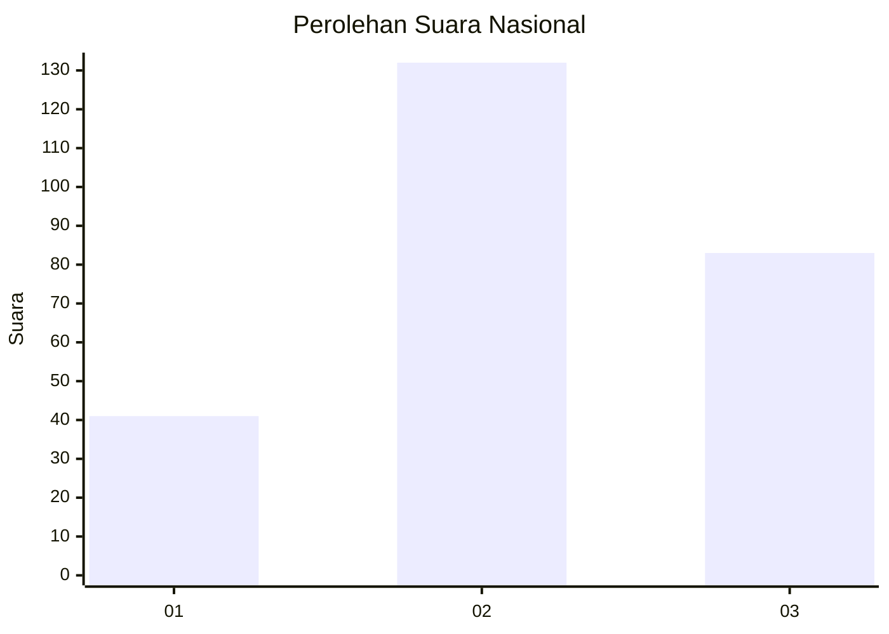
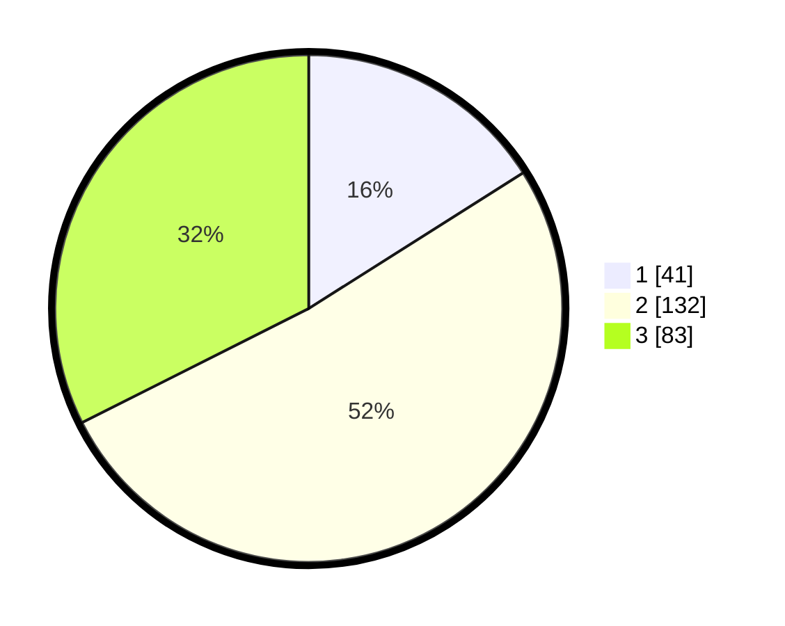

# Hasil

## Grafik

## Tabel

| No. | Nama Paslon    | Suara | Suara (raw) | Persentase |
|:--- |:-------------- | -----:| -----------:| ----------:|
| 1   | ANIES MUHAIMIN | 41    | [41][p-1]   | 16,02      |
| 2   | PRABOWO GIBRAN | 132   | [132][p-2]  | 51,56      |
| 3   | GANJAR MAHFUD  | 83    | [83][p-3]   | 32,42      |

[p-1]: https://github.com/gigit-pemilu/pemilu-2024/blob/main/pilpres/hitung-suara/sub/34-di-yogyakarta/sub/02-bantul/sub/08-bantul/sub/2001-palbapang/sub/019-tps/sub/paslon-1.txt
[p-2]: https://github.com/gigit-pemilu/pemilu-2024/blob/main/pilpres/hitung-suara/sub/34-di-yogyakarta/sub/02-bantul/sub/08-bantul/sub/2001-palbapang/sub/019-tps/sub/paslon-2.txt
[p-3]: https://github.com/gigit-pemilu/pemilu-2024/blob/main/pilpres/hitung-suara/sub/34-di-yogyakarta/sub/02-bantul/sub/08-bantul/sub/2001-palbapang/sub/019-tps/sub/paslon-3.txt

## Foto C Plano

https://sirekap-obj-formc.kpu.go.id/a2c6/pemilu/ppwp/34/02/08/20/01/3402082001019-20240215-042507--3dcbe84e-a388-40ac-8dd3-8db7a27bbbcb.jpg

https://sirekap-obj-formc.kpu.go.id/a2c6/pemilu/ppwp/34/02/08/20/01/3402082001019-20240215-034813--314895af-86c5-4c09-8e93-e544d64cb67c.jpg

https://sirekap-obj-formc.kpu.go.id/a2c6/pemilu/ppwp/34/02/08/20/01/3402082001019-20240215-034851--d18943ac-b56c-4724-8779-3486dde7bf65.jpg

## Metadata

| Key        | Value               |
| ---------- | ------------------- |
| Time Stamp | 2024-02-24 22:31:28 |

