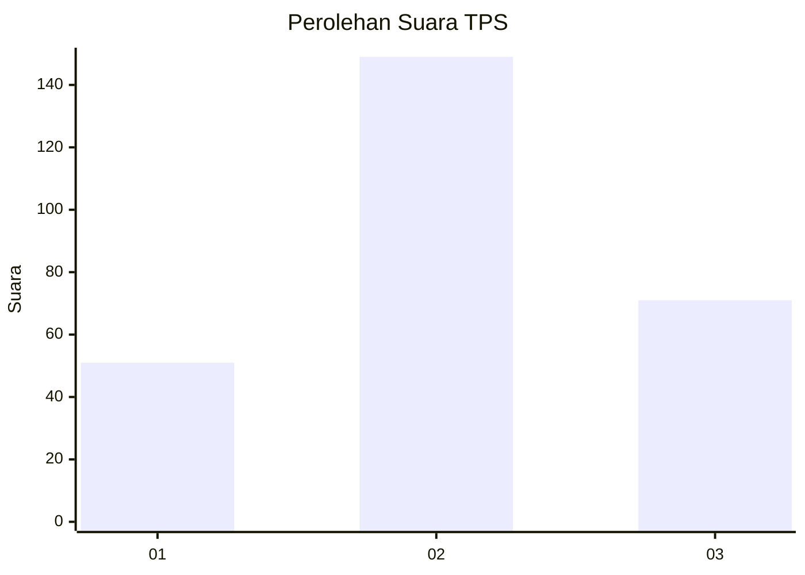
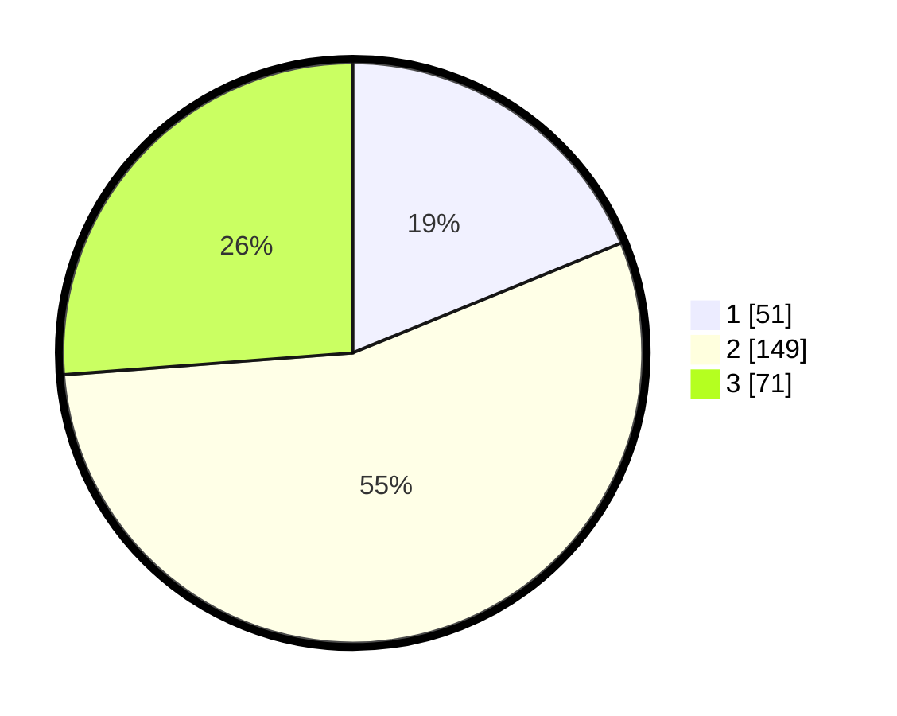

# Hasil

## Grafik

## Tabel

| No. | Nama Paslon    | Suara | Suara (raw) | Persentase |
|:--- |:-------------- | -----:| -----------:| ----------:|
| 1   | ANIES MUHAIMIN | 51    | [51][p-1]   | 18,82      |
| 2   | PRABOWO GIBRAN | 149   | [149][p-2]  | 54,98      |
| 3   | GANJAR MAHFUD  | 71    | [71][p-3]   | 26,20      |

[p-1]: https://github.com/gigit-pemilu/pemilu-2024-34-di-yogyakarta/blob/main/pilpres/hitung-suara/sub/34-di-yogyakarta/sub/02-bantul/sub/08-bantul/sub/2001-palbapang/sub/023-tps/sub/paslon-1.txt
[p-2]: https://github.com/gigit-pemilu/pemilu-2024-34-di-yogyakarta/blob/main/pilpres/hitung-suara/sub/34-di-yogyakarta/sub/02-bantul/sub/08-bantul/sub/2001-palbapang/sub/023-tps/sub/paslon-2.txt
[p-3]: https://github.com/gigit-pemilu/pemilu-2024-34-di-yogyakarta/blob/main/pilpres/hitung-suara/sub/34-di-yogyakarta/sub/02-bantul/sub/08-bantul/sub/2001-palbapang/sub/023-tps/sub/paslon-3.txt

## Foto C Plano

https://sirekap-obj-formc.kpu.go.id/15db/pemilu/ppwp/34/02/08/20/01/3402082001023-20240215-035229--190c776b-156f-47b2-b6d1-3fc22f3ddc6b.jpg

https://sirekap-obj-formc.kpu.go.id/15db/pemilu/ppwp/34/02/08/20/01/3402082001023-20240215-035557--9136bf7b-0064-42cd-a789-985252513c62.jpg

https://sirekap-obj-formc.kpu.go.id/15db/pemilu/ppwp/34/02/08/20/01/3402082001023-20240215-040303--1c1abc99-0cc6-4906-8cfe-db9e502d1146.jpg

## Metadata

| Key        | Value               |
| ---------- | ------------------- |
| Time Stamp | 2024-02-24 22:31:28 |

