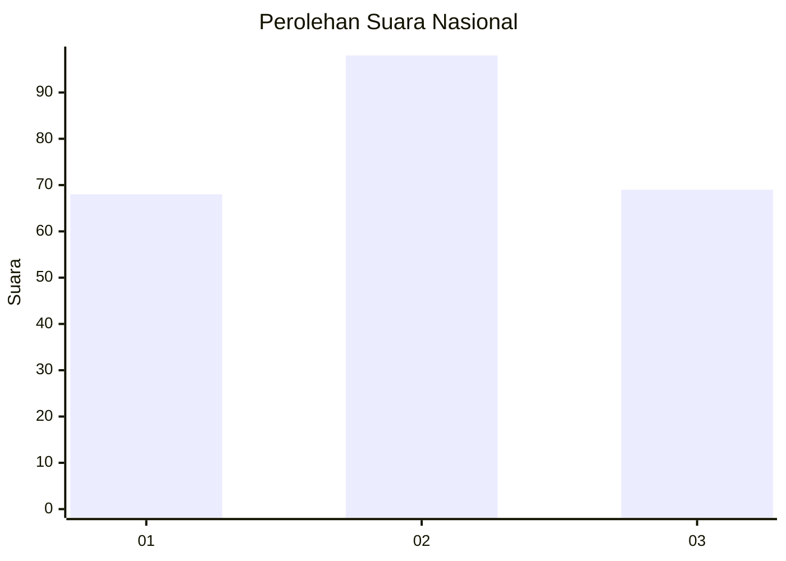
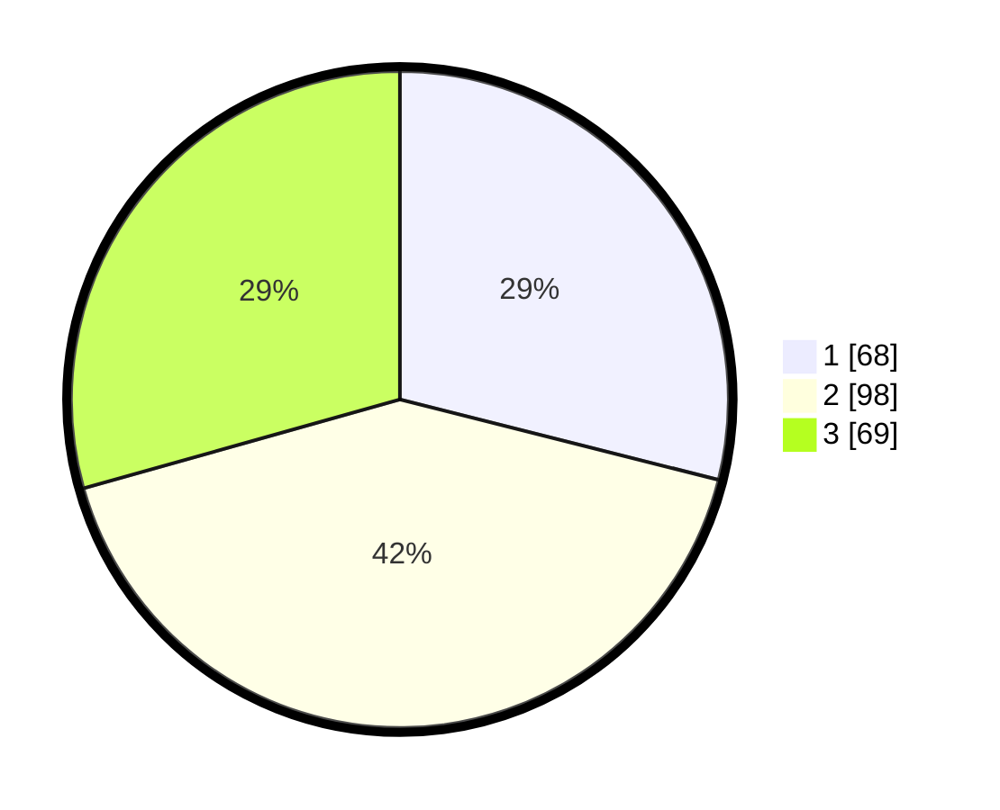

# Hasil

## Grafik

## Tabel

| No. | Nama Paslon    | Suara | Suara (raw) | Persentase |
|:--- |:-------------- | -----:| -----------:| ----------:|
| 1   | ANIES MUHAIMIN | 68    | [68][p-1]   | 28,94      |
| 2   | PRABOWO GIBRAN | 98    | [98][p-2]   | 41,70      |
| 3   | GANJAR MAHFUD  | 69    | [69][p-3]   | 29,36      |

[p-1]: https://github.com/gigit-pemilu/pemilu-2024/blob/main/pilpres/hitung-suara/sub/34-di-yogyakarta/sub/02-bantul/sub/08-bantul/sub/2001-palbapang/sub/031-tps/sub/paslon-1.txt
[p-2]: https://github.com/gigit-pemilu/pemilu-2024/blob/main/pilpres/hitung-suara/sub/34-di-yogyakarta/sub/02-bantul/sub/08-bantul/sub/2001-palbapang/sub/031-tps/sub/paslon-2.txt
[p-3]: https://github.com/gigit-pemilu/pemilu-2024/blob/main/pilpres/hitung-suara/sub/34-di-yogyakarta/sub/02-bantul/sub/08-bantul/sub/2001-palbapang/sub/031-tps/sub/paslon-3.txt

## Foto C Plano

https://sirekap-obj-formc.kpu.go.id/c84a/pemilu/ppwp/34/02/08/20/01/3402082001031-20240215-020125--324cf2f9-5d51-4825-afbe-26642a03d050.jpg

https://sirekap-obj-formc.kpu.go.id/c84a/pemilu/ppwp/34/02/08/20/01/3402082001031-20240215-020243--e614a4b5-4851-4ac4-bf7c-1ee5593f9483.jpg

https://sirekap-obj-formc.kpu.go.id/c84a/pemilu/ppwp/34/02/08/20/01/3402082001031-20240215-020357--b9a9ef78-fc04-4370-bc71-5b0e4b37eef6.jpg

## Metadata

| Key        | Value               |
| ---------- | ------------------- |
| Time Stamp | 2024-02-24 22:31:28 |

