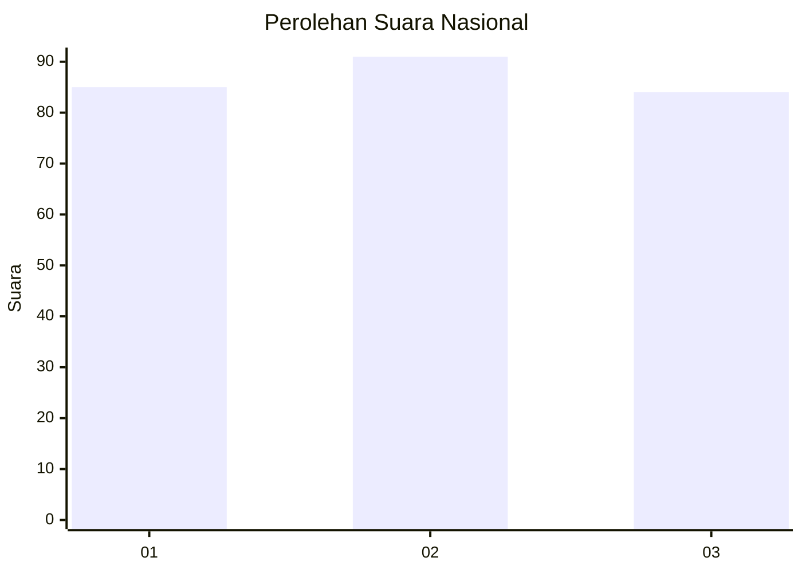
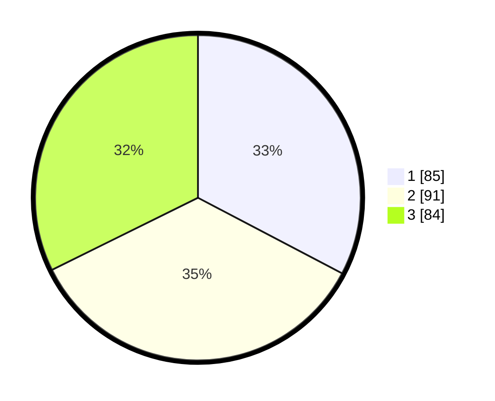

# Hasil

## Grafik

## Tabel

| No. | Nama Paslon    | Suara | Suara (raw) | Persentase |
|:--- |:-------------- | -----:| -----------:| ----------:|
| 1   | ANIES MUHAIMIN | 85    | [85][p-1]   | 32,69      |
| 2   | PRABOWO GIBRAN | 91    | [91][p-2]   | 35,00      |
| 3   | GANJAR MAHFUD  | 84    | [84][p-3]   | 32,31      |

[p-1]: https://github.com/gigit-pemilu/pemilu-2024/blob/main/pilpres/hitung-suara/sub/34-di-yogyakarta/sub/02-bantul/sub/08-bantul/sub/2001-palbapang/sub/033-tps/sub/paslon-1.txt
[p-2]: https://github.com/gigit-pemilu/pemilu-2024/blob/main/pilpres/hitung-suara/sub/34-di-yogyakarta/sub/02-bantul/sub/08-bantul/sub/2001-palbapang/sub/033-tps/sub/paslon-2.txt
[p-3]: https://github.com/gigit-pemilu/pemilu-2024/blob/main/pilpres/hitung-suara/sub/34-di-yogyakarta/sub/02-bantul/sub/08-bantul/sub/2001-palbapang/sub/033-tps/sub/paslon-3.txt

## Foto C Plano

https://sirekap-obj-formc.kpu.go.id/5889/pemilu/ppwp/34/02/08/20/01/3402082001033-20240221-192525--159f0b0d-e922-45e3-8a65-0ea7536b8000.jpg

https://sirekap-obj-formc.kpu.go.id/5889/pemilu/ppwp/34/02/08/20/01/3402082001033-20240215-003449--31d35592-eb83-4e51-9bfa-e419891fdeb7.jpg

https://sirekap-obj-formc.kpu.go.id/5889/pemilu/ppwp/34/02/08/20/01/3402082001033-20240215-003620--d300f50e-f5c7-43fd-a76a-85871e120ab0.jpg

## Metadata

| Key        | Value               |
| ---------- | ------------------- |
| Time Stamp | 2024-02-21 20:00:00 |

