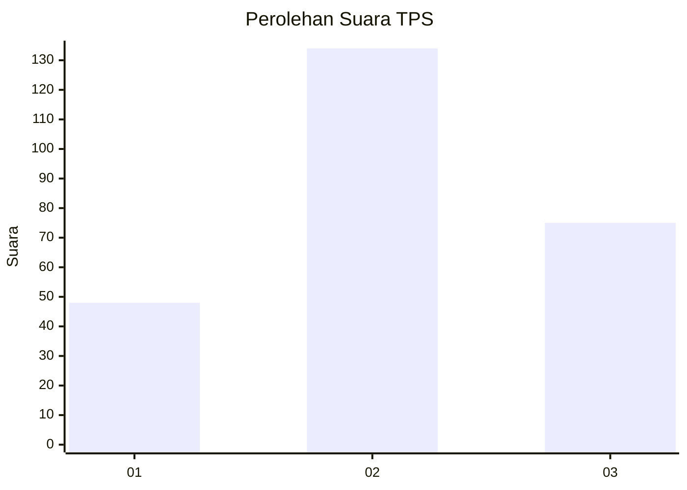
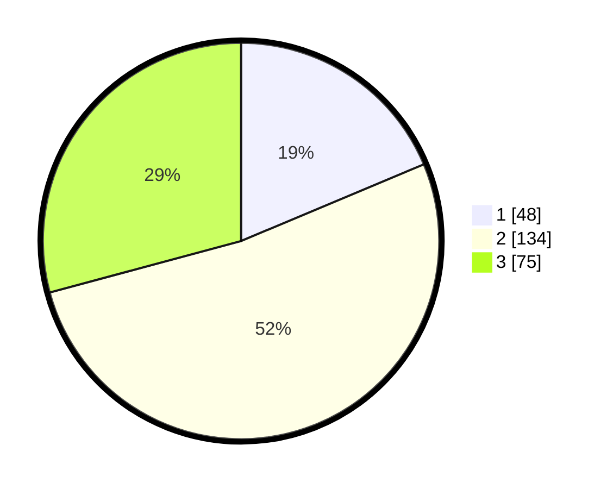

# Hasil

## Grafik

## Tabel

| No. | Nama Paslon    | Suara | Suara (raw) | Persentase |
|:--- |:-------------- | -----:| -----------:| ----------:|
| 1   | ANIES MUHAIMIN | 48    | [48][p-1]   | 18,68      |
| 2   | PRABOWO GIBRAN | 134   | [134][p-2]  | 52,14      |
| 3   | GANJAR MAHFUD  | 75    | [75][p-3]   | 29,18      |

[p-1]: https://github.com/gigit-pemilu/pemilu-2024-34-di-yogyakarta/blob/main/pilpres/hitung-suara/sub/34-di-yogyakarta/sub/02-bantul/sub/08-bantul/sub/2001-palbapang/sub/035-tps/sub/paslon-1.txt
[p-2]: https://github.com/gigit-pemilu/pemilu-2024-34-di-yogyakarta/blob/main/pilpres/hitung-suara/sub/34-di-yogyakarta/sub/02-bantul/sub/08-bantul/sub/2001-palbapang/sub/035-tps/sub/paslon-2.txt
[p-3]: https://github.com/gigit-pemilu/pemilu-2024-34-di-yogyakarta/blob/main/pilpres/hitung-suara/sub/34-di-yogyakarta/sub/02-bantul/sub/08-bantul/sub/2001-palbapang/sub/035-tps/sub/paslon-3.txt

## Foto C Plano

https://sirekap-obj-formc.kpu.go.id/d04f/pemilu/ppwp/34/02/08/20/01/3402082001035-20240215-000602--156dc936-d57c-4799-b550-0528edab2fd6.jpg

https://sirekap-obj-formc.kpu.go.id/d04f/pemilu/ppwp/34/02/08/20/01/3402082001035-20240215-000817--5fa36e94-01f4-4777-a78d-a5fd27dbbfc7.jpg

https://sirekap-obj-formc.kpu.go.id/d04f/pemilu/ppwp/34/02/08/20/01/3402082001035-20240215-001015--8cc2dcf9-37b5-423b-afaa-cd42fcf424e0.jpg

## Metadata

| Key        | Value               |
| ---------- | ------------------- |
| Time Stamp | 2024-02-24 22:31:28 |

