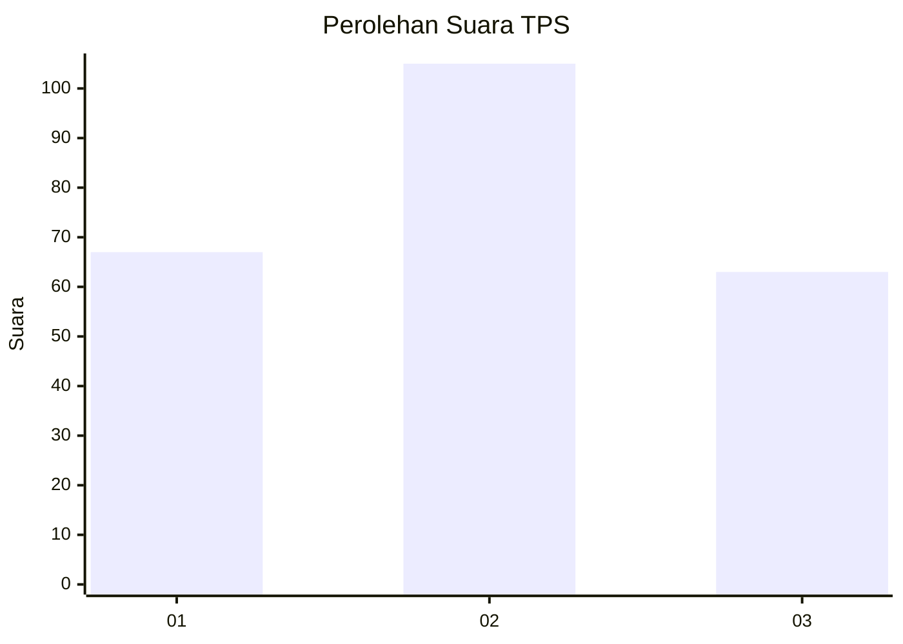
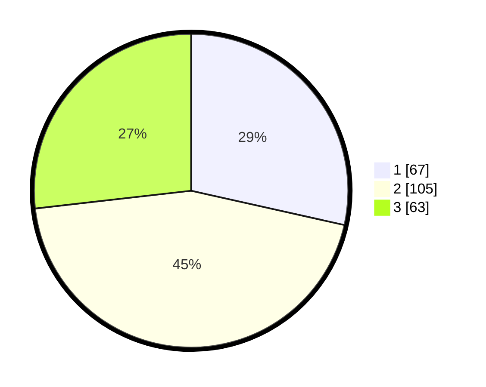

# Hasil

## Grafik

## Tabel

| No. | Nama Paslon    | Suara | Suara (raw) | Persentase |
|:--- |:-------------- | -----:| -----------:| ----------:|
| 1   | ANIES MUHAIMIN | 67    | [67][p-1]   | 28,51      |
| 2   | PRABOWO GIBRAN | 105   | [105][p-2]  | 44,68      |
| 3   | GANJAR MAHFUD  | 63    | [63][p-3]   | 26,81      |

[p-1]: https://github.com/gigit-pemilu/pemilu-2024-34-di-yogyakarta/blob/main/pilpres/hitung-suara/sub/34-di-yogyakarta/sub/02-bantul/sub/08-bantul/sub/2002-ringinharjo/sub/013-tps/sub/paslon-1.txt
[p-2]: https://github.com/gigit-pemilu/pemilu-2024-34-di-yogyakarta/blob/main/pilpres/hitung-suara/sub/34-di-yogyakarta/sub/02-bantul/sub/08-bantul/sub/2002-ringinharjo/sub/013-tps/sub/paslon-2.txt
[p-3]: https://github.com/gigit-pemilu/pemilu-2024-34-di-yogyakarta/blob/main/pilpres/hitung-suara/sub/34-di-yogyakarta/sub/02-bantul/sub/08-bantul/sub/2002-ringinharjo/sub/013-tps/sub/paslon-3.txt

## Foto C Plano

https://sirekap-obj-formc.kpu.go.id/fb75/pemilu/ppwp/34/02/08/20/02/3402082002013-20240215-210810--1fb2e711-bb9a-4447-bf89-ab806a316cd3.jpg

https://sirekap-obj-formc.kpu.go.id/fb75/pemilu/ppwp/34/02/08/20/02/3402082002013-20240215-210818--7f9349a7-c87d-458d-9697-0f16204801d4.jpg

https://sirekap-obj-formc.kpu.go.id/fb75/pemilu/ppwp/34/02/08/20/02/3402082002013-20240215-210833--d2157743-b684-4806-b3d2-3125c2cf1a98.jpg

## Metadata

| Key        | Value               |
| ---------- | ------------------- |
| Time Stamp | 2024-02-17 06:00:03 |

