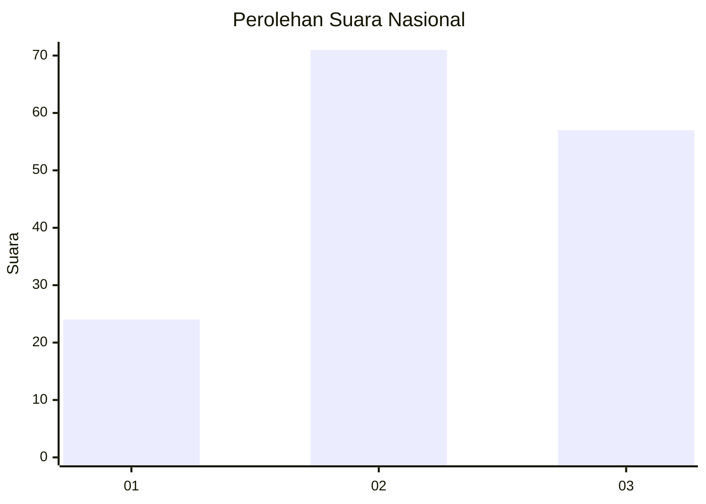
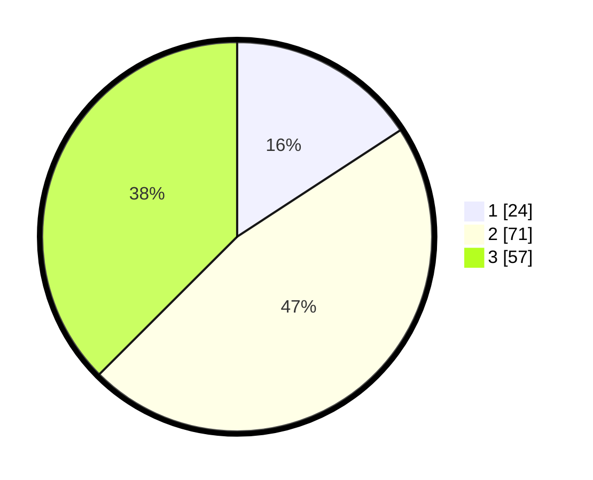

# Hasil

## Grafik

## Tabel

| No. | Nama Paslon    | Suara | Suara (raw) | Persentase |
|:--- |:-------------- | -----:| -----------:| ----------:|
| 1   | ANIES MUHAIMIN | 24    | [24][p-1]   | 15,79      |
| 2   | PRABOWO GIBRAN | 71    | [71][p-2]   | 46,71      |
| 3   | GANJAR MAHFUD  | 57    | [57][p-3]   | 37,50      |

[p-1]: https://github.com/gigit-pemilu/pemilu-2024/blob/main/pilpres/hitung-suara/sub/34-di-yogyakarta/sub/02-bantul/sub/08-bantul/sub/2002-ringinharjo/sub/017-tps/sub/paslon-1.txt
[p-2]: https://github.com/gigit-pemilu/pemilu-2024/blob/main/pilpres/hitung-suara/sub/34-di-yogyakarta/sub/02-bantul/sub/08-bantul/sub/2002-ringinharjo/sub/017-tps/sub/paslon-2.txt
[p-3]: https://github.com/gigit-pemilu/pemilu-2024/blob/main/pilpres/hitung-suara/sub/34-di-yogyakarta/sub/02-bantul/sub/08-bantul/sub/2002-ringinharjo/sub/017-tps/sub/paslon-3.txt

## Foto C Plano

https://sirekap-obj-formc.kpu.go.id/b16f/pemilu/ppwp/34/02/08/20/02/3402082002017-20240216-004451--2cb22eef-668c-422e-b814-31af9c2d40bb.jpg

https://sirekap-obj-formc.kpu.go.id/b16f/pemilu/ppwp/34/02/08/20/02/3402082002017-20240216-004453--303dafed-789a-41b7-8272-c879d56cf6c4.jpg

https://sirekap-obj-formc.kpu.go.id/b16f/pemilu/ppwp/34/02/08/20/02/3402082002017-20240216-004452--5a727412-ba43-4782-8460-7c1e3f2175ac.jpg

## Metadata

| Key        | Value               |
| ---------- | ------------------- |
| Time Stamp | 2024-02-20 12:00:00 |

## DATA PEMILIH TETAP

Jumlah pemilih dalam DPT: **174**.
 * L: **87**.
 * P: **87**.

## DATA PENGGUNA HAK PILIH

Jumlah pengguna hak pilih dalam DPT: **147**.
 * L: **75**.
 * P: **72**.

Jumlah pengguna hak pilih dalam DPTb: **6**.
 * L: **2**.
 * P: **4**.

Jumlah pengguna hak pilih dalam DPK: **2**.
 * L: **2**.
 * P: **0**.

Jumlah pengguna hak pilih: **155**.
 * L: **79**.
 * P: **76**.

## JUMLAH SUARA SAH DAN TIDAK SAH

JUMLAH SELURUH SUARA SAH: **152**.

JUMLAH SUARA TIDAK SAH: **3**.

JUMLAH SELURUH SUARA SAH DAN SUARA TIDAK SAH: **155**.

