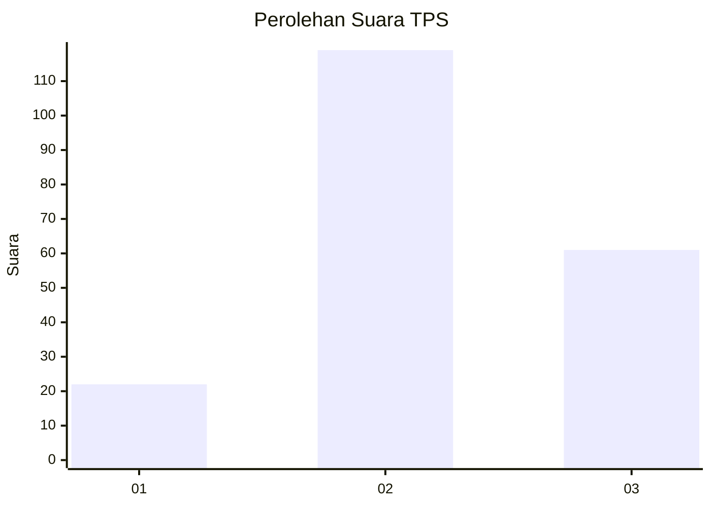
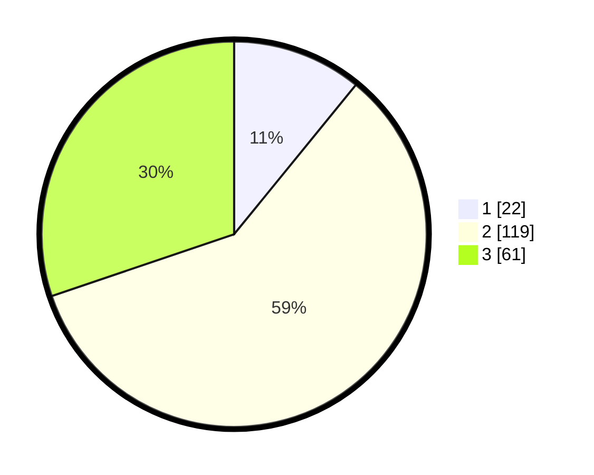

# Hasil

## Grafik

## Tabel

| No. | Nama Paslon    | Suara | Suara (raw) | Persentase |
|:--- |:-------------- | -----:| -----------:| ----------:|
| 1   | ANIES MUHAIMIN | 22    | [22][p-1]   | 10,89      |
| 2   | PRABOWO GIBRAN | 119   | [119][p-2]  | 58,91      |
| 3   | GANJAR MAHFUD  | 61    | [61][p-3]   | 30,20      |

[p-1]: https://github.com/gigit-pemilu/pemilu-2024-34-di-yogyakarta/blob/main/pilpres/hitung-suara/sub/34-di-yogyakarta/sub/02-bantul/sub/08-bantul/sub/2003-bantul/sub/002-tps/sub/paslon-1.txt
[p-2]: https://github.com/gigit-pemilu/pemilu-2024-34-di-yogyakarta/blob/main/pilpres/hitung-suara/sub/34-di-yogyakarta/sub/02-bantul/sub/08-bantul/sub/2003-bantul/sub/002-tps/sub/paslon-2.txt
[p-3]: https://github.com/gigit-pemilu/pemilu-2024-34-di-yogyakarta/blob/main/pilpres/hitung-suara/sub/34-di-yogyakarta/sub/02-bantul/sub/08-bantul/sub/2003-bantul/sub/002-tps/sub/paslon-3.txt

## Foto C Plano

https://sirekap-obj-formc.kpu.go.id/be77/pemilu/ppwp/34/02/08/20/03/3402082003002-20240214-234352--fa585d43-2a3e-4288-8e84-e34c61f6eaed.jpg

https://sirekap-obj-formc.kpu.go.id/be77/pemilu/ppwp/34/02/08/20/03/3402082003002-20240214-234708--1593f031-b7ad-4577-8a57-cc422af62f07.jpg

https://sirekap-obj-formc.kpu.go.id/be77/pemilu/ppwp/34/02/08/20/03/3402082003002-20240214-234834--04ab64cc-533b-485a-b9f3-915d71897aba.jpg

## Metadata

| Key        | Value               |
| ---------- | ------------------- |
| Time Stamp | 2024-02-24 22:31:28 |

