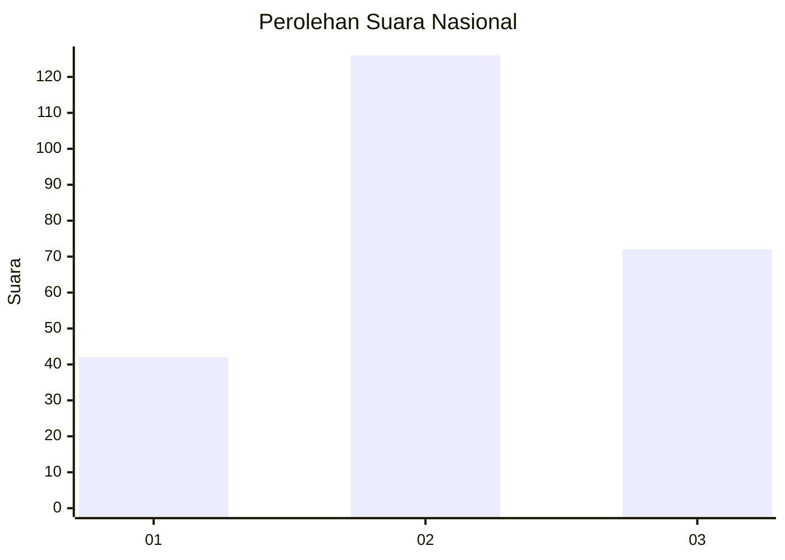
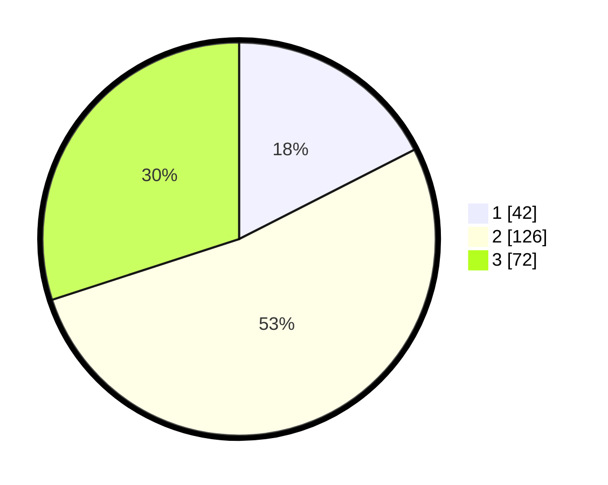

# Hasil

## Grafik

## Tabel

| No. | Nama Paslon    | Suara | Suara (raw) | Persentase |
|:--- |:-------------- | -----:| -----------:| ----------:|
| 1   | ANIES MUHAIMIN | 42    | [42][p-1]   | 17,50      |
| 2   | PRABOWO GIBRAN | 126   | [126][p-2]  | 52,50      |
| 3   | GANJAR MAHFUD  | 72    | [72][p-3]   | 30,00      |

[p-1]: https://github.com/gigit-pemilu/pemilu-2024/blob/main/pilpres/hitung-suara/sub/34-di-yogyakarta/sub/02-bantul/sub/08-bantul/sub/2003-bantul/sub/003-tps/sub/paslon-1.txt
[p-2]: https://github.com/gigit-pemilu/pemilu-2024/blob/main/pilpres/hitung-suara/sub/34-di-yogyakarta/sub/02-bantul/sub/08-bantul/sub/2003-bantul/sub/003-tps/sub/paslon-2.txt
[p-3]: https://github.com/gigit-pemilu/pemilu-2024/blob/main/pilpres/hitung-suara/sub/34-di-yogyakarta/sub/02-bantul/sub/08-bantul/sub/2003-bantul/sub/003-tps/sub/paslon-3.txt

## Foto C Plano

https://sirekap-obj-formc.kpu.go.id/4bec/pemilu/ppwp/34/02/08/20/03/3402082003003-20240215-230040--80933da9-5d65-46fb-8a2d-1ab7ca07c899.jpg

https://sirekap-obj-formc.kpu.go.id/4bec/pemilu/ppwp/34/02/08/20/03/3402082003003-20240215-225732--10a15678-d325-431f-9cb1-a19ce0b974a0.jpg

https://sirekap-obj-formc.kpu.go.id/4bec/pemilu/ppwp/34/02/08/20/03/3402082003003-20240215-225825--9eb23f12-8c0d-423d-bda1-10b716126bc1.jpg

## Metadata

| Key        | Value               |
| ---------- | ------------------- |
| Time Stamp | 2024-02-20 12:00:00 |

