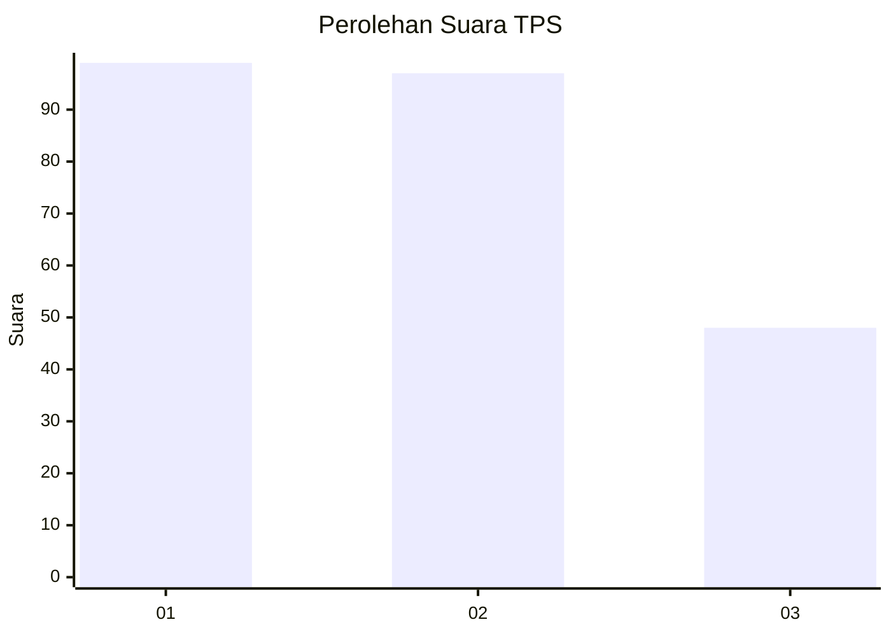
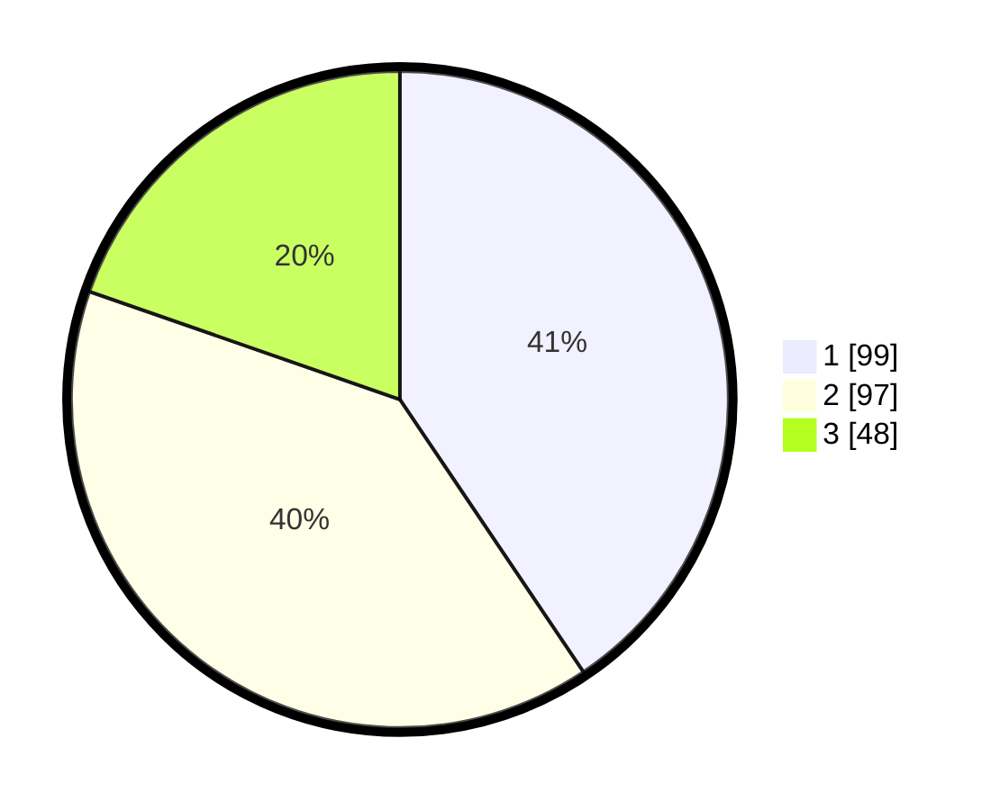

# Hasil

## Grafik

## Tabel

| No. | Nama Paslon    | Suara | Suara (raw) | Persentase |
|:--- |:-------------- | -----:| -----------:| ----------:|
| 1   | ANIES MUHAIMIN | 99    | [99][p-1]   | 40,57      |
| 2   | PRABOWO GIBRAN | 97    | [97][p-2]   | 39,75      |
| 3   | GANJAR MAHFUD  | 48    | [48][p-3]   | 19,67      |

[p-1]: https://github.com/gigit-pemilu/pemilu-2024-34-di-yogyakarta/blob/main/pilpres/hitung-suara/sub/34-di-yogyakarta/sub/02-bantul/sub/08-bantul/sub/2003-bantul/sub/005-tps/sub/paslon-1.txt
[p-2]: https://github.com/gigit-pemilu/pemilu-2024-34-di-yogyakarta/blob/main/pilpres/hitung-suara/sub/34-di-yogyakarta/sub/02-bantul/sub/08-bantul/sub/2003-bantul/sub/005-tps/sub/paslon-2.txt
[p-3]: https://github.com/gigit-pemilu/pemilu-2024-34-di-yogyakarta/blob/main/pilpres/hitung-suara/sub/34-di-yogyakarta/sub/02-bantul/sub/08-bantul/sub/2003-bantul/sub/005-tps/sub/paslon-3.txt

## Foto C Plano

https://sirekap-obj-formc.kpu.go.id/9ffe/pemilu/ppwp/34/02/08/20/03/3402082003005-20240214-222949--ccaffabf-3665-4b36-bd0e-dfda4e2e5c9c.jpg

https://sirekap-obj-formc.kpu.go.id/9ffe/pemilu/ppwp/34/02/08/20/03/3402082003005-20240214-222634--447a5f71-eafd-4543-b452-92a7e0fa3663.jpg

https://sirekap-obj-formc.kpu.go.id/9ffe/pemilu/ppwp/34/02/08/20/03/3402082003005-20240214-223328--d85acee3-8c3e-4bdb-aad0-c1808f7804cc.jpg

## Metadata

| Key        | Value               |
| ---------- | ------------------- |
| Time Stamp | 2024-02-24 22:31:28 |

