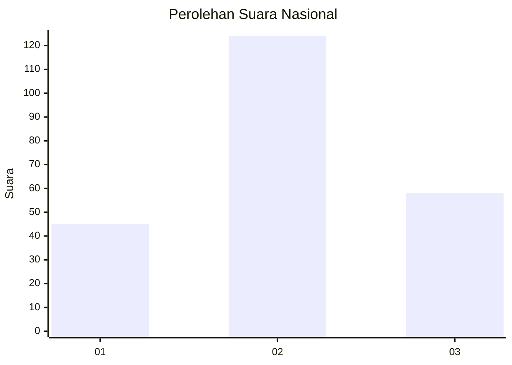
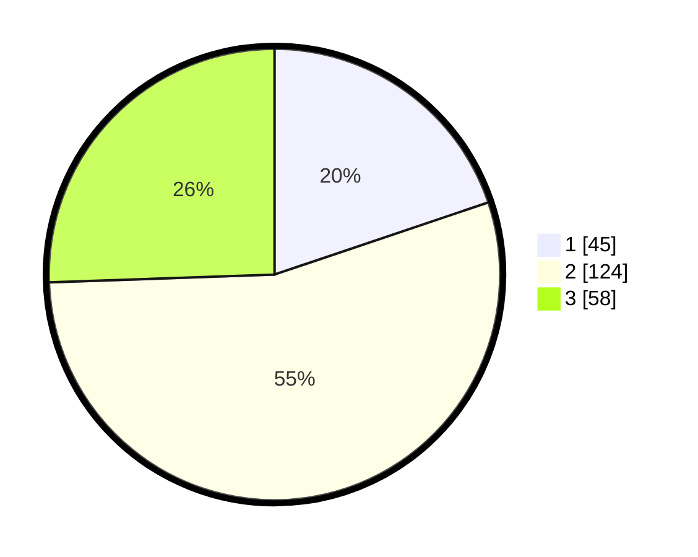

# Hasil

## Grafik

## Tabel

| No. | Nama Paslon    | Suara | Suara (raw) | Persentase |
|:--- |:-------------- | -----:| -----------:| ----------:|
| 1   | ANIES MUHAIMIN | 45    | [45][p-1]   | 19,82      |
| 2   | PRABOWO GIBRAN | 124   | [124][p-2]  | 54,63      |
| 3   | GANJAR MAHFUD  | 58    | [58][p-3]   | 25,55      |

[p-1]: https://github.com/gigit-pemilu/pemilu-2024/blob/main/pilpres/hitung-suara/sub/34-di-yogyakarta/sub/02-bantul/sub/08-bantul/sub/2003-bantul/sub/007-tps/sub/paslon-1.txt
[p-2]: https://github.com/gigit-pemilu/pemilu-2024/blob/main/pilpres/hitung-suara/sub/34-di-yogyakarta/sub/02-bantul/sub/08-bantul/sub/2003-bantul/sub/007-tps/sub/paslon-2.txt
[p-3]: https://github.com/gigit-pemilu/pemilu-2024/blob/main/pilpres/hitung-suara/sub/34-di-yogyakarta/sub/02-bantul/sub/08-bantul/sub/2003-bantul/sub/007-tps/sub/paslon-3.txt

## Foto C Plano

https://sirekap-obj-formc.kpu.go.id/2571/pemilu/ppwp/34/02/08/20/03/3402082003007-20240215-010054--87b84251-a477-4765-baf7-8eacb9cd6188.jpg

https://sirekap-obj-formc.kpu.go.id/2571/pemilu/ppwp/34/02/08/20/03/3402082003007-20240215-010141--b24b56b7-c765-4369-84e1-a4ec8dc2789b.jpg

https://sirekap-obj-formc.kpu.go.id/2571/pemilu/ppwp/34/02/08/20/03/3402082003007-20240215-010248--b92b8a0b-fc73-487d-be67-ab5e7841217e.jpg

## Metadata

| Key        | Value               |
| ---------- | ------------------- |
| Time Stamp | 2024-02-16 16:25:10 |

