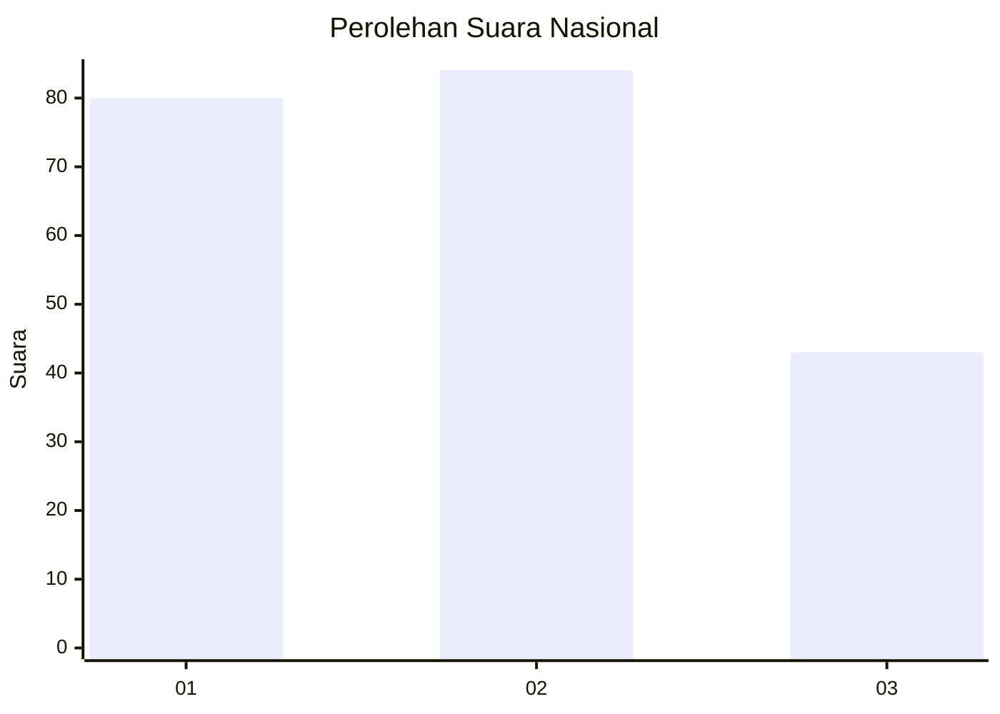
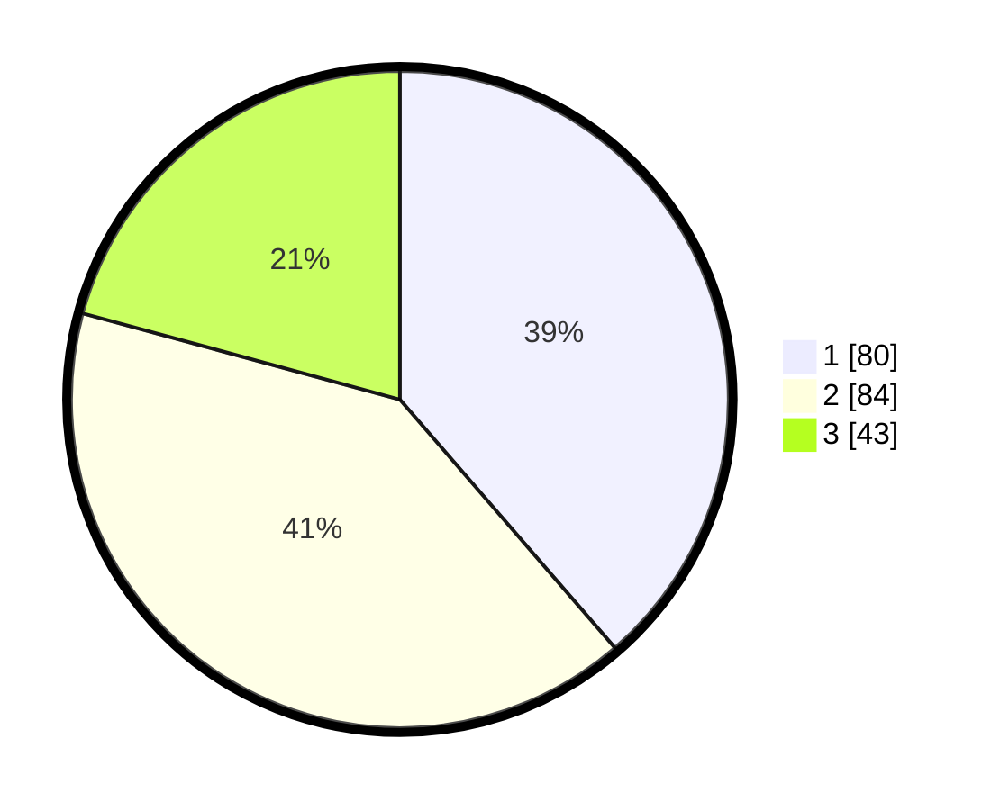

# Hasil

## Grafik

## Tabel

| No. | Nama Paslon    | Suara | Suara (raw) | Persentase |
|:--- |:-------------- | -----:| -----------:| ----------:|
| 1   | ANIES MUHAIMIN | 80    | [80][p-1]   | 38,65      |
| 2   | PRABOWO GIBRAN | 84    | [84][p-2]   | 40,58      |
| 3   | GANJAR MAHFUD  | 43    | [43][p-3]   | 20,77      |

[p-1]: https://github.com/gigit-pemilu/pemilu-2024/blob/main/pilpres/hitung-suara/sub/34-di-yogyakarta/sub/02-bantul/sub/08-bantul/sub/2003-bantul/sub/010-tps/sub/paslon-1.txt
[p-2]: https://github.com/gigit-pemilu/pemilu-2024/blob/main/pilpres/hitung-suara/sub/34-di-yogyakarta/sub/02-bantul/sub/08-bantul/sub/2003-bantul/sub/010-tps/sub/paslon-2.txt
[p-3]: https://github.com/gigit-pemilu/pemilu-2024/blob/main/pilpres/hitung-suara/sub/34-di-yogyakarta/sub/02-bantul/sub/08-bantul/sub/2003-bantul/sub/010-tps/sub/paslon-3.txt

## Foto C Plano

https://sirekap-obj-formc.kpu.go.id/cc13/pemilu/ppwp/34/02/08/20/03/3402082003010-20240214-231011--433d288d-fbb8-4dc3-898c-a5d4e8202741.jpg

https://sirekap-obj-formc.kpu.go.id/cc13/pemilu/ppwp/34/02/08/20/03/3402082003010-20240214-231238--1863a18b-79e3-4e2e-8c4e-3fbdca411ff8.jpg

https://sirekap-obj-formc.kpu.go.id/cc13/pemilu/ppwp/34/02/08/20/03/3402082003010-20240214-231332--e349221a-2758-4f0d-8998-a6a73a52e57d.jpg

## Metadata

| Key        | Value               |
| ---------- | ------------------- |
| Time Stamp | 2024-02-24 22:31:28 |

