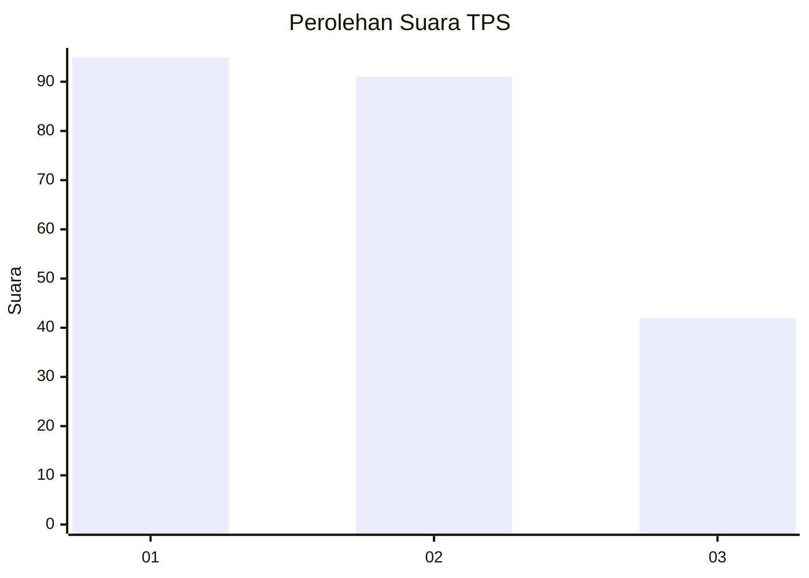
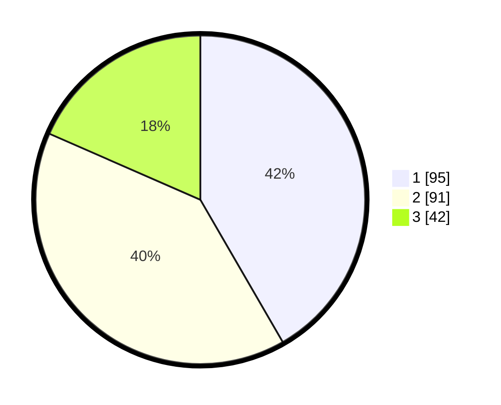

# Hasil

## Grafik

## Tabel

| No. | Nama Paslon    | Suara | Suara (raw) | Persentase |
|:--- |:-------------- | -----:| -----------:| ----------:|
| 1   | ANIES MUHAIMIN | 95    | [95][p-1]   | 41,67      |
| 2   | PRABOWO GIBRAN | 91    | [91][p-2]   | 39,91      |
| 3   | GANJAR MAHFUD  | 42    | [42][p-3]   | 18,42      |

[p-1]: https://github.com/gigit-pemilu/pemilu-2024-34-di-yogyakarta/blob/main/pilpres/hitung-suara/sub/34-di-yogyakarta/sub/02-bantul/sub/08-bantul/sub/2003-bantul/sub/016-tps/sub/paslon-1.txt
[p-2]: https://github.com/gigit-pemilu/pemilu-2024-34-di-yogyakarta/blob/main/pilpres/hitung-suara/sub/34-di-yogyakarta/sub/02-bantul/sub/08-bantul/sub/2003-bantul/sub/016-tps/sub/paslon-2.txt
[p-3]: https://github.com/gigit-pemilu/pemilu-2024-34-di-yogyakarta/blob/main/pilpres/hitung-suara/sub/34-di-yogyakarta/sub/02-bantul/sub/08-bantul/sub/2003-bantul/sub/016-tps/sub/paslon-3.txt

## Foto C Plano

https://sirekap-obj-formc.kpu.go.id/99f5/pemilu/ppwp/34/02/08/20/03/3402082003016-20240214-200312--df6272ee-91c8-451b-8ff0-8badcaef1239.jpg

https://sirekap-obj-formc.kpu.go.id/99f5/pemilu/ppwp/34/02/08/20/03/3402082003016-20240214-193551--aa534379-fe5e-406c-a24f-7480ccd6865a.jpg

https://sirekap-obj-formc.kpu.go.id/99f5/pemilu/ppwp/34/02/08/20/03/3402082003016-20240214-191128--c7631281-b4c0-472b-a9d7-ff12883ace29.jpg

## Metadata

| Key        | Value               |
| ---------- | ------------------- |
| Time Stamp | 2024-02-15 20:00:44 |

