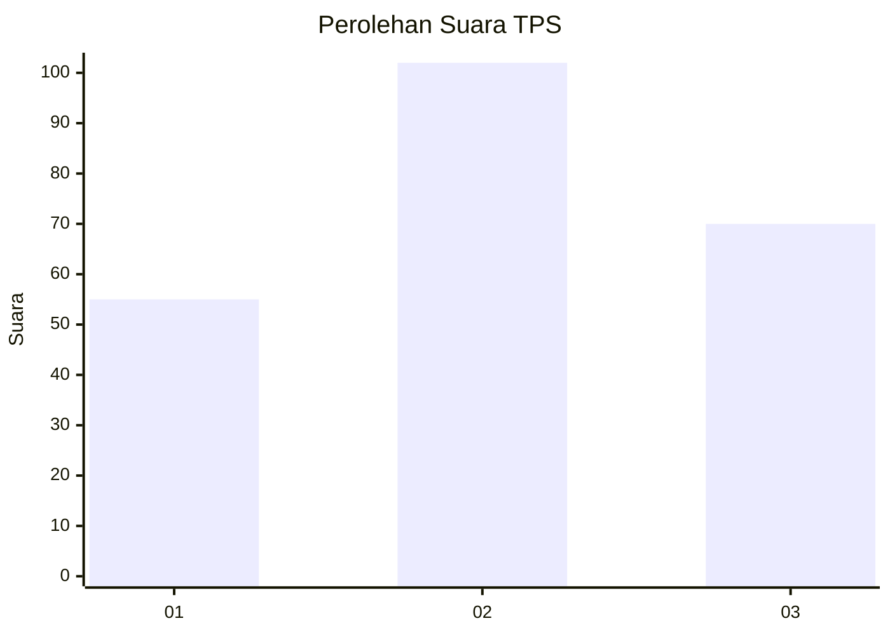
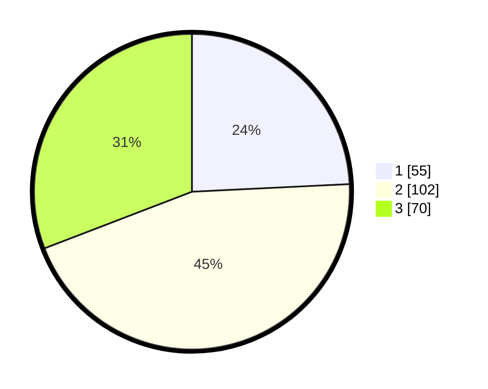

# Hasil

## Grafik

## Tabel

| No. | Nama Paslon    | Suara | Suara (raw) | Persentase |
|:--- |:-------------- | -----:| -----------:| ----------:|
| 1   | ANIES MUHAIMIN | 55    | [55][p-1]   | 24,23      |
| 2   | PRABOWO GIBRAN | 102   | [102][p-2]  | 44,93      |
| 3   | GANJAR MAHFUD  | 70    | [70][p-3]   | 30,84      |

[p-1]: https://github.com/gigit-pemilu/pemilu-2024-34-di-yogyakarta/blob/main/pilpres/hitung-suara/sub/34-di-yogyakarta/sub/02-bantul/sub/08-bantul/sub/2003-bantul/sub/021-tps/sub/paslon-1.txt
[p-2]: https://github.com/gigit-pemilu/pemilu-2024-34-di-yogyakarta/blob/main/pilpres/hitung-suara/sub/34-di-yogyakarta/sub/02-bantul/sub/08-bantul/sub/2003-bantul/sub/021-tps/sub/paslon-2.txt
[p-3]: https://github.com/gigit-pemilu/pemilu-2024-34-di-yogyakarta/blob/main/pilpres/hitung-suara/sub/34-di-yogyakarta/sub/02-bantul/sub/08-bantul/sub/2003-bantul/sub/021-tps/sub/paslon-3.txt

## Foto C Plano

https://sirekap-obj-formc.kpu.go.id/ec2b/pemilu/ppwp/34/02/08/20/03/3402082003021-20240214-184522--53bef798-a39a-44f2-8714-176dd56c5d32.jpg

https://sirekap-obj-formc.kpu.go.id/ec2b/pemilu/ppwp/34/02/08/20/03/3402082003021-20240214-184539--b2a289b6-bab9-4b31-8f30-266865a37c1f.jpg

https://sirekap-obj-formc.kpu.go.id/ec2b/pemilu/ppwp/34/02/08/20/03/3402082003021-20240214-230630--c531cab8-80e2-469e-b745-9e1196b3903e.jpg

## Metadata

| Key        | Value               |
| ---------- | ------------------- |
| Time Stamp | 2024-02-24 22:31:28 |

