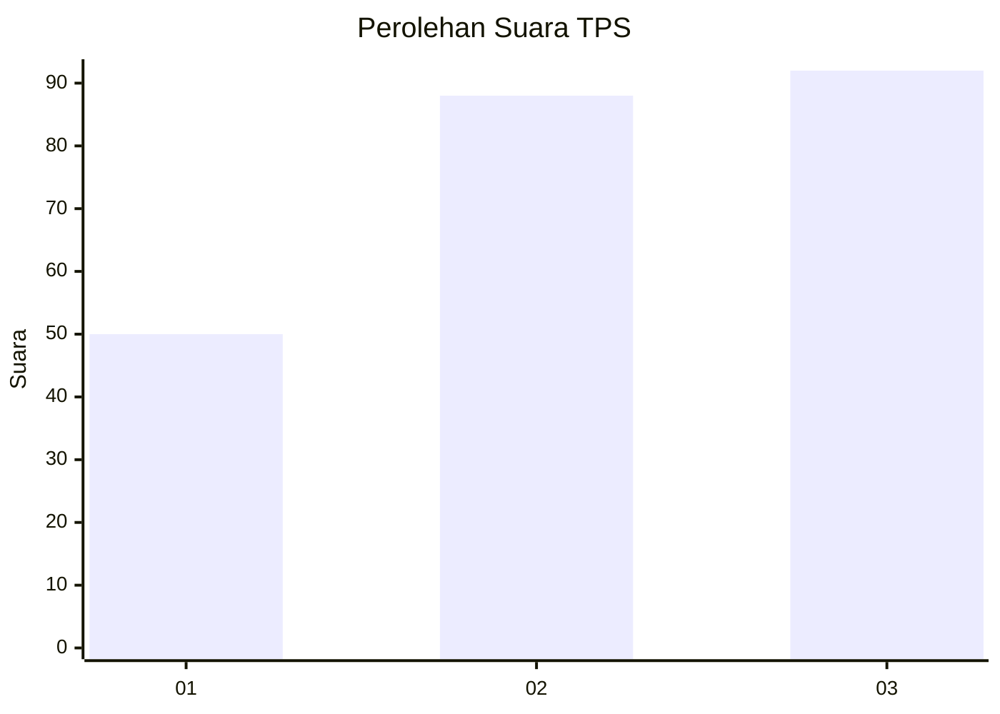
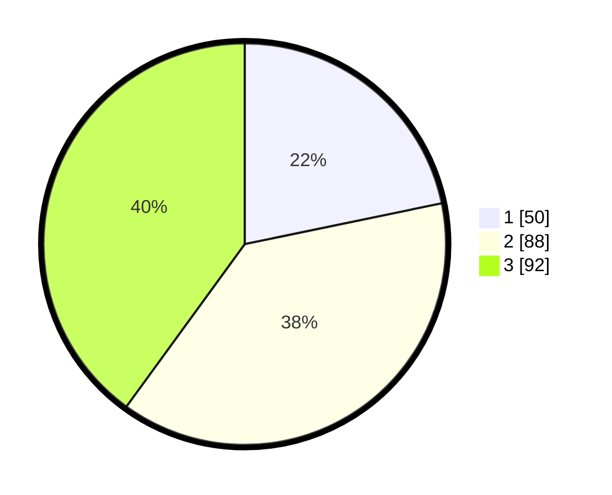

# Hasil

## Grafik

## Tabel

| No. | Nama Paslon    | Suara | Suara (raw) | Persentase |
|:--- |:-------------- | -----:| -----------:| ----------:|
| 1   | ANIES MUHAIMIN | 50    | [50][p-1]   | 21,74      |
| 2   | PRABOWO GIBRAN | 88    | [88][p-2]   | 38,26      |
| 3   | GANJAR MAHFUD  | 92    | [92][p-3]   | 40,00      |

[p-1]: https://github.com/gigit-pemilu/pemilu-2024-34-di-yogyakarta/blob/main/pilpres/hitung-suara/sub/34-di-yogyakarta/sub/02-bantul/sub/08-bantul/sub/2003-bantul/sub/022-tps/sub/paslon-1.txt
[p-2]: https://github.com/gigit-pemilu/pemilu-2024-34-di-yogyakarta/blob/main/pilpres/hitung-suara/sub/34-di-yogyakarta/sub/02-bantul/sub/08-bantul/sub/2003-bantul/sub/022-tps/sub/paslon-2.txt
[p-3]: https://github.com/gigit-pemilu/pemilu-2024-34-di-yogyakarta/blob/main/pilpres/hitung-suara/sub/34-di-yogyakarta/sub/02-bantul/sub/08-bantul/sub/2003-bantul/sub/022-tps/sub/paslon-3.txt

## Foto C Plano

https://sirekap-obj-formc.kpu.go.id/2730/pemilu/ppwp/34/02/08/20/03/3402082003022-20240215-015129--ba82cb54-5f45-4688-b280-c50362900240.jpg

https://sirekap-obj-formc.kpu.go.id/2730/pemilu/ppwp/34/02/08/20/03/3402082003022-20240215-015525--f225948c-67a7-4d34-8015-9f4f1039230f.jpg

https://sirekap-obj-formc.kpu.go.id/2730/pemilu/ppwp/34/02/08/20/03/3402082003022-20240216-125545--5d5ac91a-d5ef-401f-a4fe-3804e5679048.jpg

## Metadata

| Key        | Value               |
| ---------- | ------------------- |
| Time Stamp | 2024-02-16 13:00:29 |

