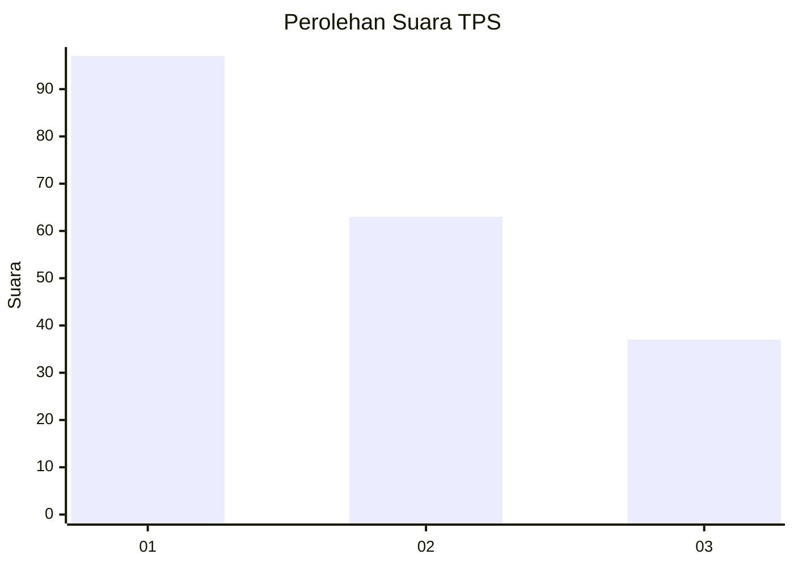
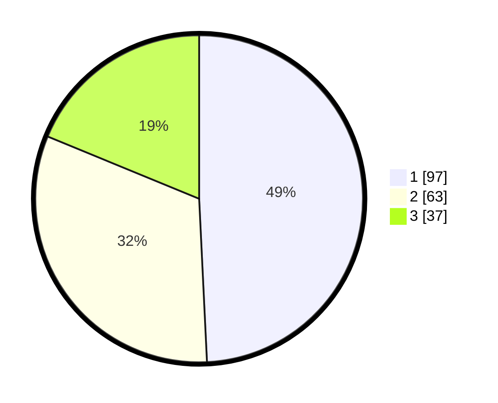

# Hasil

## Grafik

## Tabel

| No. | Nama Paslon    | Suara | Suara (raw) | Persentase |
|:--- |:-------------- | -----:| -----------:| ----------:|
| 1   | ANIES MUHAIMIN | 97    | [97][p-1]   | 49,24      |
| 2   | PRABOWO GIBRAN | 63    | [63][p-2]   | 31,98      |
| 3   | GANJAR MAHFUD  | 37    | [37][p-3]   | 18,78      |

[p-1]: https://github.com/gigit-pemilu/pemilu-2024-34-di-yogyakarta/blob/main/pilpres/hitung-suara/sub/34-di-yogyakarta/sub/02-bantul/sub/08-bantul/sub/2003-bantul/sub/029-tps/sub/paslon-1.txt
[p-2]: https://github.com/gigit-pemilu/pemilu-2024-34-di-yogyakarta/blob/main/pilpres/hitung-suara/sub/34-di-yogyakarta/sub/02-bantul/sub/08-bantul/sub/2003-bantul/sub/029-tps/sub/paslon-2.txt
[p-3]: https://github.com/gigit-pemilu/pemilu-2024-34-di-yogyakarta/blob/main/pilpres/hitung-suara/sub/34-di-yogyakarta/sub/02-bantul/sub/08-bantul/sub/2003-bantul/sub/029-tps/sub/paslon-3.txt

## Foto C Plano

https://sirekap-obj-formc.kpu.go.id/472d/pemilu/ppwp/34/02/08/20/03/3402082003029-20240214-191853--c019c953-a34a-45f9-b06e-a9f46fd91ad4.jpg

https://sirekap-obj-formc.kpu.go.id/472d/pemilu/ppwp/34/02/08/20/03/3402082003029-20240214-191901--aaa9e3f1-2220-4c5f-9a76-06a792afa548.jpg

https://sirekap-obj-formc.kpu.go.id/472d/pemilu/ppwp/34/02/08/20/03/3402082003029-20240214-191908--41c0b0d2-858b-4b11-9a13-886b9b9b9b0c.jpg

## Metadata

| Key        | Value               |
| ---------- | ------------------- |
| Time Stamp | 2024-02-14 21:46:01 |

## DATA PEMILIH TETAP

Jumlah pemilih dalam DPT: **219**.
 * L: **108**.
 * P: **111**.

## DATA PENGGUNA HAK PILIH

Jumlah pengguna hak pilih dalam DPT: **189**.
 * L: **92**.
 * P: **97**.

Jumlah pengguna hak pilih dalam DPTb: **9**.
 * L: **9**.
 * P: **0**.

Jumlah pengguna hak pilih dalam DPK: **2**.
 * L: **0**.
 * P: **2**.

Jumlah pengguna hak pilih: **200**.
 * L: **101**.
 * P: **99**.

## JUMLAH SUARA SAH DAN TIDAK SAH

JUMLAH SELURUH SUARA SAH: **197**.

JUMLAH SUARA TIDAK SAH: **3**.

JUMLAH SELURUH SUARA SAH DAN SUARA TIDAK SAH: **200**.

