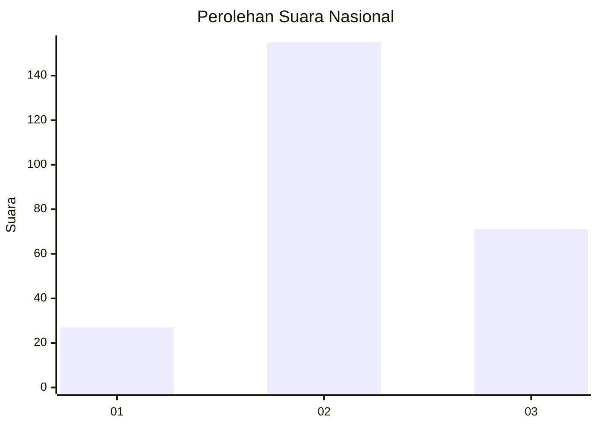
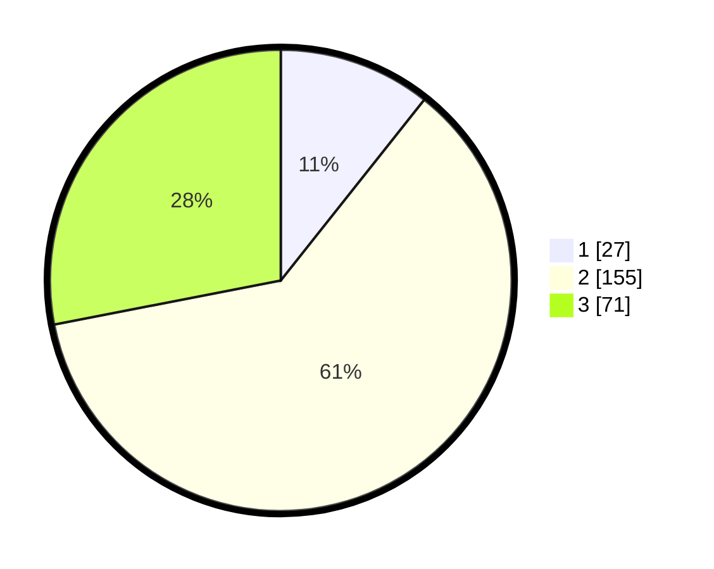

# Hasil

## Grafik

## Tabel

| No. | Nama Paslon    | Suara | Suara (raw) | Persentase |
|:--- |:-------------- | -----:| -----------:| ----------:|
| 1   | ANIES MUHAIMIN | 27    | [27][p-1]   | 10,67      |
| 2   | PRABOWO GIBRAN | 155   | [155][p-2]  | 61,26      |
| 3   | GANJAR MAHFUD  | 71    | [71][p-3]   | 28,06      |

[p-1]: https://github.com/gigit-pemilu/pemilu-2024/blob/main/pilpres/hitung-suara/sub/34-di-yogyakarta/sub/02-bantul/sub/08-bantul/sub/2003-bantul/sub/037-tps/sub/paslon-1.txt
[p-2]: https://github.com/gigit-pemilu/pemilu-2024/blob/main/pilpres/hitung-suara/sub/34-di-yogyakarta/sub/02-bantul/sub/08-bantul/sub/2003-bantul/sub/037-tps/sub/paslon-2.txt
[p-3]: https://github.com/gigit-pemilu/pemilu-2024/blob/main/pilpres/hitung-suara/sub/34-di-yogyakarta/sub/02-bantul/sub/08-bantul/sub/2003-bantul/sub/037-tps/sub/paslon-3.txt

## Foto C Plano

https://sirekap-obj-formc.kpu.go.id/1f5d/pemilu/ppwp/34/02/08/20/03/3402082003037-20240215-032804--4ebd23ab-e57e-464b-9509-6bcc51a4043c.jpg

https://sirekap-obj-formc.kpu.go.id/1f5d/pemilu/ppwp/34/02/08/20/03/3402082003037-20240215-032848--4195de9f-b270-48e7-a064-6040625676ae.jpg

https://sirekap-obj-formc.kpu.go.id/1f5d/pemilu/ppwp/34/02/08/20/03/3402082003037-20240215-040207--66c02b56-cfc0-4242-950b-ce9207b5dd09.jpg

## Metadata

| Key        | Value               |
| ---------- | ------------------- |
| Time Stamp | 2024-02-15 16:00:26 |

