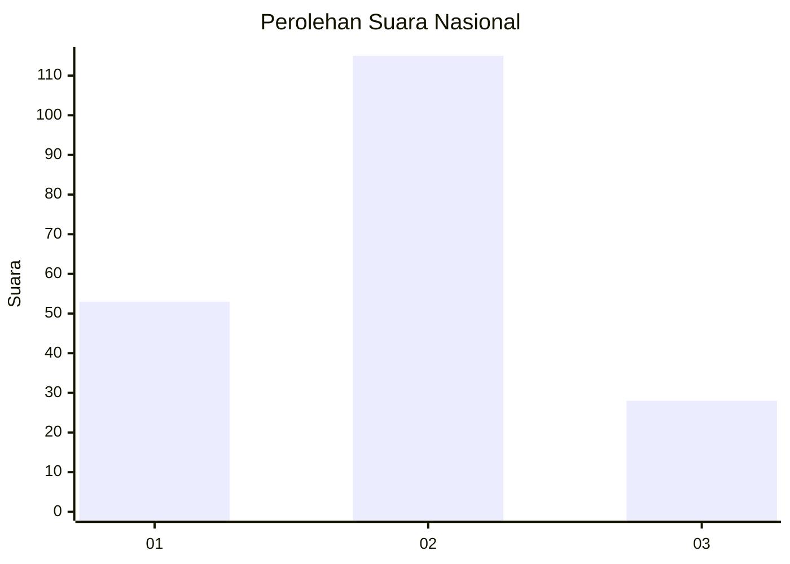
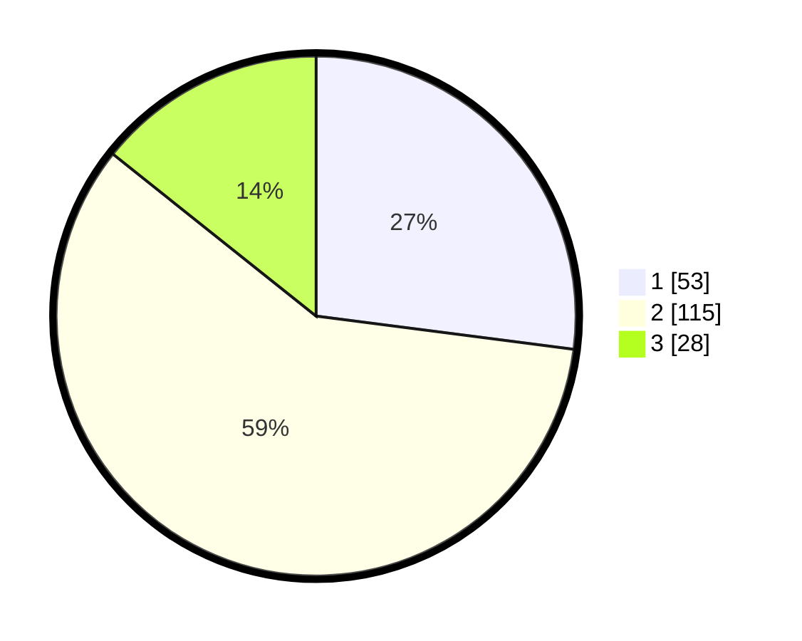

# Hasil

## Grafik

## Tabel

| No. | Nama Paslon    | Suara | Suara (raw) | Persentase |
|:--- |:-------------- | -----:| -----------:| ----------:|
| 1   | ANIES MUHAIMIN | 53    | [53][p-1]   | 27,04      |
| 2   | PRABOWO GIBRAN | 115   | [115][p-2]  | 58,67      |
| 3   | GANJAR MAHFUD  | 28    | [28][p-3]   | 14,29      |

[p-1]: https://github.com/gigit-pemilu/pemilu-2024/blob/main/pilpres/hitung-suara/sub/34-di-yogyakarta/sub/02-bantul/sub/08-bantul/sub/2003-bantul/sub/040-tps/sub/paslon-1.txt
[p-2]: https://github.com/gigit-pemilu/pemilu-2024/blob/main/pilpres/hitung-suara/sub/34-di-yogyakarta/sub/02-bantul/sub/08-bantul/sub/2003-bantul/sub/040-tps/sub/paslon-2.txt
[p-3]: https://github.com/gigit-pemilu/pemilu-2024/blob/main/pilpres/hitung-suara/sub/34-di-yogyakarta/sub/02-bantul/sub/08-bantul/sub/2003-bantul/sub/040-tps/sub/paslon-3.txt

## Foto C Plano

https://sirekap-obj-formc.kpu.go.id/7aab/pemilu/ppwp/34/02/08/20/03/3402082003040-20240221-154730--ebe4e762-c0de-4d6a-a304-87b21907addd.jpg

https://sirekap-obj-formc.kpu.go.id/7aab/pemilu/ppwp/34/02/08/20/03/3402082003040-20240221-154732--eec5304d-e75d-4b2b-b755-7232d66e4313.jpg

https://sirekap-obj-formc.kpu.go.id/7aab/pemilu/ppwp/34/02/08/20/03/3402082003040-20240221-154731--be6a4f91-de0b-4a94-a46e-9c0d5e164262.jpg

## Metadata

| Key        | Value               |
| ---------- | ------------------- |
| Time Stamp | 2024-02-21 18:00:00 |

## DATA PEMILIH TETAP

Jumlah pemilih dalam DPT: **220**.
 * L: **96**.
 * P: **124**.

## DATA PENGGUNA HAK PILIH

Jumlah pengguna hak pilih dalam DPT: **195**.
 * L: **83**.
 * P: **112**.

Jumlah pengguna hak pilih dalam DPTb: **6**.
 * L: **0**.
 * P: **6**.

Jumlah pengguna hak pilih dalam DPK: **3**.
 * L: **2**.
 * P: **1**.

Jumlah pengguna hak pilih: **204**.
 * L: **85**.
 * P: **119**.

## JUMLAH SUARA SAH DAN TIDAK SAH

JUMLAH SELURUH SUARA SAH: **196**.

JUMLAH SUARA TIDAK SAH: **8**.

JUMLAH SELURUH SUARA SAH DAN SUARA TIDAK SAH: **204**.

