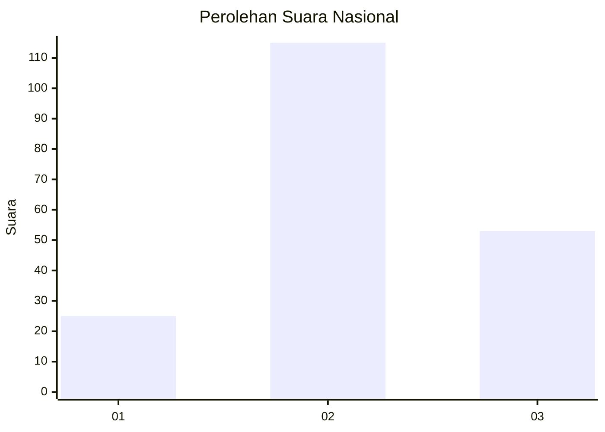
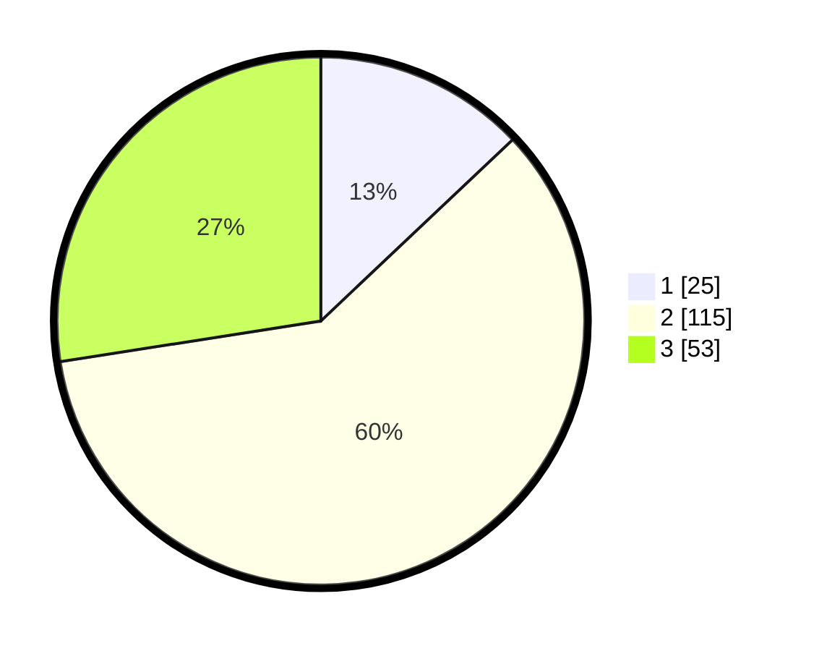

# Hasil

## Grafik

## Tabel

| No. | Nama Paslon    | Suara | Suara (raw) | Persentase |
|:--- |:-------------- | -----:| -----------:| ----------:|
| 1   | ANIES MUHAIMIN | 25    | [25][p-1]   | 12,95      |
| 2   | PRABOWO GIBRAN | 115   | [115][p-2]  | 59,59      |
| 3   | GANJAR MAHFUD  | 53    | [53][p-3]   | 27,46      |

[p-1]: https://github.com/gigit-pemilu/pemilu-2024/blob/main/pilpres/hitung-suara/sub/34-di-yogyakarta/sub/02-bantul/sub/08-bantul/sub/2003-bantul/sub/045-tps/sub/paslon-1.txt
[p-2]: https://github.com/gigit-pemilu/pemilu-2024/blob/main/pilpres/hitung-suara/sub/34-di-yogyakarta/sub/02-bantul/sub/08-bantul/sub/2003-bantul/sub/045-tps/sub/paslon-2.txt
[p-3]: https://github.com/gigit-pemilu/pemilu-2024/blob/main/pilpres/hitung-suara/sub/34-di-yogyakarta/sub/02-bantul/sub/08-bantul/sub/2003-bantul/sub/045-tps/sub/paslon-3.txt

## Foto C Plano

https://sirekap-obj-formc.kpu.go.id/732a/pemilu/ppwp/34/02/08/20/03/3402082003045-20240214-230754--08b60c81-1d2b-4f94-b04f-0ff401d46658.jpg

https://sirekap-obj-formc.kpu.go.id/732a/pemilu/ppwp/34/02/08/20/03/3402082003045-20240214-200444--cb6c1c30-0ff5-44c6-8019-f32bd717b0a6.jpg

https://sirekap-obj-formc.kpu.go.id/732a/pemilu/ppwp/34/02/08/20/03/3402082003045-20240214-231037--3172423c-a76d-484b-953f-61f0fdb630fc.jpg

## Metadata

| Key        | Value               |
| ---------- | ------------------- |
| Time Stamp | 2024-02-24 22:31:28 |

