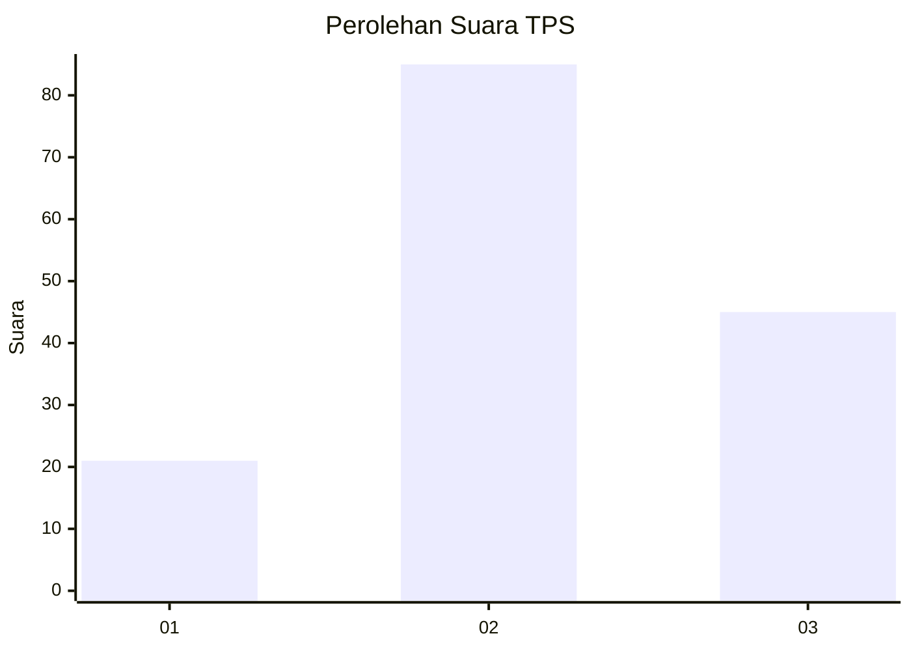
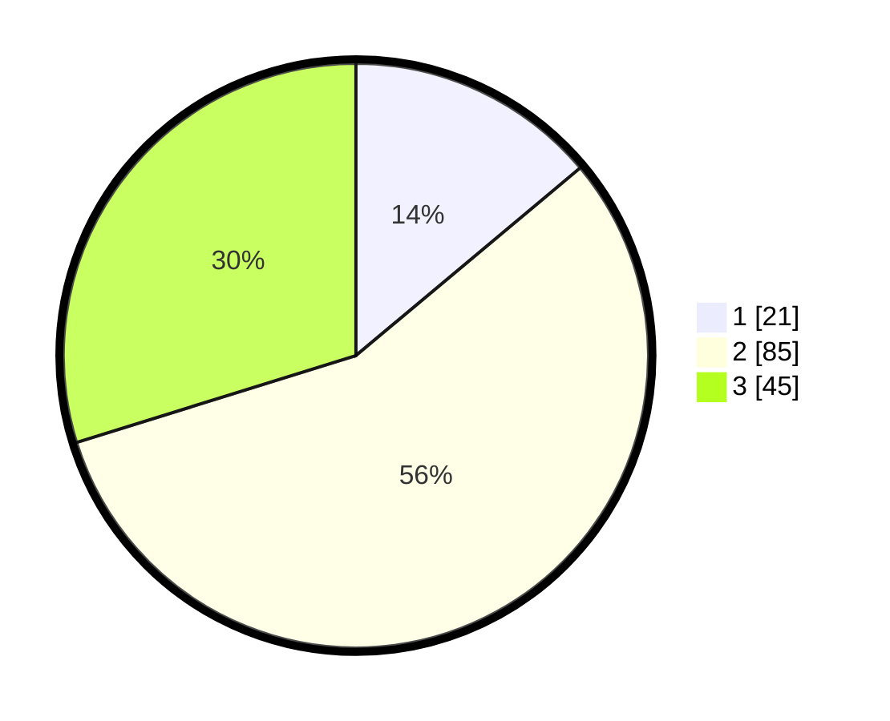

# Hasil

## Grafik

## Tabel

| No. | Nama Paslon    | Suara | Suara (raw) | Persentase |
|:--- |:-------------- | -----:| -----------:| ----------:|
| 1   | ANIES MUHAIMIN | 21    | [21][p-1]   | 13,91      |
| 2   | PRABOWO GIBRAN | 85    | [85][p-2]   | 56,29      |
| 3   | GANJAR MAHFUD  | 45    | [45][p-3]   | 29,80      |

[p-1]: https://github.com/gigit-pemilu/pemilu-2024-34-di-yogyakarta/blob/main/pilpres/hitung-suara/sub/34-di-yogyakarta/sub/02-bantul/sub/08-bantul/sub/2003-bantul/sub/046-tps/sub/paslon-1.txt
[p-2]: https://github.com/gigit-pemilu/pemilu-2024-34-di-yogyakarta/blob/main/pilpres/hitung-suara/sub/34-di-yogyakarta/sub/02-bantul/sub/08-bantul/sub/2003-bantul/sub/046-tps/sub/paslon-2.txt
[p-3]: https://github.com/gigit-pemilu/pemilu-2024-34-di-yogyakarta/blob/main/pilpres/hitung-suara/sub/34-di-yogyakarta/sub/02-bantul/sub/08-bantul/sub/2003-bantul/sub/046-tps/sub/paslon-3.txt

## Foto C Plano

https://sirekap-obj-formc.kpu.go.id/842f/pemilu/ppwp/34/02/08/20/03/3402082003046-20240214-222819--680e5c2e-639f-4610-a0fb-a6f0e2547473.jpg

https://sirekap-obj-formc.kpu.go.id/842f/pemilu/ppwp/34/02/08/20/03/3402082003046-20240214-221739--821b8d0d-da92-4a61-82e7-63686e93450f.jpg

https://sirekap-obj-formc.kpu.go.id/842f/pemilu/ppwp/34/02/08/20/03/3402082003046-20240214-222151--58902777-1afa-4c70-aa00-b9faa2f696df.jpg

## Metadata

| Key        | Value               |
| ---------- | ------------------- |
| Time Stamp | 2024-02-15 12:00:28 |

